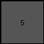

# 27a28665 • 005 • refine_dreamer

---


Previous Code:
```python
"""
Calculates a value based on the presence and repetition of non-white colors
on the diagonals and other positions of a 3x3 input grid.
"""

import numpy as np

def check_diagonals(grid):
    """Checks for non-white colors on both diagonals and returns the count."""
    main_diag_color = None
    anti_diag_color = None
    count = 0

    # Check main diagonal
    if grid[0, 0] != 0 and grid[1, 1] != 0 and grid[2, 2] != 0 and grid[0,0] == grid[1,1] and grid[1,1] == grid[2,2]:
      main_diag_color = grid[0,0]
      count += 1


    # Check anti-diagonal
    if grid[0, 2] != 0 and grid[1, 1] != 0 and grid[2, 0] != 0 and grid[0,2] == grid[1,1] and grid[1,1] == grid[2,0]:
      anti_diag_color = grid[0,2]
      count += 1
    
    return count, main_diag_color, anti_diag_color

def check_repetitions(grid, main_diag_color, anti_diag_color):
    """
    Checks the color repetitions
    """

    count = 0
    
    colors = np.unique(grid[grid != 0])
    for color in colors:
        color_count = np.count_nonzero(grid == color)
        if color_count > 1:
          count += color_count

    if main_diag_color is not None and anti_diag_color is not None and main_diag_color == anti_diag_color:
        count -= 2
    elif main_diag_color is not None:
        count -=1
    elif anti_diag_color is not None:
        count -= 1

    return count if count > 0 else 0

def transform(input_grid):
    """
    Calculates a value based on diagonal colors and repetitions,
    returning it as a 1x1 grid.
    """
    input_array = np.array(input_grid)

    # Check diagonals.
    diagonal_count, main_diag_color, anti_diag_color = check_diagonals(input_array)
    
    # Check the repetition
    repetition_count = check_repetitions(input_array, main_diag_color, anti_diag_color)

    total_count = diagonal_count + repetition_count


    # Create a 1x1 output grid.
    output_grid = np.array([[total_count]])

    return output_grid
```

Train Set Results:

## Example 1:

Input:
```
5 5 0
5 0 5
0 5 0
```
Expected Output:
```
1
```
Transformed Output:
```
5
```

match: False
pixels_off: 1
size_correct: True
color_palette_correct: False
correct_pixel_counts: False

## Example 2:

Input:
```
8 0 8
0 8 0
8 0 8
```
Expected Output:
```
2
```
Transformed Output:
```
5
```

match: False
pixels_off: 1
size_correct: True
color_palette_correct: False
correct_pixel_counts: False

## Example 3:

Input:
```
5 0 5
0 5 0
5 0 5
```
Expected Output:
```
2
```
Transformed Output:
```
5
```

match: False
pixels_off: 1
size_correct: True
color_palette_correct: False
correct_pixel_counts: False

## Example 4:

Input:
```
0 1 1
0 1 1
1 0 0
```
Expected Output:
```
3
```
Transformed Output:
```
5
```

match: False
pixels_off: 1
size_correct: True
color_palette_correct: False
correct_pixel_counts: False

## Example 5:

Input:
```
0 8 8
0 8 8
8 0 0
```
Expected Output:
```
3
```
Transformed Output:
```
5
```

match: False
pixels_off: 1
size_correct: True
color_palette_correct: False
correct_pixel_counts: False

## Example 6:

Input:
```
4 4 0
4 0 4
0 4 0
```
Expected Output:
```
1
```
Transformed Output:
```
5
```

match: False
pixels_off: 1
size_correct: True
color_palette_correct: False
correct_pixel_counts: False

## Example 7:

Input:
```
0 5 0
5 5 5
0 5 0
```
Expected Output:
```
6
```
Transformed Output:
```
5
```

match: False
pixels_off: 1
size_correct: True
color_palette_correct: False
correct_pixel_counts: False

**INSTRUCTIONS**

The code above was generated based on observations from the first training
example

we have tested the transform function on each of the task example inputs and
compared with the expected output

review each of the examples provided and the results and consider how the
natural language program should be updated to accommodate this new knowledge

respond with the following deliverables:

- general assessment of the information provided and strategy for resolving the
  errors
- gather metrics about each of the examples and results - use code_execution to
  develop accurate reports on your assumptions
- a YAML block documenting facts - Focus on identifying objects, their properties, and the actions performed on them.
- a natural language program - Be as clear and concise as possible, providing a complete description of the transformation rule.


your responses should be considered as information in a report - not a
conversation
