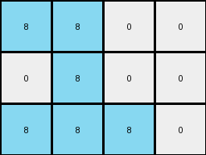

# 28bf18c6 • 003 • refine_dreamer

---


Previous Code:
```python
"""
1.  **Identify the Cluster:** Locate the contiguous cluster of '8' (azure) pixels within the input grid.
2.  **Determine Bounding Box:** Find the minimum and maximum row and column indices occupied by the azure pixels. This defines a rectangular "bounding box" around the cluster.
3.  **Construct the output:** Extract every other value beginning with the top left corner of the cluster. Extract three rows.
4. **Fill output:** Create output from the extracted values.
"""

import numpy as np

def find_cluster(grid, color):
    # Find coordinates of all pixels with the specified color.
    coords = np.argwhere(grid == color)
    if coords.size == 0:
        return None, None, None, None  # No cluster found
    min_row = np.min(coords[:, 0])
    max_row = np.max(coords[:, 0])
    min_col = np.min(coords[:, 1])
    max_col = np.max(coords[:, 1])
    return min_row, max_row, min_col, max_col

def transform(input_grid):
    input_grid = np.array(input_grid)
    # Find the bounding box of the azure cluster (color 8).
    min_row, max_row, min_col, max_col = find_cluster(input_grid, 8)
    
    if min_row is None:  # Handle cases where no cluster is found
       return [[]]

    # construct output grid from bounding box
    output_grid = []
    for i in range(min_row, min_row + 3):
        row = []
        for j in range(min_col, max_col + 2):
            if j >= input_grid.shape[1] or i >= input_grid.shape[0]:
                # add a white square if out of bounds
                row.append(0)
            else:
                row.append(input_grid[i,j])    
        output_grid.append(row)

    
    return output_grid
```

Train Set Results:

## Example 1:

Input:
```
0 0 0 0 0 0 0 0
0 8 8 0 0 0 0 0
0 0 8 0 0 0 0 0
0 8 8 8 0 0 0 0
0 0 0 0 0 0 0 0
0 0 0 0 0 0 0 0
0 0 0 0 0 0 0 0
0 0 0 0 0 0 0 0
```
Expected Output:
```
8 8 0 8 8 0
0 8 0 0 8 0
8 8 8 8 8 8
```
Transformed Output:
```
8 8 0 0
0 8 0 0
8 8 8 0
```

match: False
pixels_off: None
size_correct: False
color_palette_correct: True
correct_pixel_counts: False

## Example 2:

Input:
```
0 0 0 0 0 0 0 0
0 0 0 0 0 0 0 0
0 0 0 0 0 0 0 0
0 0 0 0 0 0 0 0
0 0 0 0 0 0 0 0
0 0 0 2 0 0 0 0
0 0 2 2 2 0 0 0
0 0 2 2 0 0 0 0
```
Expected Output:
```
0 2 0 0 2 0
2 2 2 2 2 2
2 2 0 2 2 0
```
Transformed Output:
```

```

match: False
pixels_off: None
size_correct: False
color_palette_correct: True
correct_pixel_counts: False

## Example 3:

Input:
```
0 0 0 0 0 0 0 0
0 0 0 0 0 1 1 0
0 0 0 0 1 0 0 0
0 0 0 0 0 1 0 0
0 0 0 0 0 0 0 0
0 0 0 0 0 0 0 0
0 0 0 0 0 0 0 0
0 0 0 0 0 0 0 0
```
Expected Output:
```
0 1 1 0 1 1
1 0 0 1 0 0
0 1 0 0 1 0
```
Transformed Output:
```

```

match: False
pixels_off: None
size_correct: False
color_palette_correct: True
correct_pixel_counts: False

**INSTRUCTIONS**

The code above was generated based on observations from the first training
example

we have tested the transform function on each of the task example inputs and
compared with the expected output

review each of the examples provided and the results and consider how the
natural language program should be updated to accommodate this new knowledge

respond with the following deliverables:

- general assessment of the information provided and strategy for resolving the
  errors
- gather metrics about each of the examples and results - use code_execution to
  develop accurate reports on your assumptions
- a YAML block documenting facts - Focus on identifying objects, their properties, and the actions performed on them.
- a natural language program - Be as clear and concise as possible, providing a complete description of the transformation rule.


your responses should be considered as information in a report - not a
conversation
