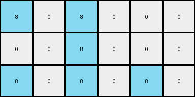
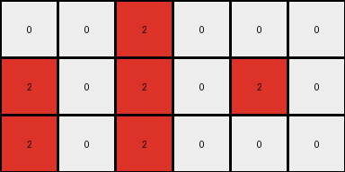
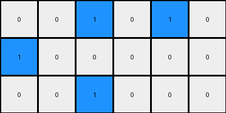

# 28bf18c6 • 005 • refine_dreamer

---


Previous Code:
```python
"""
1.  **Find the Cluster:** Identify a contiguous cluster of non-black (non-zero) pixels within the input grid.
2.  **Determine Bounding Box:** Calculate the bounding box of this cluster.
3.  **Calculate Output Dimensions:** The output grid always has 3 rows. The number of columns is twice the width of the bounding box.
4.  **Construct Output Grid:** Create a new grid. Fill by alternating between the color in the original image and black (0), starting from the top-left of the bounding box in the input, and inserting black.
5.  Return the result.
"""

import numpy as np

def find_cluster(grid):
    # Find coordinates of all non-zero pixels.
    coords = np.argwhere(grid != 0)
    if coords.size == 0:
        return None, None, None, None  # No cluster found
    min_row = np.min(coords[:, 0])
    max_row = np.max(coords[:, 0])
    min_col = np.min(coords[:, 1])
    max_col = np.max(coords[:, 1])
    return min_row, max_row, min_col, max_col

def transform(input_grid):
    input_grid = np.array(input_grid)
    # Find the bounding box of the non-zero cluster.
    min_row, max_row, min_col, max_col = find_cluster(input_grid)
    
    if min_row is None:  # Handle cases where no cluster is found
       return [[0]] # Return a 1x1 grid with a black pixel

    # Calculate output dimensions.
    output_rows = 3
    output_cols = (max_col - min_col + 1) * 2
    output_grid = np.zeros((output_rows, output_cols), dtype=int)

    # construct output
    for i in range(output_rows):
        output_col_index = 0
        for j in range(min_col, max_col + 1):
            # get input row, add modulo in case outside range
            input_row = min_row + i
            if input_row < input_grid.shape[0] and j < input_grid.shape[1]:
              output_grid[i, output_col_index] = input_grid[input_row, j]
            else:
                # if out of range use background
                output_grid[i, output_col_index] = 0
            output_col_index += 1
            # next is background
            output_grid[i, output_col_index] = 0  # black pixel
            output_col_index += 1

    
    return output_grid
```

Train Set Results:

## Example 1:

Input:
```
0 0 0 0 0 0 0 0
0 8 8 0 0 0 0 0
0 0 8 0 0 0 0 0
0 8 8 8 0 0 0 0
0 0 0 0 0 0 0 0
0 0 0 0 0 0 0 0
0 0 0 0 0 0 0 0
0 0 0 0 0 0 0 0
```
Expected Output:
```
8 8 0 8 8 0
0 8 0 0 8 0
8 8 8 8 8 8
```
Transformed Output:
```
8 0 8 0 0 0
0 0 8 0 0 0
8 0 8 0 8 0
```

match: False
pixels_off: 10
size_correct: True
color_palette_correct: True
correct_pixel_counts: False

## Example 2:

Input:
```
0 0 0 0 0 0 0 0
0 0 0 0 0 0 0 0
0 0 0 0 0 0 0 0
0 0 0 0 0 0 0 0
0 0 0 0 0 0 0 0
0 0 0 2 0 0 0 0
0 0 2 2 2 0 0 0
0 0 2 2 0 0 0 0
```
Expected Output:
```
0 2 0 0 2 0
2 2 2 2 2 2
2 2 0 2 2 0
```
Transformed Output:
```
0 0 2 0 0 0
2 0 2 0 2 0
2 0 2 0 0 0
```

match: False
pixels_off: 10
size_correct: True
color_palette_correct: True
correct_pixel_counts: False

## Example 3:

Input:
```
0 0 0 0 0 0 0 0
0 0 0 0 0 1 1 0
0 0 0 0 1 0 0 0
0 0 0 0 0 1 0 0
0 0 0 0 0 0 0 0
0 0 0 0 0 0 0 0
0 0 0 0 0 0 0 0
0 0 0 0 0 0 0 0
```
Expected Output:
```
0 1 1 0 1 1
1 0 0 1 0 0
0 1 0 0 1 0
```
Transformed Output:
```
0 0 1 0 1 0
1 0 0 0 0 0
0 0 1 0 0 0
```

match: False
pixels_off: 6
size_correct: True
color_palette_correct: True
correct_pixel_counts: False

**INSTRUCTIONS**

The code above was generated based on observations from the first training
example

we have tested the transform function on each of the task example inputs and
compared with the expected output

review each of the examples provided and the results and consider how the
natural language program should be updated to accommodate this new knowledge

respond with the following deliverables:

- general assessment of the information provided and strategy for resolving the
  errors
- gather metrics about each of the examples and results - use code_execution to
  develop accurate reports on your assumptions
- a YAML block documenting facts - Focus on identifying objects, their properties, and the actions performed on them.
- a natural language program - Be as clear and concise as possible, providing a complete description of the transformation rule.


your responses should be considered as information in a report - not a
conversation
