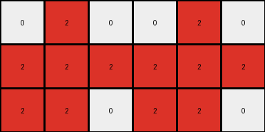

# 28bf18c6 • 011 • refine_dreamer

---


Previous Code:
```python
"""
1.  **Identify Source Rows**: Focus on bottom three rows of input.
2.  **Determine Width:** Calculate the width of the output grid. The width is determined by the columns containing non-zero pixels within the *source rows*. Find the leftmost and rightmost columns with non-zero values. The difference between the column indices plus one sets the base width.
3.  **Extract Pattern:** Create a new grid with a height of three rows and calculated width. Copy the color values of the pixels from the *source rows* into the new grid, maintaining their relative positions.
4.  **Double width**: create a new grid with double the base width
5. **Replicate Pattern:** Copy extracted pattern to the right of the original pattern.
"""

import numpy as np

def transform(input_grid):
    # Create a NumPy array from the input grid
    input_array = np.array(input_grid)

    # 1. Identify Source Rows: Focus on bottom three rows of the input
    rows, cols = input_array.shape
    start_row = max(0, rows - 3)  # Ensure start_row is not negative

    # 2. Determine Width: Calculate width based on non-zero columns in source rows
    source_rows = input_array[start_row:rows, :]
    non_zero_cols = np.where(np.any(source_rows != 0, axis=0))[0]

    if non_zero_cols.size > 0:  # Check for non zero columns
        leftmost_col = non_zero_cols[0]
        rightmost_col = non_zero_cols[-1]
        new_width = rightmost_col - leftmost_col + 1
    else:
      return []
    
    # 3. Extract Pattern & 4. Double Width
    output_grid = np.zeros((3, new_width * 2), dtype=int)
    output_grid[0:3, 0:new_width] = input_array[start_row:rows, leftmost_col:rightmost_col + 1]

    # 5. Replicate Pattern: Copy the extracted pattern to the right
    output_grid[0:3, new_width:new_width*2] = output_grid[0:3, 0:new_width]

    return output_grid.tolist()
```

Train Set Results:

## Example 1:

Input:
```
0 0 0 0 0 0 0 0
0 8 8 0 0 0 0 0
0 0 8 0 0 0 0 0
0 8 8 8 0 0 0 0
0 0 0 0 0 0 0 0
0 0 0 0 0 0 0 0
0 0 0 0 0 0 0 0
0 0 0 0 0 0 0 0
```
Expected Output:
```
8 8 0 8 8 0
0 8 0 0 8 0
8 8 8 8 8 8
```
Transformed Output:
```

```

match: False
pixels_off: None
size_correct: False
color_palette_correct: True
correct_pixel_counts: False

## Example 2:

Input:
```
0 0 0 0 0 0 0 0
0 0 0 0 0 0 0 0
0 0 0 0 0 0 0 0
0 0 0 0 0 0 0 0
0 0 0 0 0 0 0 0
0 0 0 2 0 0 0 0
0 0 2 2 2 0 0 0
0 0 2 2 0 0 0 0
```
Expected Output:
```
0 2 0 0 2 0
2 2 2 2 2 2
2 2 0 2 2 0
```
Transformed Output:
```
0 2 0 0 2 0
2 2 2 2 2 2
2 2 0 2 2 0
```

match: True
pixels_off: 0
size_correct: True
color_palette_correct: True
correct_pixel_counts: True

## Example 3:

Input:
```
0 0 0 0 0 0 0 0
0 0 0 0 0 1 1 0
0 0 0 0 1 0 0 0
0 0 0 0 0 1 0 0
0 0 0 0 0 0 0 0
0 0 0 0 0 0 0 0
0 0 0 0 0 0 0 0
0 0 0 0 0 0 0 0
```
Expected Output:
```
0 1 1 0 1 1
1 0 0 1 0 0
0 1 0 0 1 0
```
Transformed Output:
```

```

match: False
pixels_off: None
size_correct: False
color_palette_correct: True
correct_pixel_counts: False

**INSTRUCTIONS**

The code above was generated based on observations from the first training
example

we have tested the transform function on each of the task example inputs and
compared with the expected output

review each of the examples provided and the results and consider how the
natural language program should be updated to accommodate this new knowledge

respond with the following deliverables:

- general assessment of the information provided and strategy for resolving the
  errors
- gather metrics about each of the examples and results - use code_execution to
  develop accurate reports on your assumptions
- a YAML block documenting facts - Focus on identifying objects, their properties, and the actions performed on them.
- a natural language program - Be as clear and concise as possible, providing a complete description of the transformation rule.


your responses should be considered as information in a report - not a
conversation
