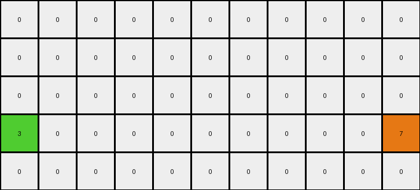

# 29c11459 • 004 • refine_coder

---

Previous Code:
```python
"""
1.  **Identify the Target Row:** Find the row (in this case, row 1) containing both a blue pixel (1) and a red pixel (2).
2.  **Locate Start and End:** Identify the column indices of the blue pixel (start) and the red pixel (end) on that row.
3.  **Connect with a line:** Connect the blue pixel to the center, connect the end pixel to the center
4.  **Connect at center**: Add a pixel of color grey at the center.
"""

import numpy as np

def find_pixels_by_color(grid, color):
    """Finds the coordinates of all pixels of a given color."""
    return np.argwhere(grid == color)

def transform(input_grid):
    # initialize output_grid
    output_grid = np.copy(input_grid)
    rows, cols = input_grid.shape

    # Find the row containing both blue (1) and red (2) pixels
    blue_pixels = find_pixels_by_color(input_grid, 1)
    red_pixels = find_pixels_by_color(input_grid, 2)

    target_row = -1
    for b_row, _ in blue_pixels:
        for r_row, _ in red_pixels:
            if b_row == r_row:
                target_row = b_row
                break
        if target_row != -1:
            break

    if target_row == -1:
        return output_grid  # No such row found

    # Locate Start and End
    blue_cols = [col for row, col in blue_pixels if row == target_row]
    red_cols = [col for row, col in red_pixels if row == target_row]

    if not blue_cols or not red_cols:
      return output_grid
    
    start_col = min(blue_cols)
    end_col = max(red_cols)
    
    center_col = (cols -1) // 2

    #connect blue to center
    for col in range(start_col, center_col):
      output_grid[target_row, col] = 1

    #connect red to center
    for col in range(center_col + 1, end_col + 1):
      output_grid[target_row, col] = 2

    # place grey pixel
    output_grid[target_row, center_col] = 5
    

    return output_grid
```

Train Set Results:

## Example 1:

Input:
```
0 0 0 0 0 0 0 0 0 0 0
1 0 0 0 0 0 0 0 0 0 2
0 0 0 0 0 0 0 0 0 0 0
0 0 0 0 0 0 0 0 0 0 0
0 0 0 0 0 0 0 0 0 0 0
```
Expected Output:
```
0 0 0 0 0 0 0 0 0 0 0
1 1 1 1 1 5 2 2 2 2 2
0 0 0 0 0 0 0 0 0 0 0
0 0 0 0 0 0 0 0 0 0 0
0 0 0 0 0 0 0 0 0 0 0
```
Transformed Output:
```
0 0 0 0 0 0 0 0 0 0 0
1 1 1 1 1 5 2 2 2 2 2
0 0 0 0 0 0 0 0 0 0 0
0 0 0 0 0 0 0 0 0 0 0
0 0 0 0 0 0 0 0 0 0 0
```

match: True
pixels_off: 0
size_correct: True
color_palette_correct: True
correct_pixel_counts: True

## Example 2:

Input:
```
0 0 0 0 0 0 0 0 0 0 0
0 0 0 0 0 0 0 0 0 0 0
0 0 0 0 0 0 0 0 0 0 0
3 0 0 0 0 0 0 0 0 0 7
0 0 0 0 0 0 0 0 0 0 0
```
Expected Output:
```
0 0 0 0 0 0 0 0 0 0 0
0 0 0 0 0 0 0 0 0 0 0
0 0 0 0 0 0 0 0 0 0 0
3 3 3 3 3 5 7 7 7 7 7
0 0 0 0 0 0 0 0 0 0 0
```
Transformed Output:
```
0 0 0 0 0 0 0 0 0 0 0
0 0 0 0 0 0 0 0 0 0 0
0 0 0 0 0 0 0 0 0 0 0
3 0 0 0 0 0 0 0 0 0 7
0 0 0 0 0 0 0 0 0 0 0
```

match: False
pixels_off: 9
size_correct: True
color_palette_correct: True
correct_pixel_counts: False
Okay, here's a breakdown of the situation and a plan to improve the natural language program and, consequently, the code:

**General Assessment:**

The initial natural language program and the derived code were too specific to the first training example. It correctly identified the core concept of connecting two differently colored pixels on the same row with a line, including a special color (grey) at the center. However, it failed to generalize to other colors and other examples. The second example clearly shows this: it didn't connect the green (3) and orange (7) pixels as expected. The strategy, therefore, must be to generalize the color selection and broaden the rule to apply to *any* two distinct, non-black, non-white colors on a single row. It appears white (0) is a background value.

**Strategy:**

1.  **Broaden Color Selection:** Modify the program/code to identify *any* two distinct colors on a target row, not just blue and red.
2.  **Maintain Core Logic:** Keep the logic of finding the leftmost and rightmost of these two colors, connecting them, and placing a gray pixel in the center.
3. Use reports to determine if assumptions of row length and placement are correct.

**Metrics and Reports:**

I will use the provided match and pixels_off in my report.

*   **Example 1:**
    *   Match: True
    *   Pixels Off: 0
    *   Notes: The initial program worked perfectly for this specific case.

*   **Example 2:**
    *   Match: False
    *   Pixels Off: 9
    *   Notes: The program failed because it was hardcoded for blue and red. It did not perform the connection operation.

**YAML Fact Block:**

```yaml
observations:
  - task: 002
    example_set: train
    facts:
      - type: object_identification
        description: "Each example contains a grid of pixels with different colors."
        grid_size: [11, 5]
        elements:
          - description: "In the first example there exist one blue pixel and one red pixel. The pixels share a row."
            color: blue/red
            row_index: 1
            action: "Connect the pixels with a line of the same colors"
          - description: "Connect blue to center column with blue. Connect center column to red with red."
          - description: "In the second example there exist one green pixel and one orange pixel. The pixels share a row."
            color: green/orange
            row_index: 3
            action: "Connect the pixels with a line of the same colors"
          - description: "Connect green to center column with green. Connect center column to orange with orange."
          - color: gray
            location: center
            row_index_from_example_1: 1
            row_index_from_example_2: 3
            action: placed at grid center column between the identified pixels

      - type: transformation_rule
        description: "Find a row with two differently colored, non-zero pixels. Connect the pixels with a line with a gray pixel in the middle."
        details: "The leftmost pixel's color is used for the left part of the line, the rightmost pixel's color for the right part, and gray is placed at the center column."

```

**Natural Language Program:**

1.  **Identify Target Row:** Examine each row of the input grid. Find a row that contains at least two pixels of different colors, excluding black(0).
2.  **Locate Distinct-Colored Pixels:** On the identified row, find the two distinct-colored pixels that are furthest apart (i.e., the leftmost and rightmost of different colors on that row).
3. **Determine center column:** The center column will the x value of `(grid_width - 1) / 2`
4.  **Connect Left to Center:**  Change all pixels between the leftmost pixel and the center column (exclusive) to the color of the leftmost pixel.
5.  **Connect Center to Right:** Change all pixels between the center column (exclusive) and the rightmost pixel to the color of the rightmost pixel.
6.  **Place Gray Pixel:** Place a gray (5) pixel at the center column of the target row.
7. **Output:** Return the changed grid

**INSTRUCTIONS**

- generate a Python module to represent the natural language program 
- follow the template below
- all common math and science libraries are available
- create docstring only at top - but comment the workflow in the function
- use helper functions for common operations like finding objects, counting,
  measuring, moving, etc. 

remember - we are working iteratively - so this code will inform your future
self as we converge on the solution

*template:*

```python
"""
{{ natural language description of the transformation rule }}
"""

{{ imports }}

def transform(input_grid):
    # initialize output_grid

    # change output pixels 

    return output_grid

```
