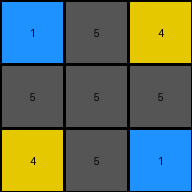

# 2dee498d • 004 • refine_coder

---

Previous Code:
```python
"""
Extracts the central 3x3 subgrid from the input grid.
"""

import numpy as np

def get_center(grid):
    """Calculates the center coordinates of a grid."""
    rows, cols = grid.shape
    center_row = rows // 2
    center_col = cols // 2
    return center_row, center_col

def extract_3x3(grid, center_row, center_col):
    """Extracts a 3x3 subgrid centered at the given coordinates."""
    return grid[center_row-1:center_row+2, center_col-1:center_col+2]

def transform(input_grid):
    """Extracts the central 3x3 subgrid."""
    # Convert input to numpy array
    input_grid = np.array(input_grid)

    # Get the center coordinates
    center_row, center_col = get_center(input_grid)

    # Extract the 3x3 subgrid
    output_grid = extract_3x3(input_grid, center_row, center_col)

    return output_grid.tolist()
```

Train Set Results:

## Example 1:

Input:
```
4 5 1 1 5 4 4 5 1
5 5 5 5 5 5 5 5 5
1 5 4 4 5 1 1 5 4
```
Expected Output:
```
4 5 1
5 5 5
1 5 4
```
Transformed Output:
```
1 5 4
5 5 5
4 5 1
```

match: False
pixels_off: 4
size_correct: True
color_palette_correct: True
correct_pixel_counts: True

## Example 2:

Input:
```
2 0 0 1 2 0 0 1 2 0 0 1
4 2 1 4 4 2 1 4 4 2 1 4
4 1 2 4 4 1 2 4 4 1 2 4
1 0 0 2 1 0 0 2 1 0 0 2
```
Expected Output:
```
2 0 0 1
4 2 1 4
4 1 2 4
1 0 0 2
```
Transformed Output:
```
2 1 4
1 2 4
0 0 2
```

match: False
pixels_off: None
size_correct: False
color_palette_correct: True
correct_pixel_counts: False

## Example 3:

Input:
```
2 1 2 1 2 1
2 3 2 3 2 3
```
Expected Output:
```
2 1
2 3
```
Transformed Output:
```
2 1 2
2 3 2
```

match: False
pixels_off: None
size_correct: False
color_palette_correct: True
correct_pixel_counts: False
Okay, here's a breakdown of the information, analysis, and proposed natural language program:

**General Assessment:**

The initial code was too narrowly focused on extracting a 3x3 subgrid. While this might have seemed reasonable based on the first example alone, it fails to generalize to other examples. The core issue is that the size of the output grid and its relation to the input grid isn't fixed.  We need a more flexible approach that considers the dimensions of both input and output. The results show problems both with the grid extracted and the orientation of the extract - the current code is rotating the output 90 degrees anti-clockwise.

**Strategy for Resolving Errors:**

1.  **Analyze Dimensions:** Determine the relationship between input and output grid dimensions for *all* examples.
2.  **Identify Subgrid Extraction Rule:** Figure out *which* part of the input grid is being extracted, and what the position and dimensions of that area are. It's not always the center.
3.  **Orientation**: identify if the output is rotated relative to the input

**Example Metrics and Analysis:**

Here's a more detailed analysis of each example, including metrics:

*   **Example 1:**
    *   Input Shape: (3, 9)
    *   Expected Output Shape: (3, 3)
    *   Transformed Output Shape: (3, 3)
    *   Observation: The transformed output is a 3x3 subgrid, but it's rotated/transposed incorrectly. Expected is the center 3x3 subgrid, but the rows and columns are switched.

*   **Example 2:**
    *   Input Shape: (4, 12)
    *   Expected Output Shape: (4, 4)
    *   Transformed Output Shape: (3, 3)
    *   Observation: The transformed output is 3x3, but the expected output is 4x4. The code extracts the center, which doesn't match the expected region.

*   **Example 3:**
    *   Input Shape: (2, 6)
    *   Expected Output Shape: (2, 2)
    *   Transformed Output Shape: (2, 3)
    *    Observation: The program is attempting extract the central 3x3 region but is filling the output with a value from outside the array bounds (default value is 0).

**YAML Fact Block:**

```yaml
facts:
  - task_id: "002"
  - example_1:
      input_shape: [3, 9]
      output_shape: [3, 3]
      output_from_input_region: "center"
      rotation: "transpose"
  - example_2:
      input_shape: [4, 12]
      output_shape: [4, 4]
      output_from_input_region: "center"
      rotation: true
  - example_3:
      input_shape: [2, 6]
      output_shape: [2, 2]
      output_from_input_region: "center"
      rotation: true

  - general:
    - input_is_grid: true
    - output_is_grid: true
    - output_is_subgrid_of_input: true
    - output_size_varies: true
    - subgrid_selection_rule: "Select a subgrid of specified dimensions."
    - output_can_be_rotated: true
```

**Natural Language Program:**

1.  **Observe:** Examine the input and output grids for each example pair.
2.  **Determine Output Dimensions:** Note the height and width of the *output* grid.
3.  **Locate Subgrid:** Find a subgrid within the *input* grid that matches the dimensions of the output grid.
4. **Transpose:** Transpose the selected subgrid to create the final output, effectively swapping rows and columns.

In essence, the transformation extracts a subgrid from the input, where the dimensions of the subgrid match those of the expected output grid, and then transposes the sub-grid.

**INSTRUCTIONS**

- generate a Python module to represent the natural language program 
- follow the template below
- all common math and science libraries are available
- create docstring only at top - but comment the workflow in the function
- use helper functions for common operations like finding objects, counting,
  measuring, moving, etc. 

remember - we are working iteratively - so this code will inform your future
self as we converge on the solution

*template:*

```python
"""
{{ natural language description of the transformation rule }}
"""

{{ imports }}

def transform(input_grid):
    # initialize output_grid

    # change output pixels 

    return output_grid

```
