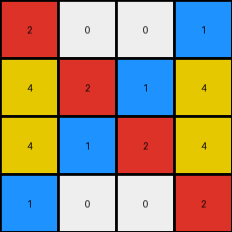

# 2dee498d • 009 • refine_dreamer

---


Previous Code:
```python
"""
Extracts the 4x4 subgrid located at the top-left corner of the input grid.
"""

import numpy as np

def transform(input_grid):
    """
    Extracts the top-left 4x4 subgrid from the input grid.

    Args:
        input_grid (list of lists): The input grid represented as a 2D list.

    Returns:
        list of lists: The 4x4 subgrid.
    """
    # Initialize the output grid as an empty list.
    output_grid = []

    # Iterate through the first 4 rows of the input grid.
    for i in range(4):
        # Extract the first 4 columns of the current row and append to output.
        output_grid.append(input_grid[i][:4])

    return output_grid
```

Train Set Results:

## Example 1:

Input:
```
4 5 1 1 5 4 4 5 1
5 5 5 5 5 5 5 5 5
1 5 4 4 5 1 1 5 4
```
Expected Output:
```
4 5 1
5 5 5
1 5 4
```
match: ERROR: index 3 is out of bounds for axis 0 with size 3
pixels_off: None
size_correct: None
color_palette_correct: None
correct_pixel_counts: None

## Example 2:

Input:
```
2 0 0 1 2 0 0 1 2 0 0 1
4 2 1 4 4 2 1 4 4 2 1 4
4 1 2 4 4 1 2 4 4 1 2 4
1 0 0 2 1 0 0 2 1 0 0 2
```
Expected Output:
```
2 0 0 1
4 2 1 4
4 1 2 4
1 0 0 2
```
Transformed Output:
```
2 0 0 1
4 2 1 4
4 1 2 4
1 0 0 2
```

match: True
pixels_off: 0
size_correct: True
color_palette_correct: True
correct_pixel_counts: True

## Example 3:

Input:
```
2 1 2 1 2 1
2 3 2 3 2 3
```
Expected Output:
```
2 1
2 3
```
match: ERROR: index 2 is out of bounds for axis 0 with size 2
pixels_off: None
size_correct: None
color_palette_correct: None
correct_pixel_counts: None

**INSTRUCTIONS**

The code above was generated based on observations from the first training
example

we have tested the transform function on each of the task example inputs and
compared with the expected output

review each of the examples provided and the results and consider how the
natural language program should be updated to accommodate this new knowledge

respond with the following deliverables:

- general assessment of the information provided and strategy for resolving the
  errors
- gather metrics about each of the examples and results - use code_execution to
  develop accurate reports on your assumptions
- a YAML block documenting facts - Focus on identifying objects, their properties, and the actions performed on them.
- a natural language program - Be as clear and concise as possible, providing a complete description of the transformation rule.


your responses should be considered as information in a report - not a
conversation
