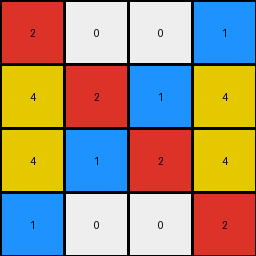

# 2dee498d • 015 • refine_dreamer

---

Previous Code:
```python
"""
The input grid is compressed by identifying a repeating 2x1 sub-grid pattern and extracting the first occurance.
The output grid represents this pattern.
"""

import numpy as np

def find_repeating_pattern(grid):
    rows, cols = grid.shape
    for c in range(1, cols + 1):
        pattern = grid[:, 0:c]
        # Check if the pattern repeats throughout the entire grid
        repeats = True
        for i in range(c, cols, c):
            if i + c > cols:
                if not np.array_equal(pattern[:, :cols-i], grid[:, i:cols]):
                   repeats = False
                   break

            elif not np.array_equal(pattern, grid[:, i:i + c]):
                repeats = False
                break
        if repeats:
            return pattern

    return None


def transform(input_grid):
    """
    Transforms the input grid by identifying and extracting a repeating 2x1 subgrid.
    """
    # Convert to numpy array for easier manipulation
    input_grid = np.array(input_grid)

    # Find the smallest repeating sub-grid.
    pattern = find_repeating_pattern(input_grid)
    if pattern is not None:
        output_grid = pattern
    else:
        output_grid = input_grid

    return output_grid.tolist()
```

Train Set Results:

## Example 1:

Input:
```
4 5 1 1 5 4 4 5 1
5 5 5 5 5 5 5 5 5
1 5 4 4 5 1 1 5 4
```
Expected Output:
```
4 5 1
5 5 5
1 5 4
```
Transformed Output:
```
4 5 1 1 5 4
5 5 5 5 5 5
1 5 4 4 5 1
```

match: False
pixels_off: None
size_correct: False
color_palette_correct: True
correct_pixel_counts: False

## Example 2:

Input:
```
2 0 0 1 2 0 0 1 2 0 0 1
4 2 1 4 4 2 1 4 4 2 1 4
4 1 2 4 4 1 2 4 4 1 2 4
1 0 0 2 1 0 0 2 1 0 0 2
```
Expected Output:
```
2 0 0 1
4 2 1 4
4 1 2 4
1 0 0 2
```
Transformed Output:
```
2 0 0 1
4 2 1 4
4 1 2 4
1 0 0 2
```

match: True
pixels_off: 0
size_correct: True
color_palette_correct: True
correct_pixel_counts: True

## Example 3:

Input:
```
2 1 2 1 2 1
2 3 2 3 2 3
```
Expected Output:
```
2 1
2 3
```
Transformed Output:
```
2 1
2 3
```

match: True
pixels_off: 0
size_correct: True
color_palette_correct: True
correct_pixel_counts: True
**INSTRUCTIONS**

The code above was generated based on observations from the first training
example

we have tested the transform function on each of the task example inputs and
compared with the expected output

review each of the examples provided and the results and consider how the
natural language program should be updated to accommodate this new knowledge

respond with the following deliverables:

- general assessment of the information provided and strategy for resolving the
  errors
- gather metrics about each of the examples and results - use code_execution to
  develop accurate reports on your assumptions
- a YAML block documenting facts - Focus on identifying objects, their properties, and the actions performed on them.
- a natural language program - Be as clear and concise as possible, providing a complete description of the transformation rule.


your responses should be considered as information in a report - not a
conversation
