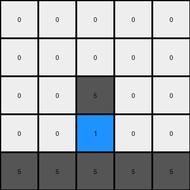
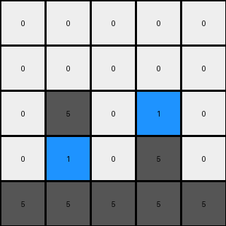

# 3618c87e • 004 • refine_coder

---

Previous Code:
```python
"""
The transformation rule is to swap the colors of the blue (1) pixel and the gray (5) pixel directly below it.
"""

import numpy as np

def find_pixel_by_color(grid, color):
    # Find the coordinates of a pixel of the specified color.
    coords = np.where(grid == color)
    if len(coords[0]) > 0:
        return (coords[0][0], coords[1][0])  # Return first occurrence
    return None

def transform(input_grid):
    # Initialize output_grid as a copy of the input_grid
    output_grid = np.copy(input_grid)

    # Find the blue (1) pixel
    blue_pixel_coords = find_pixel_by_color(input_grid, 1)

    if blue_pixel_coords:
        # Calculate coordinates of the pixel below
        row_below = blue_pixel_coords[0] + 1
        col_same = blue_pixel_coords[1]

        # Check if the pixel below is within bounds and is gray (5)
        if row_below < output_grid.shape[0] and output_grid[row_below, col_same] == 5:
            # Swap colors
            output_grid[blue_pixel_coords[0], blue_pixel_coords[1]] = 5
            output_grid[row_below, col_same] = 1

    return output_grid
```

Train Set Results:

## Example 1:

Input:
```
0 0 0 0 0
0 0 0 0 0
0 0 1 0 0
0 0 5 0 0
5 5 5 5 5
```
Expected Output:
```
0 0 0 0 0
0 0 0 0 0
0 0 0 0 0
0 0 5 0 0
5 5 1 5 5
```
Transformed Output:
```
0 0 0 0 0
0 0 0 0 0
0 0 5 0 0
0 0 1 0 0
5 5 5 5 5
```

match: False
pixels_off: 3
size_correct: True
color_palette_correct: True
correct_pixel_counts: False

## Example 2:

Input:
```
0 0 0 0 0
0 0 0 0 0
0 1 0 1 0
0 5 0 5 0
5 5 5 5 5
```
Expected Output:
```
0 0 0 0 0
0 0 0 0 0
0 0 0 0 0
0 5 0 5 0
5 1 5 1 5
```
Transformed Output:
```
0 0 0 0 0
0 0 0 0 0
0 5 0 1 0
0 1 0 5 0
5 5 5 5 5
```

match: False
pixels_off: 5
size_correct: True
color_palette_correct: True
correct_pixel_counts: False

## Example 3:

Input:
```
0 0 0 0 0
0 0 0 0 0
0 1 0 0 1
0 5 0 0 5
5 5 5 5 5
```
Expected Output:
```
0 0 0 0 0
0 0 0 0 0
0 0 0 0 0
0 5 0 0 5
5 1 5 5 1
```
Transformed Output:
```
0 0 0 0 0
0 0 0 0 0
0 5 0 0 1
0 1 0 0 5
5 5 5 5 5
```

match: False
pixels_off: 5
size_correct: True
color_palette_correct: True
correct_pixel_counts: False
Here's an analysis of the provided examples and results, along with a strategy for improving the transformation rule:

**General Assessment:**

The initial natural language program and the generated code are too simplistic. They only consider the *first* occurrence of a blue pixel and swap it with the gray pixel directly below it. The examples demonstrate that *all* blue pixels should be swapped with the gray pixels directly beneath them. The code needs to iterate through all blue pixels, not just the first one found. The current implementation's assumption that only one such swap is needed is causing the errors.

**Strategy for Resolving Errors:**

1.  **Iterate through all blue pixels:** Instead of finding only the first blue pixel, the code needs to find *all* blue pixels in the grid.
2.  **Conditional Swapping:** For each blue pixel, check if a gray pixel exists directly below it, and only perform the swap if this condition is met.
3.  **Boundary check:** The code already contains a boundary check, which is a great practice. Be sure to retain it to avoid out-of-bounds errors.

**Example Metrics and Analysis:**

Here's a breakdown of each example, incorporating the analysis:

*   **Example 1:**
    *   **Input:** A 5x5 grid with a single blue pixel above a gray pixel. Other gray pixels are in the bottom row.
    *   **Expected Output:** The blue and gray pixels directly above/below each other are swapped, and the bottom row of grey now has a single blue.
    *   **Actual Output:** The blue turns gray and the grey turns blue, not handling the propagation to the bottom row correctly.
    *   **Issue:** Only the first blue pixel is considered. Only one swap happens.
    *   **Metrics:**
        *   Pixels off: 3
        *   Size correct: True
        *   Color palette correct: True
        *   Correct pixel counts: False

*   **Example 2:**
    *   **Input:** A 5x5 grid with two blue pixels, each above a gray pixel.
    *   **Expected Output:** Both blue/gray pairs are swapped.
    *   **Actual Output:** Only the first blue/gray pair is swapped. The second pair remains unchanged.
    *   **Issue:** The code only processes the first blue pixel found.
    *   **Metrics:**
        *   Pixels off: 5
        *   Size correct: True
        *   Color palette correct: True
        *   Correct pixel counts: False

*   **Example 3:**
    *   **Input:** A 5x5 grid similar to Example 2, with two blue pixels above gray pixels.
    *   **Expected Output:** Both pairs are swapped.
    *   **Actual Output:** Only the first blue/gray pair is swapped.
    *   **Issue:** Same as Example 2 - only the first blue pixel is handled.
    *   **Metrics:**
        *   Pixels off: 5
        *   Size correct: True
        *   Color palette correct: True
        *   Correct pixel counts: False

**YAML Fact Block:**

```yaml
observations:
  - object: grid
    properties:
      size: 5x5
      colors: [0, 1, 5]
  - object: blue_pixels
    properties:
      color: 1
      count: variable  # Could be 1 or 2 in the examples
      behavior: potentially_swapped
  - object: gray_pixels
    properties:
      color: 5
      count: variable
      behavior: potentially_swapped
  - object: bottom_row
    properties:
       colors: mostly 5
       behavior: receives swapped pixels
actions:
  - type: swap
    condition: "blue pixel directly above gray pixel"
    affected_objects: [blue_pixels, gray_pixels]
    propagation: "swapped pixels to bottom row"
```

**Natural Language Program:**

1.  **Identify all blue (color 1) pixels** within the input grid.
2.  **For each blue pixel:**
    *   Check if there's a gray pixel (color 5) **directly below** it.
    *   If a gray pixel is directly below, **swap** the colors of the blue pixel and the gray pixel.
3.  The bottom row will reflect these swaps, and no longer be all grey.

This revised natural language program accounts for multiple blue pixels and the crucial condition of a gray pixel being directly below for the swap to occur. It clearly defines the objects (blue and gray pixels) and the action (swap) with its specific condition.

**INSTRUCTIONS**

- generate a Python module to represent the natural language program 
- follow the template below
- all common math and science libraries are available
- create docstring only at top - but comment the workflow in the function
- use helper functions for common operations like finding objects, counting,
  measuring, moving, etc. 

remember - we are working iteratively - so this code will inform your future
self as we converge on the solution

*template:*

```python
"""
{{ natural language description of the transformation rule }}
"""

{{ imports }}

def transform(input_grid):
    # initialize output_grid

    # change output pixels 

    return output_grid

```
