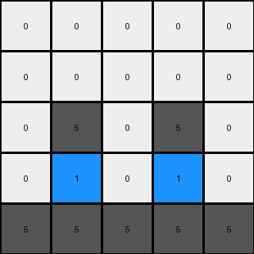
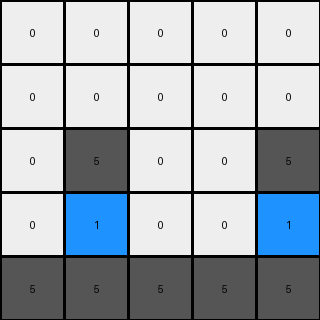

# 3618c87e • 005 • refine_dreamer

---


Previous Code:
```python
"""
1.  Identify all blue (color 1) pixels within the input grid.
2.  For each blue pixel:
    *   Check if there's a gray pixel (color 5) directly below it.
    *   If a gray pixel is directly below, swap the colors of the blue pixel and the gray pixel.
3.  The bottom row will reflect these swaps, and no longer be all grey.
"""

import numpy as np

def find_all_pixels_by_color(grid, color):
    # Find the coordinates of all pixels of the specified color.
    coords = np.where(grid == color)
    return list(zip(coords[0], coords[1]))

def transform(input_grid):
    # Initialize output_grid as a copy of the input_grid
    output_grid = np.copy(input_grid)

    # Find all blue (1) pixels
    blue_pixel_coords = find_all_pixels_by_color(input_grid, 1)

    for blue_pixel in blue_pixel_coords:
        # Calculate coordinates of the pixel below
        row_below = blue_pixel[0] + 1
        col_same = blue_pixel[1]

        # Check if the pixel below is within bounds and is gray (5)
        if row_below < output_grid.shape[0] and output_grid[row_below, col_same] == 5:
            # Swap colors
            output_grid[blue_pixel[0], blue_pixel[1]] = 5
            output_grid[row_below, col_same] = 1

    return output_grid
```

Train Set Results:

## Example 1:

Input:
```
0 0 0 0 0
0 0 0 0 0
0 0 1 0 0
0 0 5 0 0
5 5 5 5 5
```
Expected Output:
```
0 0 0 0 0
0 0 0 0 0
0 0 0 0 0
0 0 5 0 0
5 5 1 5 5
```
Transformed Output:
```
0 0 0 0 0
0 0 0 0 0
0 0 5 0 0
0 0 1 0 0
5 5 5 5 5
```

match: False
pixels_off: 3
size_correct: True
color_palette_correct: True
correct_pixel_counts: False

## Example 2:

Input:
```
0 0 0 0 0
0 0 0 0 0
0 1 0 1 0
0 5 0 5 0
5 5 5 5 5
```
Expected Output:
```
0 0 0 0 0
0 0 0 0 0
0 0 0 0 0
0 5 0 5 0
5 1 5 1 5
```
Transformed Output:
```
0 0 0 0 0
0 0 0 0 0
0 5 0 5 0
0 1 0 1 0
5 5 5 5 5
```

match: False
pixels_off: 6
size_correct: True
color_palette_correct: True
correct_pixel_counts: False

## Example 3:

Input:
```
0 0 0 0 0
0 0 0 0 0
0 1 0 0 1
0 5 0 0 5
5 5 5 5 5
```
Expected Output:
```
0 0 0 0 0
0 0 0 0 0
0 0 0 0 0
0 5 0 0 5
5 1 5 5 1
```
Transformed Output:
```
0 0 0 0 0
0 0 0 0 0
0 5 0 0 5
0 1 0 0 1
5 5 5 5 5
```

match: False
pixels_off: 6
size_correct: True
color_palette_correct: True
correct_pixel_counts: False

**INSTRUCTIONS**

The code above was generated based on observations from the first training
example

we have tested the transform function on each of the task example inputs and
compared with the expected output

review each of the examples provided and the results and consider how the
natural language program should be updated to accommodate this new knowledge

respond with the following deliverables:

- general assessment of the information provided and strategy for resolving the
  errors
- gather metrics about each of the examples and results - use code_execution to
  develop accurate reports on your assumptions
- a YAML block documenting facts - Focus on identifying objects, their properties, and the actions performed on them.
- a natural language program - Be as clear and concise as possible, providing a complete description of the transformation rule.


your responses should be considered as information in a report - not a
conversation
