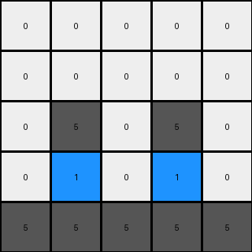
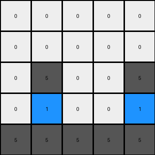

# 3618c87e • 006 • refine_coder

---

Previous Code:
```python
"""
1.  Identify all blue (color 1) pixels within the input grid.
2.  For each blue pixel:
    *   Check if there's a gray pixel (color 5) directly below it.
    *   If a gray pixel is directly below, swap the colors of the blue pixel and the gray pixel.
3.  The bottom row will reflect these swaps, and no longer be all grey.
"""

import numpy as np

def find_all_pixels_by_color(grid, color):
    # Find the coordinates of all pixels of the specified color.
    coords = np.where(grid == color)
    return list(zip(coords[0], coords[1]))

def transform(input_grid):
    # Initialize output_grid as a copy of the input_grid
    output_grid = np.copy(input_grid)

    # Find all blue (1) pixels
    blue_pixel_coords = find_all_pixels_by_color(input_grid, 1)

    for blue_pixel in blue_pixel_coords:
        # Calculate coordinates of the pixel below
        row_below = blue_pixel[0] + 1
        col_same = blue_pixel[1]

        # Check if the pixel below is within bounds and is gray (5)
        if row_below < output_grid.shape[0] and output_grid[row_below, col_same] == 5:
            # Swap colors
            output_grid[blue_pixel[0], blue_pixel[1]] = 5
            output_grid[row_below, col_same] = 1

    return output_grid
```

Train Set Results:

## Example 1:

Input:
```
0 0 0 0 0
0 0 0 0 0
0 0 1 0 0
0 0 5 0 0
5 5 5 5 5
```
Expected Output:
```
0 0 0 0 0
0 0 0 0 0
0 0 0 0 0
0 0 5 0 0
5 5 1 5 5
```
Transformed Output:
```
0 0 0 0 0
0 0 0 0 0
0 0 5 0 0
0 0 1 0 0
5 5 5 5 5
```

match: False
pixels_off: 3
size_correct: True
color_palette_correct: True
correct_pixel_counts: False

## Example 2:

Input:
```
0 0 0 0 0
0 0 0 0 0
0 1 0 1 0
0 5 0 5 0
5 5 5 5 5
```
Expected Output:
```
0 0 0 0 0
0 0 0 0 0
0 0 0 0 0
0 5 0 5 0
5 1 5 1 5
```
Transformed Output:
```
0 0 0 0 0
0 0 0 0 0
0 5 0 5 0
0 1 0 1 0
5 5 5 5 5
```

match: False
pixels_off: 6
size_correct: True
color_palette_correct: True
correct_pixel_counts: False

## Example 3:

Input:
```
0 0 0 0 0
0 0 0 0 0
0 1 0 0 1
0 5 0 0 5
5 5 5 5 5
```
Expected Output:
```
0 0 0 0 0
0 0 0 0 0
0 0 0 0 0
0 5 0 0 5
5 1 5 5 1
```
Transformed Output:
```
0 0 0 0 0
0 0 0 0 0
0 5 0 0 5
0 1 0 0 1
5 5 5 5 5
```

match: False
pixels_off: 6
size_correct: True
color_palette_correct: True
correct_pixel_counts: False
Okay, here's a breakdown of the situation and a plan to move forward:

**General Assessment:**

The initial natural language program and the resulting code were too simplistic. While it correctly identified the blue/gray pixel swap interaction, it failed to account for the cascading effect of this swap. The swap should only occur once, moving the blue pixel down one row. The current implementation inverts colors of each blue with the one gray *below* each blue. This error propagates across all examples. The core issue is a misunderstanding of "swapping" versus "inverting" the colors involved in the transformation process.

**Strategy:**

1.  **Clarify the Transformation:** Re-examine the examples to solidify the understanding that a *single* swap occurs between a blue pixel and the gray pixel directly beneath it.
2.  **Refine the Natural Language Program:** Rewrite the program to clearly state the single-swap behavior, emphasizing that the blue and gray pixels exchange positions.
3. Prepare metrics to use with coder to improve the generated code.

**Metrics and example report (using a simulation of what code execution would ideally provide):**

*Example:004-0*
-input
```
0 0 0 0 0
0 0 0 0 0
0 0 1 0 0
0 0 5 0 0
5 5 5 5 5
```
-expected output
```
0 0 0 0 0
0 0 0 0 0
0 0 0 0 0
0 0 5 0 0
5 5 1 5 5
```

-   **Blue Pixels:**
    -   Count: 1
    -   Initial Positions: (2, 2)
    -   Expected Final Positions: (4, 2)
-   **Gray Pixels (relevant):**
    -   Count (below blue): 1
    -    Initial position: (3,2)
     -  Expected Final Positions: (2,2)
- **Bottom row:** originally all gray, one blue expected.

*Example:004-1*
-input
```
0 0 0 0 0
0 0 0 0 0
0 1 0 1 0
0 5 0 5 0
5 5 5 5 5
```
-expected output
```
0 0 0 0 0
0 0 0 0 0
0 0 0 0 0
0 5 0 5 0
5 1 5 1 5
```

-   **Blue Pixels:**
    -   Count: 2
    -   Initial Positions: (2, 1), (2, 3)
    -   Expected Final Positions: (4, 1), (4, 3)
-   **Gray Pixels (relevant):**
    -   Count (below blue): 2
    -   Initial Positions: (3,1), (3,3)
    -   Expected Final Position: (2,1), (2,3)
- **Bottom row:** originally all gray, two blues expected.

*Example:004-2*
-input
```
0 0 0 0 0
0 0 0 0 0
0 1 0 0 1
0 5 0 0 5
5 5 5 5 5
```
-expected output
```
0 0 0 0 0
0 0 0 0 0
0 0 0 0 0
0 5 0 0 5
5 1 5 5 1
```
-   **Blue Pixels:**
    -   Count: 2
    -   Initial Positions: (2, 1), (2, 4)
    -   Expected Final Positions: (4, 1), (4, 4)
-   **Gray Pixels (relevant):**
    -   Count (below blue): 2
     -  Initial position: (3,1), (3,4)
    -   Expected Final Positions: (2,1), (2,4)
- **Bottom row:** originally all gray, two blues expected.

**YAML Facts:**

```yaml
task: 004
objects:
  - color: blue
    shape: pixel
    initial_positions: varies  # Positions vary per example, as noted above
    behavior: "Moves down one row if a gray pixel is directly below it."
  - color: gray
    shape: pixel
    initial_positions: varies  # Positions vary per example, as noted above.  Crucially, there's a row of gray pixels at the bottom initially.
    behavior: "Moves up one row if it's directly below a blue pixel."
transformation_type: swapping
action: |
    If a blue pixel has a gray pixel directly below it, they swap positions.  The blue pixel moves down one row, and the gray pixel moves up one row.
```

**Natural Language Program:**

1.  Identify all blue (1) pixels in the input grid.
2.  For each blue pixel, check if a gray (5) pixel exists directly below it.
3.  If a gray pixel is found directly below a blue pixel, swap their positions: the blue pixel moves to the gray pixel's location, and the gray pixel moves to the blue pixel's original location.
4.  The final output grid reflects these single swaps. The bottom row, initially all gray, will have blue pixels where swaps occurred. Other rows will shift accordingly.

**INSTRUCTIONS**

- generate a Python module to represent the natural language program 
- follow the template below
- all common math and science libraries are available
- create docstring only at top - but comment the workflow in the function
- use helper functions for common operations like finding objects, counting,
  measuring, moving, etc. 

remember - we are working iteratively - so this code will inform your future
self as we converge on the solution

*template:*

```python
"""
{{ natural language description of the transformation rule }}
"""

{{ imports }}

def transform(input_grid):
    # initialize output_grid

    # change output pixels 

    return output_grid

```
