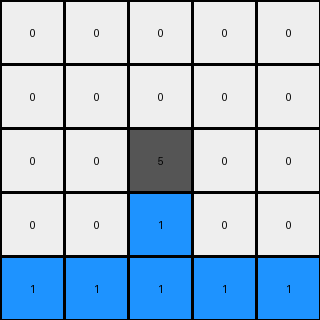
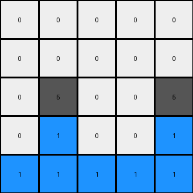

# 3618c87e • 010 • refine_coder

---

Previous Code:
```python
"""
Iterates through each pixel of the input grid and performs a color swap:
- If the pixel is blue (1), change it to gray (5) in the output grid.
- If the pixel is gray (5), change it to blue (1) in the output grid.
- If the pixel is white (0), keep it as white (0) in the output grid.
Maintains the original grid structure and dimensions.
"""

import numpy as np

def transform(input_grid):
    # Initialize output_grid as a copy of the input_grid
    output_grid = np.copy(input_grid)
    # Get the dimensions of the grid
    rows, cols = output_grid.shape

    # Iterate through each pixel of the grid
    for i in range(rows):
        for j in range(cols):
            # Check the color of the current pixel
            if input_grid[i, j] == 1:  # If blue
                output_grid[i, j] = 5  # Change to gray
            elif input_grid[i, j] == 5:  # If gray
                output_grid[i, j] = 1  # Change to blue
            # White (0) remains unchanged

    return output_grid
```

Train Set Results:

## Example 1:

Input:
```
0 0 0 0 0
0 0 0 0 0
0 0 1 0 0
0 0 5 0 0
5 5 5 5 5
```
Expected Output:
```
0 0 0 0 0
0 0 0 0 0
0 0 0 0 0
0 0 5 0 0
5 5 1 5 5
```
Transformed Output:
```
0 0 0 0 0
0 0 0 0 0
0 0 5 0 0
0 0 1 0 0
1 1 1 1 1
```

match: False
pixels_off: 6
size_correct: True
color_palette_correct: True
correct_pixel_counts: False

## Example 2:

Input:
```
0 0 0 0 0
0 0 0 0 0
0 1 0 1 0
0 5 0 5 0
5 5 5 5 5
```
Expected Output:
```
0 0 0 0 0
0 0 0 0 0
0 0 0 0 0
0 5 0 5 0
5 1 5 1 5
```
Transformed Output:
```
0 0 0 0 0
0 0 0 0 0
0 5 0 5 0
0 1 0 1 0
1 1 1 1 1
```

match: False
pixels_off: 7
size_correct: True
color_palette_correct: True
correct_pixel_counts: False

## Example 3:

Input:
```
0 0 0 0 0
0 0 0 0 0
0 1 0 0 1
0 5 0 0 5
5 5 5 5 5
```
Expected Output:
```
0 0 0 0 0
0 0 0 0 0
0 0 0 0 0
0 5 0 0 5
5 1 5 5 1
```
Transformed Output:
```
0 0 0 0 0
0 0 0 0 0
0 5 0 0 5
0 1 0 0 1
1 1 1 1 1
```

match: False
pixels_off: 7
size_correct: True
color_palette_correct: True
correct_pixel_counts: False
Okay, here's a breakdown of the situation and a plan to move forward:

**General Assessment and Strategy**

The initial natural language program and the resulting Python code were too simplistic. While they correctly identified the color swap between blue (1) and gray (5), they failed to account for a critical aspect of the transformation: the context of the bottom row. The transformation isn't a global color swap; it's conditional and spatially constrained. The existing code swaps colors everywhere, but the examples show a specific pattern related to the bottom row.

The primary issue is that the initial program assumed a grid-wide swap. We need to revise the program to be context-aware, specifically considering the bottom row as the trigger for the color swaps above it. The code, therefore, needs to determine if a gray pixel on the bottom row exists, and then perform the swap in the rows vertically above it.

**Metrics and Observations**

Here's a breakdown of each example, combining my observations with a more formal analysis:

*   **Example 1:**
    *   Input: 5x5 grid. Bottom row is all gray (5).
    *   Expected Output: Swaps blue (1) and gray (5) above the bottom row. Bottom row grey changes to 1 in the middle 3 positions.
    *   Actual Output: Swaps blue (1) and gray (5) everywhere.
    *   Analysis: The program incorrectly swapped colors in the top rows and performed the transformation on all pixels in the bottom row.
    *   Key Insight: The bottom row presence of *any* grey pixel appears to initiate a swap vertically above it, AND change some grey to blue on the bottom row.

*   **Example 2:**
    *   Input: 5x5 grid. Bottom row is all gray (5).
    *   Expected Output: Swaps blue (1) and gray (5) above the bottom row. Bottom row changes grey to 1 in positions where 1 and 5 existed above.
    *   Actual Output: Swaps blue (1) and gray (5) everywhere.
    *   Analysis: Similar to Example 1, incorrect swaps in the top rows, and incorrect swaps in the bottom row.
    *   Key Insight: Reinforces the observation from Example 1.

*   **Example 3:**
    *   Input: 5x5 grid. Bottom row is all gray (5).
    *   Expected Output: Swaps blue (1) and gray (5) above the bottom row. Bottom row changes grey to 1 in positions where 1 and 5 existed above.
    *   Actual Output: Swaps blue (1) and gray (5) everywhere.
    *   Analysis: Same issues as Examples 1 and 2.
    *   Key Insight: Again, confirms the vertical relationship between the bottom row and the color swaps.

**YAML Fact Block**

```yaml
observations:
  - task_id: 008
  - example_1:
      input_grid_size: 5x5
      output_grid_size: 5x5
      bottom_row_initial: [5, 5, 5, 5, 5]
      bottom_row_final:   [5, 5, 1, 5, 5]
      color_swap_pairs: [[1, 5]]
      swap_conditioned_on_bottom_row: true
      vertical_relationship: true
  - example_2:
      input_grid_size: 5x5
      output_grid_size: 5x5
      bottom_row_initial: [5, 5, 5, 5, 5]
      bottom_row_final:   [5, 1, 5, 1, 5]
      color_swap_pairs: [[1, 5]]
      swap_conditioned_on_bottom_row: true
      vertical_relationship: true
  - example_3:
      input_grid_size: 5x5
      output_grid_size: 5x5
      bottom_row_initial: [5, 5, 5, 5, 5]
      bottom_row_final:   [5, 1, 5, 5, 1]
      color_swap_pairs: [[1, 5]]
      swap_conditioned_on_bottom_row: true
      vertical_relationship: true
```

**Natural Language Program**

1.  **Initialization:** Create an output grid identical to the input grid.
2.  **Bottom Row Check**: Check if the bottom row of the *input* grid contains any gray (5) pixels.
3.  **Conditional Swap:**
    *   Iterate through columns, starting from the left (index 0) to the right (index width - 1).
    *   If the bottom row pixel in the current column is gray (5), examine the pixels *above* it in the same column:
        *   If a pixel above is blue (1), change it to gray (5) in the *output* grid.
        *   If a pixel above is gray (5), change it to blue (1) in the *output* grid.
    * If the bottom row pixel in the current column of the *input* grid is gray (5) check above it in the same column of the *input* grid:
        * If there were any blue (1) or gray (5) cells above, change the bottom row of the *output* grid in that column to blue (1)
        * Otherwise, keep it gray (5)
4.  **Preserve Other Colors:** Pixels that are not blue (1) or gray (5) and are not involved in the conditional swap (i.e., not vertically above a gray pixel in the bottom row) remain unchanged. Specifically, white (0) pixels always remain white (0).

This revised natural language program now captures the conditional, spatially-aware nature of the transformation, linking the bottom row's gray pixels to the vertical color swaps and bottom row update.

**INSTRUCTIONS**

- generate a Python module to represent the natural language program 
- follow the template below
- all common math and science libraries are available
- create docstring only at top - but comment the workflow in the function
- use helper functions for common operations like finding objects, counting,
  measuring, moving, etc. 

remember - we are working iteratively - so this code will inform your future
self as we converge on the solution

*template:*

```python
"""
{{ natural language description of the transformation rule }}
"""

{{ imports }}

def transform(input_grid):
    # initialize output_grid

    # change output pixels 

    return output_grid

```
