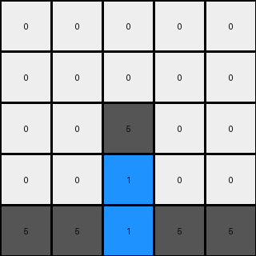

# 3618c87e • 011 • refine_dreamer

---

Previous Code:
```python
"""
1.  **Initialization:** Create an output grid identical to the input grid.
2.  **Bottom Row Check**: Check if the bottom row of the *input* grid contains any gray (5) pixels.
3.  **Conditional Swap:**
    *   Iterate through columns, starting from the left (index 0) to the right (index width - 1).
    *   If the bottom row pixel in the current column is gray (5), examine the pixels *above* it in the same column:
        *   If a pixel above is blue (1), change it to gray (5) in the *output* grid.
        *   If a pixel above is gray (5), change it to blue (1) in the *output* grid.
    * If the bottom row pixel in the current column of the *input* grid is gray (5) check above it in the same column of the *input* grid:
        * If there were any blue (1) or gray (5) cells above, change the bottom row of the *output* grid in that column to blue (1)
        * Otherwise, keep it gray (5)
4.  **Preserve Other Colors:** Pixels that are not blue (1) or gray (5) and are not involved in the conditional swap (i.e., not vertically above a gray pixel in the bottom row) remain unchanged. Specifically, white (0) pixels always remain white (0).
"""

import numpy as np

def transform(input_grid):
    # Initialize output_grid as a copy of the input_grid
    output_grid = np.copy(input_grid)
    rows, cols = input_grid.shape
    bottom_row = input_grid[-1, :]

    # Iterate through columns
    for j in range(cols):
        # Check if the bottom row pixel is gray (5)
        if bottom_row[j] == 5:
            # Conditional swap in the column above
            for i in range(rows - 1):  # Iterate through rows above the bottom row
                if input_grid[i, j] == 1:  # If blue
                    output_grid[i, j] = 5  # Change to gray
                elif input_grid[i, j] == 5:  # If gray
                    output_grid[i, j] = 1  # Change to blue
            
            # Check for blue(1) or gray(5) above and modify the bottom row of output grid.
            found = False
            for i in range(rows-1):
                if input_grid[i,j] == 1 or input_grid[i,j] == 5:
                    found = True
                    break
            if found:
                output_grid[-1,j] = 1

    return output_grid
```

Train Set Results:

## Example 1:

Input:
```
0 0 0 0 0
0 0 0 0 0
0 0 1 0 0
0 0 5 0 0
5 5 5 5 5
```
Expected Output:
```
0 0 0 0 0
0 0 0 0 0
0 0 0 0 0
0 0 5 0 0
5 5 1 5 5
```
Transformed Output:
```
0 0 0 0 0
0 0 0 0 0
0 0 5 0 0
0 0 1 0 0
5 5 1 5 5
```

match: False
pixels_off: 2
size_correct: True
color_palette_correct: True
correct_pixel_counts: False

## Example 2:

Input:
```
0 0 0 0 0
0 0 0 0 0
0 1 0 1 0
0 5 0 5 0
5 5 5 5 5
```
Expected Output:
```
0 0 0 0 0
0 0 0 0 0
0 0 0 0 0
0 5 0 5 0
5 1 5 1 5
```
Transformed Output:
```
0 0 0 0 0
0 0 0 0 0
0 5 0 5 0
0 1 0 1 0
5 1 5 1 5
```

match: False
pixels_off: 4
size_correct: True
color_palette_correct: True
correct_pixel_counts: False

## Example 3:

Input:
```
0 0 0 0 0
0 0 0 0 0
0 1 0 0 1
0 5 0 0 5
5 5 5 5 5
```
Expected Output:
```
0 0 0 0 0
0 0 0 0 0
0 0 0 0 0
0 5 0 0 5
5 1 5 5 1
```
Transformed Output:
```
0 0 0 0 0
0 0 0 0 0
0 5 0 0 5
0 1 0 0 1
5 1 5 5 1
```

match: False
pixels_off: 4
size_correct: True
color_palette_correct: True
correct_pixel_counts: False
**INSTRUCTIONS**

The code above was generated based on observations from the first training
example

we have tested the transform function on each of the task example inputs and
compared with the expected output

review each of the examples provided and the results and consider how the
natural language program should be updated to accommodate this new knowledge

respond with the following deliverables:

- general assessment of the information provided and strategy for resolving the
  errors
- gather metrics about each of the examples and results - use code_execution to
  develop accurate reports on your assumptions
- a YAML block documenting facts - Focus on identifying objects, their properties, and the actions performed on them.
- a natural language program - Be as clear and concise as possible, providing a complete description of the transformation rule.


your responses should be considered as information in a report - not a
conversation
