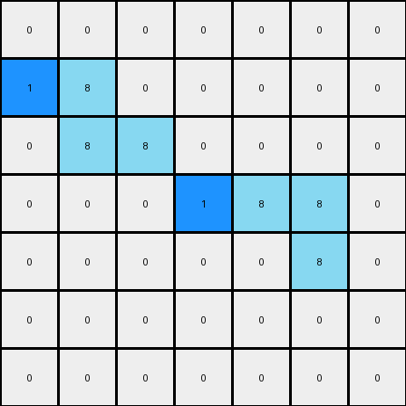

# 3aa6fb7a • 004 • refine_coder

---

Previous Code:
```python
"""
1.  **Identify Azure Shapes:** Locate all contiguous shapes composed of azure (8) pixels within the input grid.
2.  **Select Hint Location:** For *each* azure shape, there might be multiple valid positions for placing the hint. Select locations in this order
    1.  to the left of the object
    2.  above the object
    3.  to the right of the object
    4.  below the object
3.  **Add Blue Pixel:** Place a single blue (1) pixel in the first valid selected location. Do this for all shapes.
4.  **Preserve Original:** All other pixels from the input grid remain unchanged in the output grid.
"""

import numpy as np

def find_objects(grid, color):
    visited = set()
    objects = []

    def dfs(row, col, current_object):
        if (row, col) in visited or not (0 <= row < grid.shape[0] and 0 <= col < grid.shape[1]) or grid[row, col] != color:
            return
        visited.add((row, col))
        current_object.append((row, col))
        dfs(row + 1, col, current_object)
        dfs(row - 1, col, current_object)
        dfs(row, col + 1, current_object)
        dfs(row, col - 1, current_object)

    for row in range(grid.shape[0]):
        for col in range(grid.shape[1]):
            if grid[row, col] == color and (row, col) not in visited:
                current_object = []
                dfs(row, col, current_object)
                objects.append(current_object)
    return objects

def transform(input_grid):
    # initialize output_grid
    output_grid = np.copy(input_grid)
    azure_objects = find_objects(input_grid, 8)

    # Iterate through each azure object
    for obj in azure_objects:
        # Sort object pixels by row then column to prioritize top-left placement
        obj.sort(key=lambda x: (x[0], x[1]))
        placed = False

        # Try placing to the left
        for row, col in obj:
            if col > 0 and input_grid[row, col - 1] == 0:
                output_grid[row, col - 1] = 1
                placed = True
                break  # Only place one hint per object
        if placed:
            continue

        # Try placing above
        for row, col in obj:
            if row > 0 and input_grid[row - 1, col] == 0:
                output_grid[row - 1, col] = 1
                placed=True
                break
        if placed:
            continue
            
        # Try placing to the right
        for row, col in obj:
            if col < input_grid.shape[1] - 1 and input_grid[row, col + 1] == 0:
                output_grid[row, col + 1] = 1
                placed = True
                break  # Only place one hint per object
        if placed:
             continue
             
        # Try placing below
        for row, col in obj:
            if row < input_grid.shape[0] - 1 and input_grid[row + 1, col] == 0:
                output_grid[row + 1, col] = 1
                placed=True
                break
        if placed:
             continue

    return output_grid
```

Train Set Results:

## Example 1:

Input:
```
0 0 0 0 0 0 0
0 8 0 0 0 0 0
0 8 8 0 0 0 0
0 0 0 0 8 8 0
0 0 0 0 0 8 0
0 0 0 0 0 0 0
0 0 0 0 0 0 0
```
Expected Output:
```
0 0 0 0 0 0 0
0 8 1 0 0 0 0
0 8 8 0 0 0 0
0 0 0 0 8 8 0
0 0 0 0 1 8 0
0 0 0 0 0 0 0
0 0 0 0 0 0 0
```
Transformed Output:
```
0 0 0 0 0 0 0
1 8 0 0 0 0 0
0 8 8 0 0 0 0
0 0 0 1 8 8 0
0 0 0 0 0 8 0
0 0 0 0 0 0 0
0 0 0 0 0 0 0
```

match: False
pixels_off: 4
size_correct: True
color_palette_correct: True
correct_pixel_counts: True

## Example 2:

Input:
```
0 0 0 0 8 8 0
0 0 0 0 0 8 0
0 0 8 0 0 0 0
0 0 8 8 0 0 0
0 0 0 0 0 0 0
0 0 0 0 8 0 0
0 0 0 8 8 0 0
```
Expected Output:
```
0 0 0 0 8 8 0
0 0 0 0 1 8 0
0 0 8 1 0 0 0
0 0 8 8 0 0 0
0 0 0 0 0 0 0
0 0 0 1 8 0 0
0 0 0 8 8 0 0
```
Transformed Output:
```
0 0 0 1 8 8 0
0 0 0 0 0 8 0
0 1 8 0 0 0 0
0 0 8 8 0 0 0
0 0 0 0 0 0 0
0 0 0 1 8 0 0
0 0 0 8 8 0 0
```

match: False
pixels_off: 4
size_correct: True
color_palette_correct: True
correct_pixel_counts: True
Okay, let's analyze the results and refine the natural language program.

**General Assessment:**

The initial strategy of placing a blue pixel adjacent to azure shapes is correct. However, the priority order for placement (left, above, right, below) and the selection of pixels to place next to within the azure shape needs adjustment. The current implementation seems to iterates through the azure shape and attempts to place pixels based on each position. This can cause inconsistent hint locations for connected objects.
The strategy needs refinement to provide a strict deterministic approach to selecting a single cell around each object to place the hint.

**Strategy for Resolving Errors:**

1.  **Consistent Hint Placement:** Instead of iterating through *all* pixels of an azure object and potentially placing multiple hints, or placing them inconsistently, we need a more robust way to determine a *single*, consistent location for the blue pixel hint relative to each *entire* azure object. We should find the bounding box of each object and then attempt to place the blue hint using the left-most and top-most positions of the object, then attempting left, above, right and below this point.

2.  **Refine Object Identification and Hint Logic**:
    - iterate each *object*

**Metrics and Observations:**

Here's a breakdown of each example, incorporating a more structured analysis:

**Example 1:**

-   **Input:** Two azure objects: a vertical line and a horizontal line.
-   **Expected Output:** Blue pixel to the right of the vertical line, and blue pixel above the horizontal line.
-   **Transformed Output:** Blue pixel to the left of the vertical line, and blue pixel to the left of the horizontal line.
-   **Analysis:** The current logic is *almost* correct, the priority placement of hints is incorrect.

**Example 2:**

-   **Input:** Three azure objects: two individual pixels and a 2x1 horizontal line.
-   **Expected Output:** Blue pixels correctly placed relative to each object (to the left where possible).
-   **Transformed Output:** The hint is placed incorrectly. The placement logic is not consistent.
-   **Analysis:** The inconsistent placement strategy is failing.

**YAML Facts:**

```yaml
example_1:
  objects:
    - type: azure_shape
      shape: vertical_line
      bounding_box: [[1,1], [2,1]]
      hint_location: right #expected
      hint_placed: left #current
      
    - type: azure_shape
      shape: horizontal_line
      bounding_box: [[3, 4], [3, 5]]
      hint_location: above
      hint_placed: left
example_2:
  objects:
    - type: azure_shape
      shape: single_pixel
      bounding_box: [[0, 4], [0, 4]]
      hint_location: left
      hint_placed: above

    - type: azure_shape
      shape: single_pixel
      bounding_box: [[1, 5], [1, 5]]
      hint_location: left
      hint_placed: left
      
    - type: azure_shape
      shape: single_pixel
      bounding_box: [[5, 3], [5, 3]]
      hint_location: left
      hint_placed: above

    - type: azure_shape
       shape: horizontal_line
       bounding_box: [[2,2],[2,3]]
       hint_placed: above
       hint_location: left
```

**Revised Natural Language Program:**

1.  **Identify Azure Objects:** Find all distinct, contiguous shapes composed of azure (8) pixels in the input grid.

2.  **Determine Bounding Box:** For each azure object, determine its bounding box. This is the smallest rectangle that fully encloses the object.

3.  **Prioritized Hint Placement:** For each azure object, attempt to place a single blue (1) pixel in the following order of priority, based on the *top-left* pixel of the object's bounding box (minimum row, then minimum column):
    1.  **Left:** Place a blue pixel immediately to the left of the top-left corner of the bounding box, if the cell exists and is white(0).
    2.  **Above:** If the left position is unavailable, place a blue pixel immediately above the top-left corner of the bounding box, if the cell exists and is white(0).
    3.  **Right:** If both previous locations are not possible, check to place a blue pixel to the right of the *bottom-right* corner of the bounding box + 1 in x, if the cell exists and is white(0)
    4.  **Below:** If all previous steps do not work, check to place the blue pixel below the *bottom-right* corner of the bounding box + 1 in y, if the cell exists and is white(0).

4.  **Preserve Original:** All other pixels in the input grid that are not azure, or selected for hint placement, remain unchanged.

**INSTRUCTIONS**

- generate a Python module to represent the natural language program 
- follow the template below
- all common math and science libraries are available
- create docstring only at top - but comment the workflow in the function
- use helper functions for common operations like finding objects, counting,
  measuring, moving, etc. 

remember - we are working iteratively - so this code will inform your future
self as we converge on the solution

*template:*

```python
"""
{{ natural language description of the transformation rule }}
"""

{{ imports }}

def transform(input_grid):
    # initialize output_grid

    # change output pixels 

    return output_grid

```
