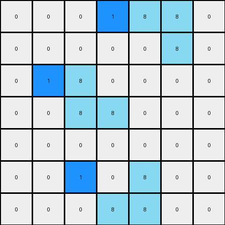

# 3aa6fb7a • 005 • refine_dreamer

---


Previous Code:
```python
"""
1.  **Identify Azure Objects:** Find all distinct, contiguous shapes composed of azure (8) pixels in the input grid.

2.  **Determine Bounding Box:** For each azure object, determine its bounding box. This is the smallest rectangle that fully encloses the object.

3.  **Prioritized Hint Placement:** For each azure object, attempt to place a single blue (1) pixel in the following order of priority, based on the *top-left* pixel of the object's bounding box (minimum row, then minimum column):
    1.  **Left:** Place a blue pixel immediately to the left of the top-left corner of the bounding box, if the cell exists and is white(0).
    2.  **Above:** If the left position is unavailable, place a blue pixel immediately above the top-left corner of the bounding box, if the cell exists and is white(0).
    3.  **Right:** If both previous locations are not possible, check to place a blue pixel to the right of the *bottom-right* corner of the bounding box + 1 in x, if the cell exists and is white(0)
    4.  **Below:** If all previous steps do not work, check to place the blue pixel below the *bottom-right* corner of the bounding box + 1 in y, if the cell exists and is white(0).

4.  **Preserve Original:** All other pixels in the input grid that are not azure, or selected for hint placement, remain unchanged.
"""

import numpy as np

def find_objects(grid, color):
    visited = set()
    objects = []

    def dfs(row, col, current_object):
        if (row, col) in visited or not (0 <= row < grid.shape[0] and 0 <= col < grid.shape[1]) or grid[row, col] != color:
            return
        visited.add((row, col))
        current_object.append((row, col))
        dfs(row + 1, col, current_object)
        dfs(row - 1, col, current_object)
        dfs(row, col + 1, current_object)
        dfs(row, col - 1, current_object)

    for row in range(grid.shape[0]):
        for col in range(grid.shape[1]):
            if grid[row, col] == color and (row, col) not in visited:
                current_object = []
                dfs(row, col, current_object)
                objects.append(current_object)
    return objects

def get_bounding_box(obj):
    min_row = min(pixel[0] for pixel in obj)
    max_row = max(pixel[0] for pixel in obj)
    min_col = min(pixel[1] for pixel in obj)
    max_col = max(pixel[1] for pixel in obj)
    return (min_row, min_col), (max_row, max_col)

def transform(input_grid):
    # initialize output_grid
    output_grid = np.copy(input_grid)
    azure_objects = find_objects(input_grid, 8)

    # Iterate through each azure object
    for obj in azure_objects:
        top_left, bottom_right = get_bounding_box(obj)
        min_row, min_col = top_left
        max_row, max_col = bottom_right

        # Try placing to the left
        if min_col > 0 and input_grid[min_row, min_col - 1] == 0:
            output_grid[min_row, min_col - 1] = 1
            continue

        # Try placing above
        if min_row > 0 and input_grid[min_row - 1, min_col] == 0:
            output_grid[min_row - 1, min_col] = 1
            continue

        # Try placing to the right
        if max_col < input_grid.shape[1] - 1 and input_grid[max_row, max_col + 1] == 0:
            output_grid[max_row, max_col + 1] = 1
            continue

        # Try placing below
        if max_row < input_grid.shape[0] - 1 and input_grid[max_row + 1, max_col] == 0:
            output_grid[max_row + 1, max_col] = 1
            continue

    return output_grid
```

Train Set Results:

## Example 1:

Input:
```
0 0 0 0 0 0 0
0 8 0 0 0 0 0
0 8 8 0 0 0 0
0 0 0 0 8 8 0
0 0 0 0 0 8 0
0 0 0 0 0 0 0
0 0 0 0 0 0 0
```
Expected Output:
```
0 0 0 0 0 0 0
0 8 1 0 0 0 0
0 8 8 0 0 0 0
0 0 0 0 8 8 0
0 0 0 0 1 8 0
0 0 0 0 0 0 0
0 0 0 0 0 0 0
```
Transformed Output:
```
0 0 0 0 0 0 0
1 8 0 0 0 0 0
0 8 8 0 0 0 0
0 0 0 1 8 8 0
0 0 0 0 0 8 0
0 0 0 0 0 0 0
0 0 0 0 0 0 0
```

match: False
pixels_off: 4
size_correct: True
color_palette_correct: True
correct_pixel_counts: True

## Example 2:

Input:
```
0 0 0 0 8 8 0
0 0 0 0 0 8 0
0 0 8 0 0 0 0
0 0 8 8 0 0 0
0 0 0 0 0 0 0
0 0 0 0 8 0 0
0 0 0 8 8 0 0
```
Expected Output:
```
0 0 0 0 8 8 0
0 0 0 0 1 8 0
0 0 8 1 0 0 0
0 0 8 8 0 0 0
0 0 0 0 0 0 0
0 0 0 1 8 0 0
0 0 0 8 8 0 0
```
Transformed Output:
```
0 0 0 1 8 8 0
0 0 0 0 0 8 0
0 1 8 0 0 0 0
0 0 8 8 0 0 0
0 0 0 0 0 0 0
0 0 1 0 8 0 0
0 0 0 8 8 0 0
```

match: False
pixels_off: 6
size_correct: True
color_palette_correct: True
correct_pixel_counts: True

**INSTRUCTIONS**

The code above was generated based on observations from the first training
example

we have tested the transform function on each of the task example inputs and
compared with the expected output

review each of the examples provided and the results and consider how the
natural language program should be updated to accommodate this new knowledge

respond with the following deliverables:

- general assessment of the information provided and strategy for resolving the
  errors
- gather metrics about each of the examples and results - use code_execution to
  develop accurate reports on your assumptions
- a YAML block documenting facts - Focus on identifying objects, their properties, and the actions performed on them.
- a natural language program - Be as clear and concise as possible, providing a complete description of the transformation rule.


your responses should be considered as information in a report - not a
conversation
