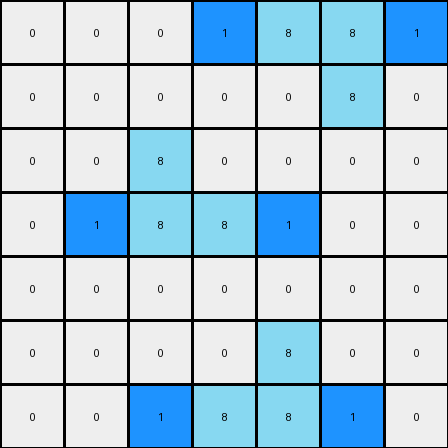

# 3aa6fb7a • 011 • refine_dreamer

---

Previous Code:
```python
"""
Identifies horizontal lines of exactly two contiguous azure (8) pixels and adds a
blue (1) pixel to the immediate left or right of the line, replacing a white (0)
pixel, if one exists.
"""

import numpy as np

def find_two_azure_lines(grid):
    # type: (np.ndarray) -> list
    """Finds all horizontal lines of exactly two contiguous azure (8) pixels."""
    rows, cols = grid.shape
    two_azure_lines = []
    for row in range(rows):
        for col in range(cols - 1):  # Iterate up to the second-to-last column
            if grid[row, col] == 8 and grid[row, col + 1] == 8:
                #check that there are no other azure pixels next to this line
                is_two_pixel_line = True
                if col > 0: #check left
                    if grid[row, col-1] == 8:
                        is_two_pixel_line = False
                if col < cols - 2:
                    if grid[row, col+2] == 8:
                        is_two_pixel_line = False
                if is_two_pixel_line:
                    two_azure_lines.append((row, col, row, col + 1))  # Store start and end coordinates
    return two_azure_lines

def transform(input_grid):
    # type: (np.ndarray) -> np.ndarray
    """Transforms the input grid by adding blue pixels to the left or right of two-pixel azure lines."""

    output_grid = np.copy(input_grid)
    rows, cols = input_grid.shape

    # Find all two-pixel azure lines
    azure_lines = find_two_azure_lines(input_grid)

    # Iterate through each identified line
    for line in azure_lines:
        row_start, col_start, row_end, col_end = line

        # Check for white pixel to the left
        if col_start > 0 and output_grid[row_start, col_start - 1] == 0:
            output_grid[row_start, col_start - 1] = 1

        # Check for white pixel to the right
        if col_end < cols - 1 and output_grid[row_end, col_end + 1] == 0:
            output_grid[row_end, col_end + 1] = 1

    return output_grid
```

Train Set Results:

## Example 1:

Input:
```
0 0 0 0 0 0 0
0 8 0 0 0 0 0
0 8 8 0 0 0 0
0 0 0 0 8 8 0
0 0 0 0 0 8 0
0 0 0 0 0 0 0
0 0 0 0 0 0 0
```
Expected Output:
```
0 0 0 0 0 0 0
0 8 1 0 0 0 0
0 8 8 0 0 0 0
0 0 0 0 8 8 0
0 0 0 0 1 8 0
0 0 0 0 0 0 0
0 0 0 0 0 0 0
```
Transformed Output:
```
0 0 0 0 0 0 0
0 8 0 0 0 0 0
1 8 8 1 0 0 0
0 0 0 1 8 8 1
0 0 0 0 0 8 0
0 0 0 0 0 0 0
0 0 0 0 0 0 0
```

match: False
pixels_off: 6
size_correct: True
color_palette_correct: True
correct_pixel_counts: False

## Example 2:

Input:
```
0 0 0 0 8 8 0
0 0 0 0 0 8 0
0 0 8 0 0 0 0
0 0 8 8 0 0 0
0 0 0 0 0 0 0
0 0 0 0 8 0 0
0 0 0 8 8 0 0
```
Expected Output:
```
0 0 0 0 8 8 0
0 0 0 0 1 8 0
0 0 8 1 0 0 0
0 0 8 8 0 0 0
0 0 0 0 0 0 0
0 0 0 1 8 0 0
0 0 0 8 8 0 0
```
Transformed Output:
```
0 0 0 1 8 8 1
0 0 0 0 0 8 0
0 0 8 0 0 0 0
0 1 8 8 1 0 0
0 0 0 0 0 0 0
0 0 0 0 8 0 0
0 0 1 8 8 1 0
```

match: False
pixels_off: 9
size_correct: True
color_palette_correct: True
correct_pixel_counts: False
**INSTRUCTIONS**

The code above was generated based on observations from the first training
example

we have tested the transform function on each of the task example inputs and
compared with the expected output

review each of the examples provided and the results and consider how the
natural language program should be updated to accommodate this new knowledge

respond with the following deliverables:

- general assessment of the information provided and strategy for resolving the
  errors
- gather metrics about each of the examples and results - use code_execution to
  develop accurate reports on your assumptions
- a YAML block documenting facts - Focus on identifying objects, their properties, and the actions performed on them.
- a natural language program - Be as clear and concise as possible, providing a complete description of the transformation rule.


your responses should be considered as information in a report - not a
conversation
