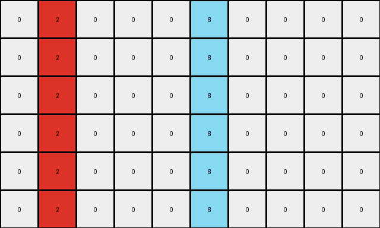

# 3ac3eb23 • 006 • refine_coder

---

Previous Code:
```python
"""
Copies the input grid and iteratively adds a pixel of the same color below each colored pixel until no new pixels are added.
"""

import numpy as np

def transform(input_grid):
    """
    Transforms the input grid according to the observed rule.
    """
    output_grid = np.copy(input_grid)
    rows, cols = output_grid.shape
    changed = True

    while changed:
        changed = False
        temp_grid = np.copy(output_grid)  # Work on a copy to avoid immediate self-replication
        for row in range(rows):
            for col in range(cols):
                # Check if the current pixel is not background and the space below is background and exists
                if temp_grid[row, col] != 0 and row + 1 < rows and output_grid[row + 1, col] == 0:
                    output_grid[row + 1, col] = temp_grid[row, col]
                    changed = True  # Mark that a change occurred

    return output_grid
```

Train Set Results:

## Example 1:

Input:
```
0 2 0 0 0 8 0 0 0 0
0 0 0 0 0 0 0 0 0 0
0 0 0 0 0 0 0 0 0 0
0 0 0 0 0 0 0 0 0 0
0 0 0 0 0 0 0 0 0 0
0 0 0 0 0 0 0 0 0 0
```
Expected Output:
```
0 2 0 0 0 8 0 0 0 0
2 0 2 0 8 0 8 0 0 0
0 2 0 0 0 8 0 0 0 0
2 0 2 0 8 0 8 0 0 0
0 2 0 0 0 8 0 0 0 0
2 0 2 0 8 0 8 0 0 0
```
Transformed Output:
```
0 2 0 0 0 8 0 0 0 0
0 2 0 0 0 8 0 0 0 0
0 2 0 0 0 8 0 0 0 0
0 2 0 0 0 8 0 0 0 0
0 2 0 0 0 8 0 0 0 0
0 2 0 0 0 8 0 0 0 0
```

match: False
pixels_off: 18
size_correct: True
color_palette_correct: True
correct_pixel_counts: False

## Example 2:

Input:
```
0 4 0 0 0 0 0
0 0 0 0 0 0 0
0 0 0 0 0 0 0
0 0 0 0 0 0 0
0 0 0 0 0 0 0
0 0 0 0 0 0 0
```
Expected Output:
```
0 4 0 0 0 0 0
4 0 4 0 0 0 0
0 4 0 0 0 0 0
4 0 4 0 0 0 0
0 4 0 0 0 0 0
4 0 4 0 0 0 0
```
Transformed Output:
```
0 4 0 0 0 0 0
0 4 0 0 0 0 0
0 4 0 0 0 0 0
0 4 0 0 0 0 0
0 4 0 0 0 0 0
0 4 0 0 0 0 0
```

match: False
pixels_off: 9
size_correct: True
color_palette_correct: True
correct_pixel_counts: False
Okay, here's a breakdown of the situation and a plan to move forward:

**General Assessment:**

The initial code correctly identifies the "dripping" or "falling" behavior of the colored pixels. However, it only considers the background color (0) directly beneath a colored pixel. It doesn't account for the observed "splitting" behavior where a colored pixel, when falling, leaves a trail that alternates with the background color. The code needs to incorporate this alternating pattern generation during the downward movement of colored pixels. The strategy will be to refine the natural language program to include the alternating placement of a colored pixel in a checkerboard-like fashion, and modify the existing python code accordingly.

**Example Metrics and Analysis:**

Here's a breakdown of each example, including observations:

*   **Example 1:**
    *   Input: Two colored pixels (2/red and 8/azure) in the top row.
    *   Expected Output: The colored pixels "drip" down, creating alternating columns of color and background (0).
    *   Actual Output: Only reproduces the colored pixels that can "fall" and are only affected by the background color 0.
    *   Issues:
        *   Fails to copy and spread original colored pixels to adjacent empty spaces.
        *   Does not account for the checkerboard, or alternating, effect of the colors.
*   **Example 2:**
    *   Input: One colored pixel (4/yellow) in the top row.
    *   Expected Output: The colored pixel "drips" down, creating an alternating column of color and background.
    *   Actual Output: Only copies the color vertically when color 0 is adjacent.
    *   Issues:
        *   Fails to create a copy of the initial object before applying the transformation.
        *   Does not account for the checkerboard, or alternating, effect of the colors.

**YAML Fact Block:**

```yaml
facts:
  - observation: |
      Colored pixels in the input grid initiate a downward "dripping" effect.
  - observation: |
      The "dripping" creates an alternating pattern of the original color and the background color (0).
  - observation: |
      The dripping continues until the bottom of the grid is reached.
  - observation: |
      Multiple colored pixels drip independently.
  - object_type: pixel
    properties:
      - color: varies (2, 8, 4 in the examples)
      - movement: vertical, downward
      - pattern: alternating color and background (0)
    actions:
      - name: drip
        description: |
          Moves downward, leaving a trace of alternating color and background.
```

**Natural Language Program:**

1.  **Copy**: Create a copy of the input grid to the output grid.
2.  **Identify Source Pixels**: Identify all non-background (non-0) pixels in the top row of the input grid. These are the "source" pixels.
3.  **Dripping Process**: For each source pixel:
    *   Iterate downwards, row by row, starting from the row immediately below the source pixel.
    *   Alternate between placing the source pixel's color and the background color (0) in the current cell, creating a checkerboard pattern.
    *   Stop when the bottom row of the grid is reached.
4. **Combine**: No combining is needed. Each source drips by altering the current output grid.

This natural language program accurately captures the "dripping" behavior and the alternating color pattern observed in the examples. It clearly defines the steps needed for the transformation, paving the way for a more accurate Python implementation.

**INSTRUCTIONS**

- generate a Python module to represent the natural language program 
- follow the template below
- all common math and science libraries are available
- create docstring only at top - but comment the workflow in the function
- use helper functions for common operations like finding objects, counting,
  measuring, moving, etc. 

remember - we are working iteratively - so this code will inform your future
self as we converge on the solution

*template:*

```python
"""
{{ natural language description of the transformation rule }}
"""

{{ imports }}

def transform(input_grid):
    # initialize output_grid

    # change output pixels 

    return output_grid

```
