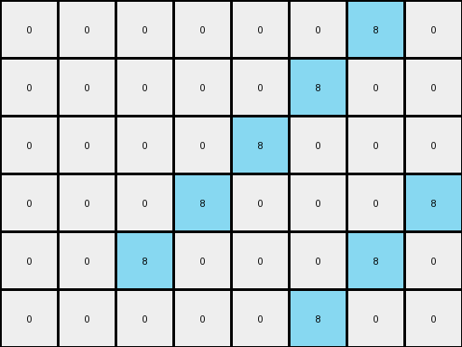

# 3af2c5a8 • 003 • refine_dreamer

---


Previous Code:
```python
"""
The input grid's dimensions are doubled to create the output grid (height x2, width x2).
Azure (8) pixel location in input is replicated at four different locations in output grid.
If we consider the output grid is divided in 2x2 subgrids.
The azure (8) pixels are present at the bottom right cell in 2x2 subgrid that corresponds to its position in input grid.
The remaining azure (8) pixels are present at the top left cell in adjacent 2x2 subgrids in output.
All other cells in the output grid, not occupied by azure, are filled with white (0).
"""

import numpy as np

def transform(input_grid):
    # Double Dimensions: The input grid's dimensions are doubled.
    input_height, input_width = input_grid.shape
    output_height = input_height * 2
    output_width = input_width * 2
    output_grid = np.zeros((output_height, output_width), dtype=int)

    # Iterate through the input grid.
    for i in range(input_height):
        for j in range(input_width):
            # Replicate and Offset for azure (8) pixels.
            if input_grid[i, j] == 8:
                # place one azure pixel in bottom right of the corresponding 2x2 sub grid
                output_grid[2*i+1, 2*j+1] = 8

                # place one azure pixel in top left of adjacent 2x2 sub grids
                if j+1 < input_width:
                  output_grid[2*i,2*j+2] = 8

                if i + 1 < input_height:
                  output_grid[2*i+2,2*j] = 8


    return output_grid
```

Train Set Results:

## Example 1:

Input:
```
0 0 8 0
0 8 0 8
0 0 8 0
```
Expected Output:
```
0 0 8 0 0 8 0 0
0 8 0 8 8 0 8 0
0 0 8 0 0 8 0 0
0 0 8 0 0 8 0 0
0 8 0 8 8 0 8 0
0 0 8 0 0 8 0 0
```
Transformed Output:
```
0 0 0 0 0 0 8 0
0 0 0 0 0 8 0 0
0 0 0 0 8 0 0 0
0 0 0 8 0 0 0 8
0 0 8 0 0 0 8 0
0 0 0 0 0 8 0 0
```

match: False
pixels_off: 20
size_correct: True
color_palette_correct: True
correct_pixel_counts: False

## Example 2:

Input:
```
0 0 3 3
0 3 0 3
3 3 3 0
```
Expected Output:
```
0 0 3 3 3 3 0 0
0 3 0 3 3 0 3 0
3 3 3 0 0 3 3 3
3 3 3 0 0 3 3 3
0 3 0 3 3 0 3 0
0 0 3 3 3 3 0 0
```
Transformed Output:
```
0 0 0 0 0 0 0 0
0 0 0 0 0 0 0 0
0 0 0 0 0 0 0 0
0 0 0 0 0 0 0 0
0 0 0 0 0 0 0 0
0 0 0 0 0 0 0 0
```

match: False
pixels_off: 28
size_correct: True
color_palette_correct: True
correct_pixel_counts: False

## Example 3:

Input:
```
3 3 3 3
3 0 0 0
3 0 0 0
```
Expected Output:
```
3 3 3 3 3 3 3 3
3 0 0 0 0 0 0 3
3 0 0 0 0 0 0 3
3 0 0 0 0 0 0 3
3 0 0 0 0 0 0 3
3 3 3 3 3 3 3 3
```
Transformed Output:
```
0 0 0 0 0 0 0 0
0 0 0 0 0 0 0 0
0 0 0 0 0 0 0 0
0 0 0 0 0 0 0 0
0 0 0 0 0 0 0 0
0 0 0 0 0 0 0 0
```

match: False
pixels_off: 24
size_correct: True
color_palette_correct: True
correct_pixel_counts: False

**INSTRUCTIONS**

The code above was generated based on observations from the first training
example

we have tested the transform function on each of the task example inputs and
compared with the expected output

review each of the examples provided and the results and consider how the
natural language program should be updated to accommodate this new knowledge

respond with the following deliverables:

- general assessment of the information provided and strategy for resolving the
  errors
- gather metrics about each of the examples and results - use code_execution to
  develop accurate reports on your assumptions
- a YAML block documenting facts - Focus on identifying objects, their properties, and the actions performed on them.
- a natural language program - Be as clear and concise as possible, providing a complete description of the transformation rule.


your responses should be considered as information in a report - not a
conversation
