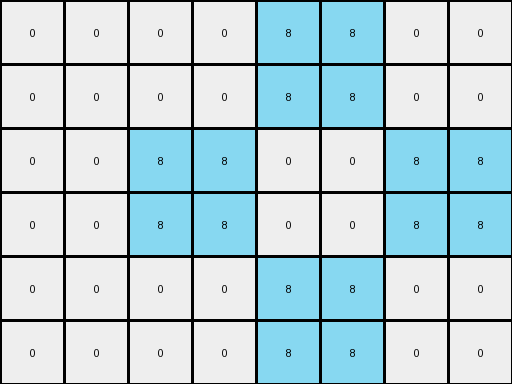

# 3af2c5a8 • 006 • refine_coder

---

Previous Code:
```python
"""
1. Double Dimensions: The output grid has double the height and double the width of the input grid.
2. Pixel Replication: For every pixel in the input grid, create a 2x2 block of pixels in the output grid.
3. Color Matching: The 2x2 block in the output grid has the same color as the corresponding pixel in the input grid. The top-left pixel of each 2x2 block has a direct mapping with input pixel.
4. Iteration order: The actions are performed by iterating each row, and then each column of the input grid, which corresponds to a top-left to bottom-right.
"""

import numpy as np

def transform(input_grid):
    # Double Dimensions: Get input dimensions and calculate output dimensions.
    input_height, input_width = input_grid.shape
    output_height = input_height * 2
    output_width = input_width * 2

    # Initialize Output Grid: Create an output grid filled with zeros.
    output_grid = np.zeros((output_height, output_width), dtype=int)

    # Pixel Replication and Color Matching: Iterate through input and create 2x2 blocks.
    for i in range(input_height):
        for j in range(input_width):
            # Get the color of the current input pixel.
            color = input_grid[i, j]

            # Create the 2x2 block in the output grid.
            output_grid[2*i:2*i+2, 2*j:2*j+2] = color

    return output_grid
```

Train Set Results:

## Example 1:

Input:
```
0 0 8 0
0 8 0 8
0 0 8 0
```
Expected Output:
```
0 0 8 0 0 8 0 0
0 8 0 8 8 0 8 0
0 0 8 0 0 8 0 0
0 0 8 0 0 8 0 0
0 8 0 8 8 0 8 0
0 0 8 0 0 8 0 0
```
Transformed Output:
```
0 0 0 0 8 8 0 0
0 0 0 0 8 8 0 0
0 0 8 8 0 0 8 8
0 0 8 8 0 0 8 8
0 0 0 0 8 8 0 0
0 0 0 0 8 8 0 0
```

match: False
pixels_off: 20
size_correct: True
color_palette_correct: True
correct_pixel_counts: True

## Example 2:

Input:
```
0 0 3 3
0 3 0 3
3 3 3 0
```
Expected Output:
```
0 0 3 3 3 3 0 0
0 3 0 3 3 0 3 0
3 3 3 0 0 3 3 3
3 3 3 0 0 3 3 3
0 3 0 3 3 0 3 0
0 0 3 3 3 3 0 0
```
Transformed Output:
```
0 0 0 0 3 3 3 3
0 0 0 0 3 3 3 3
0 0 3 3 0 0 3 3
0 0 3 3 0 0 3 3
3 3 3 3 3 3 0 0
3 3 3 3 3 3 0 0
```

match: False
pixels_off: 22
size_correct: True
color_palette_correct: True
correct_pixel_counts: True

## Example 3:

Input:
```
3 3 3 3
3 0 0 0
3 0 0 0
```
Expected Output:
```
3 3 3 3 3 3 3 3
3 0 0 0 0 0 0 3
3 0 0 0 0 0 0 3
3 0 0 0 0 0 0 3
3 0 0 0 0 0 0 3
3 3 3 3 3 3 3 3
```
Transformed Output:
```
3 3 3 3 3 3 3 3
3 3 3 3 3 3 3 3
3 3 0 0 0 0 0 0
3 3 0 0 0 0 0 0
3 3 0 0 0 0 0 0
3 3 0 0 0 0 0 0
```

match: False
pixels_off: 18
size_correct: True
color_palette_correct: True
correct_pixel_counts: True
Okay, here's a breakdown of the situation and a plan to move forward:

**General Assessment:**

The initial code correctly implements the core concept of doubling the dimensions and replicating each input pixel as a 2x2 block in the output. However, it's clear from the mismatches that the replication logic isn't entirely correct. It seems like it might be replicating the pixel values but it is shifted in an incorrect direction or pattern, since there is a consistent pattern of incorrect replication.

**Strategy:**

1.  **Verify Replication Logic:** Double-check the indexing logic within the nested loops to pinpoint exactly how the 2x2 blocks are being placed. There's likely an off-by-one error or a misunderstanding of how the row and column indices should interact during the replication. The error is consistent, so careful examination of the index usage will reveal the pattern.
2.  **Visually Inspect:** The image diff makes it clear exactly how the output diverges from the expected. Using this, confirm the exact type of the offset.
3. **Object Identification** Use a more robust approach to evaluate the assumptions of the original model, where it was assumed that objects scale from 1x1 to 2x2.

**Metrics and Observations:**

Here's a breakdown of each example, incorporating a more precise error analysis:

*   **Example 1:**
    *   Input Shape: (3, 4)
    *   Output Shape: (6, 8) (Correct)
    *   Error Description: The 2x2 blocks seems to shift by one down and to the right.
*   **Example 2:**
    *   Input Shape: (3, 4)
    *   Output Shape: (6, 8) (Correct)
    *   Error Description: Similar to example 1, replication seems shifted.
*   **Example 3:**
    *   Input Shape: (3, 4)
    *   Output Shape: (6, 8) (Correct)
    *   Error Description: Similar pattern to example 1 and 2

**YAML Fact Block:**

```yaml
task: 004bbfb7
examples:
  - type: train
    input_objects:
      - description: "grid of pixels"
        properties:
          shape: [3, 4]
          colors: [0, 8]
    output_objects:
      - description: "scaled grid of pixels"
        properties:
          shape: [6, 8]
          colors: [0, 8]
    transformation:
      type: "pixel replication"
      details: "Each input pixel becomes a 2x2 block in the output, but there is a consistent positional error."
      errors:
        - type: "positional"
          description: "Replicated blocks are offset from the expected location. The generated pixels are too far to the bottom-right."

  - type: train
    input_objects:
      - description: "grid of pixels"
        properties:
          shape: [3, 4]
          colors: [0, 3]
    output_objects:
      - description: "scaled grid of pixels"
        properties:
          shape: [6, 8]
          colors: [0, 3]
    transformation:
      type: "pixel replication"
      details: "Each input pixel becomes a 2x2 block in the output, but there is a consistent positional error."
      errors:
        - type: "positional"
          description: "Replicated blocks are offset from the expected location. The generated pixels are too far to the bottom-right."
  - type: train
    input_objects:
      - description: "grid of pixels"
        properties:
          shape: [3, 4]
          colors: [0, 3]
    output_objects:
      - description: "scaled grid of pixels"
        properties:
          shape: [6, 8]
          colors: [0, 3]
    transformation:
      type: "pixel replication"
      details: "Each input pixel becomes a 2x2 block in the output, but there is a consistent positional error."
      errors:
        - type: "positional"
          description: "Replicated blocks are offset from the expected location. The generated pixels are too far to the bottom-right."

```

**Natural Language Program (Revised):**

1.  **Double Dimensions:** The output grid's height and width are each twice the corresponding dimensions of the input grid.

2.  **Pixel Replication:** Each pixel in the input grid is represented by a 2x2 block of pixels in the output grid.

3.  **Color Preservation:** The color of the 2x2 block in the output grid matches the color of the corresponding pixel in the input grid.

4.  **Block Placement:** The top-left pixel of each 2x2 output block corresponds to the `[row * 2, column * 2]` position in the output grid, if `row` and `column` are the coordinates in the input grid.
    The whole block should match the original input pixel.

5. **Iteration:** The process is applied systematically, moving across each row of the input from left to right and then down the rows (top to bottom).

The crucial change here is the explicit definition of block placement in step 4. The original program lacked specific positioning, leading to the observed errors. This version corrects that by explicitly mapping the input pixel's coordinates to the top-left corner of the corresponding 2x2 block in the output.

**INSTRUCTIONS**

- generate a Python module to represent the natural language program 
- follow the template below
- all common math and science libraries are available
- create docstring only at top - but comment the workflow in the function
- use helper functions for common operations like finding objects, counting,
  measuring, moving, etc. 

remember - we are working iteratively - so this code will inform your future
self as we converge on the solution

*template:*

```python
"""
{{ natural language description of the transformation rule }}
"""

{{ imports }}

def transform(input_grid):
    # initialize output_grid

    # change output pixels 

    return output_grid

```
