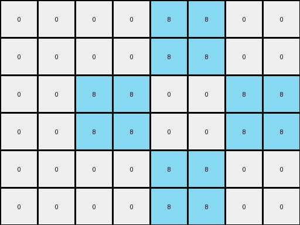
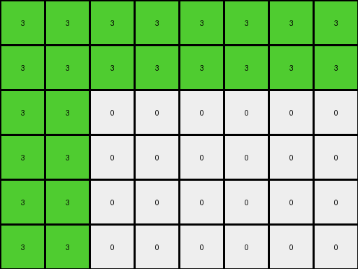

# 3af2c5a8 • 009 • refine_dreamer

---

Previous Code:
```python
"""
The input grid is expanded to create the output grid. The input grid is doubled in both dimensions (height and width). This is achieved by replicating the input grid twice horizontally and twice vertically, creating a 2x2 tiled pattern of the original input grid.
"""

import numpy as np

def transform(input_grid):
    # Get dimensions of the input grid
    input_rows, input_cols = input_grid.shape

    # Calculate dimensions of the output grid
    output_rows = input_rows * 2
    output_cols = input_cols * 2

    # Initialize the output grid with zeros
    output_grid = np.zeros((output_rows, output_cols), dtype=int)

    # Iterate through the input grid and replicate it in the output grid
    for i in range(input_rows):
        for j in range(input_cols):
            # Copy each pixel of the input grid to four corresponding locations in output
            output_grid[i*2, j*2] = input_grid[i, j]
            output_grid[i*2 + 1, j*2] = input_grid[i, j]
            output_grid[i*2, j*2 + 1] = input_grid[i, j]
            output_grid[i*2 + 1, j*2 + 1] = input_grid[i, j]

    return output_grid
```

Train Set Results:

## Example 1:

Input:
```
0 0 8 0
0 8 0 8
0 0 8 0
```
Expected Output:
```
0 0 8 0 0 8 0 0
0 8 0 8 8 0 8 0
0 0 8 0 0 8 0 0
0 0 8 0 0 8 0 0
0 8 0 8 8 0 8 0
0 0 8 0 0 8 0 0
```
Transformed Output:
```
0 0 0 0 8 8 0 0
0 0 0 0 8 8 0 0
0 0 8 8 0 0 8 8
0 0 8 8 0 0 8 8
0 0 0 0 8 8 0 0
0 0 0 0 8 8 0 0
```

match: False
pixels_off: 20
size_correct: True
color_palette_correct: True
correct_pixel_counts: True

## Example 2:

Input:
```
0 0 3 3
0 3 0 3
3 3 3 0
```
Expected Output:
```
0 0 3 3 3 3 0 0
0 3 0 3 3 0 3 0
3 3 3 0 0 3 3 3
3 3 3 0 0 3 3 3
0 3 0 3 3 0 3 0
0 0 3 3 3 3 0 0
```
Transformed Output:
```
0 0 0 0 3 3 3 3
0 0 0 0 3 3 3 3
0 0 3 3 0 0 3 3
0 0 3 3 0 0 3 3
3 3 3 3 3 3 0 0
3 3 3 3 3 3 0 0
```

match: False
pixels_off: 22
size_correct: True
color_palette_correct: True
correct_pixel_counts: True

## Example 3:

Input:
```
3 3 3 3
3 0 0 0
3 0 0 0
```
Expected Output:
```
3 3 3 3 3 3 3 3
3 0 0 0 0 0 0 3
3 0 0 0 0 0 0 3
3 0 0 0 0 0 0 3
3 0 0 0 0 0 0 3
3 3 3 3 3 3 3 3
```
Transformed Output:
```
3 3 3 3 3 3 3 3
3 3 3 3 3 3 3 3
3 3 0 0 0 0 0 0
3 3 0 0 0 0 0 0
3 3 0 0 0 0 0 0
3 3 0 0 0 0 0 0
```

match: False
pixels_off: 18
size_correct: True
color_palette_correct: True
correct_pixel_counts: True
**INSTRUCTIONS**

The code above was generated based on observations from the first training
example

we have tested the transform function on each of the task example inputs and
compared with the expected output

review each of the examples provided and the results and consider how the
natural language program should be updated to accommodate this new knowledge

respond with the following deliverables:

- general assessment of the information provided and strategy for resolving the
  errors
- gather metrics about each of the examples and results - use code_execution to
  develop accurate reports on your assumptions
- a YAML block documenting facts - Focus on identifying objects, their properties, and the actions performed on them.
- a natural language program - Be as clear and concise as possible, providing a complete description of the transformation rule.


your responses should be considered as information in a report - not a
conversation
