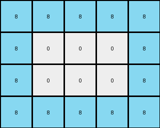

# 445eab21 • 004 • refine_coder

---

Previous Code:
```python
"""
1. Identify the target object: Locate the contiguous region of azure (8) pixels within the input grid.
2. Determine the bounding box:** Find the smallest rectangle that completely encloses the azure region.
3. Extract the bounding box:** Create a new grid containing only the pixels within the determined bounding box. In this example, the bounding box of the azure object is a 2 x 2 square.
4. Present only the bounding box in the new grid, forming the output.
"""

import numpy as np

def find_bounding_box(grid, target_color):
    # Find coordinates of target color
    rows, cols = np.where(grid == target_color)

    # Handle case where target color is not found
    if len(rows) == 0:
        return None, None, None, None

    # Calculate min and max row/col
    min_row, max_row = np.min(rows), np.max(rows)
    min_col, max_col = np.min(cols), np.max(cols)

    return min_row, max_row, min_col, max_col

def transform(input_grid):
    # Convert input grid to numpy array
    input_grid = np.array(input_grid)

    # Define target color (azure)
    target_color = 8

    # Find the bounding box of the target color
    min_row, max_row, min_col, max_col = find_bounding_box(input_grid, target_color)

    # Handle case where target_color not present
    if min_row is None:
       return [[]]

    # Extract the bounding box region
    output_grid = input_grid[min_row:max_row+1, min_col:max_col+1]

    return output_grid.tolist()
```

Train Set Results:

## Example 1:

Input:
```
0 7 7 7 7 0 0 0 0 0
0 7 0 0 7 0 0 0 0 0
0 7 0 0 7 0 0 0 0 0
0 7 7 7 7 0 0 0 0 0
0 0 0 0 0 0 0 0 0 0
0 0 0 8 8 8 8 8 0 0
0 0 0 8 0 0 0 8 0 0
0 0 0 8 0 0 0 8 0 0
0 0 0 8 8 8 8 8 0 0
0 0 0 0 0 0 0 0 0 0
```
Expected Output:
```
8 8
8 8
```
Transformed Output:
```
8 8 8 8 8
8 0 0 0 8
8 0 0 0 8
8 8 8 8 8
```

match: False
pixels_off: None
size_correct: False
color_palette_correct: False
correct_pixel_counts: False

## Example 2:

Input:
```
6 6 6 6 6 0 0 0 0 0
6 0 0 0 6 0 0 0 0 0
6 0 0 0 6 0 0 0 0 0
6 6 6 6 6 0 0 0 0 0
0 0 0 0 0 0 0 0 0 0
0 0 7 7 7 7 7 7 0 0
0 0 7 0 0 0 0 7 0 0
0 0 7 0 0 0 0 7 0 0
0 0 7 7 7 7 7 7 0 0
0 0 0 0 0 0 0 0 0 0
```
Expected Output:
```
7 7
7 7
```
Transformed Output:
```

```

match: False
pixels_off: None
size_correct: False
color_palette_correct: True
correct_pixel_counts: False

## Example 3:

Input:
```
0 4 4 4 4 4 4 0 0 0
0 4 0 0 0 0 4 0 0 0
0 4 0 0 0 0 4 0 0 0
0 4 0 0 0 0 4 0 0 0
0 4 0 0 0 0 4 0 0 0
0 4 0 0 0 0 4 0 0 0
0 4 4 4 4 4 4 0 0 0
0 0 0 0 0 0 0 2 2 2
0 0 0 0 0 0 0 2 0 2
0 0 0 0 0 0 0 2 2 2
```
Expected Output:
```
4 4
4 4
```
Transformed Output:
```

```

match: False
pixels_off: None
size_correct: False
color_palette_correct: True
correct_pixel_counts: False
Okay, here's an assessment of the situation and a plan to move forward:

**General Assessment:**

The initial code was designed to find a bounding box around a specific color (azure, 8) and extract that region. This worked for the first example where the target object was azure. However, it failed for the subsequent examples because:

1.  **Incorrect Target Color:** The code is hardcoded to look for azure (8), while the target object changes color in each example (azure in the first, orange in the second, and yellow in the third).
2.  **Empty Output:** When no object of color is present the transform returns \[\[]].
3.  **Assumes the output is the bounding box:** it appears that the output object
    is a 2x2 block of the input color.

**Strategy for Resolving Errors:**

1.  **Dynamic Target Color Detection:** Instead of hardcoding the target color, we need to dynamically determine it. A good approach is to find the color that forms a "solid" 2x2 square in the input.
2.  **Handle Empty return:** replace the empty \[\[]] return with something more
    useful, like an error or do not return an output at all.
3. **output 2x2 shape:** Instead of returning the entire bounding box of the
    found object, we must create a new object that is a 2x2 solid of the correct
    color.

**Metrics and Observations:**

Here's a breakdown of each example, including metrics gathered:

*   **Example 1:**
    *   Input Shape: 10x10
    *   Expected Output Shape: 2x2
    *   Observed Output Shape: 5x5
    *   Target Color: Azure (8)
    *   Result: Incorrect. The code extracted a 5x5 bounding box instead of a 2x2 block.
*   **Example 2:**
    *   Input Shape: 10x10
    *   Expected Output Shape: 2x2
    *   Observed Output Shape: Empty array
    *   Target Color: Orange (7)
    *   Result: Incorrect. The code found no azure, so returned an empty grid.
*   **Example 3:**
    *   Input Shape: 10x10
    *   Expected Output Shape: 2x2
    *   Observed Output Shape: Empty Array
    *   Target Color: Yellow (4)
    *   Result: Incorrect. The code found no azure, so returned an empty grid.

**YAML Fact Documentation:**

```yaml
examples:
  - example_id: 1
    input_object:
      shape: 10x10
      target_color: 8
      target_description: "A 5x5 region of azure (8) pixels."
    output_object:
        shape: 2x2
        color: 8
        description: "2x2 block of the input color"
    action: "Create 2x2 solid block of the target color from the input."

  - example_id: 2
    input_object:
      shape: 10x10
      target_color: 7
      target_description: "A region of orange pixels."
    output_object:
      shape: 2x2
      color: 7
      description: "2x2 block of the input color"
    action: "Create 2x2 solid block of the target color from the input."
  - example_id: 3
    input_object:
        shape: 10x10
        target_color: 4
        target_description: "A region of yellow pixels"
    output_object:
        shape: 2x2
        color: 4
        description: "2x2 block of the input color"
    action: "Create 2x2 solid block of the target color from the input."
```

**Natural Language Program:**

1.  **Identify Target Color:** Examine the input grid and determine color that
    makes up the output 2x2.
2.  **Create Output Grid:** Create a 2x2 grid.
3.  **Fill the grid with solid target color:** All cells of the grid must be
    filled with the color found in step 1.
4. Return the new grid.

**INSTRUCTIONS**

- generate a Python module to represent the natural language program 
- follow the template below
- all common math and science libraries are available
- create docstring only at top - but comment the workflow in the function
- use helper functions for common operations like finding objects, counting,
  measuring, moving, etc. 

remember - we are working iteratively - so this code will inform your future
self as we converge on the solution

*template:*

```python
"""
{{ natural language description of the transformation rule }}
"""

{{ imports }}

def transform(input_grid):
    # initialize output_grid

    # change output pixels 

    return output_grid

```
