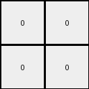

# 445eab21 • 011 • refine_dreamer

---


Previous Code:
```python
"""
1.  **Scan the Input:** Examine the input grid to identify all unique colors present.
2.  **Check for 2x2 Squares:** For each unique color, check if a 2x2 square of that color exists anywhere within the input grid.
3. **Select Square and Output**: Find any/the first 2x2 square and represent this in the output.
4.  **Default Output:** If no 2x2 square of any color is found, output a 2x2 grid of black (color 0).
"""

import numpy as np

def find_objects(grid, color):
    """
    Finds all contiguous regions of a specific color in the grid.
    """
    coords = np.argwhere(grid == color)
    if len(coords) == 0:
        return []

    objects = []
    visited = set()

    def dfs(row, col, current_object):
        if (row, col) not in visited and 0 <= row < grid.shape[0] and 0 <= col < grid.shape[1] and grid[row, col] == color:
            visited.add((row, col))
            current_object.append((row, col))
            dfs(row + 1, col, current_object)
            dfs(row - 1, col, current_object)
            dfs(row, col + 1, current_object)
            dfs(row, col - 1, current_object)


    for row, col in coords:
        if (row, col) not in visited:
            current_object = []
            dfs(row, col, current_object)
            objects.append(current_object)

    return objects

def extract_2x2_square(grid, color):
    """
    Extracts the first 2x2 square of the specified color.
    Returns coordinates of the 2x2 square as a list of tuples.
    """
    coords = np.argwhere(grid == color)
    for r, c in coords:
        if (r + 1 < grid.shape[0] and c + 1 < grid.shape[1] and
            grid[r + 1, c] == color and
            grid[r, c + 1] == color and
            grid[r + 1, c + 1] == color):
            return [[r, c], [r + 1, c], [r, c + 1], [r + 1, c + 1]]
    return []

def transform(input_grid):
    """
    Transforms the input grid according to the described rules.
    """
    # initialize output
    output_grid = np.full((2, 2), 0, dtype=int)

    # Get unique colors
    unique_colors = np.unique(input_grid)

    # Check for 2x2 squares for each unique color
    for color in unique_colors:
        square_coords = extract_2x2_square(input_grid, color)
        if square_coords:  # if square is available represent in output
            output_grid[:] = color
            return output_grid

    return output_grid
```

Train Set Results:

## Example 1:

Input:
```
0 7 7 7 7 0 0 0 0 0
0 7 0 0 7 0 0 0 0 0
0 7 0 0 7 0 0 0 0 0
0 7 7 7 7 0 0 0 0 0
0 0 0 0 0 0 0 0 0 0
0 0 0 8 8 8 8 8 0 0
0 0 0 8 0 0 0 8 0 0
0 0 0 8 0 0 0 8 0 0
0 0 0 8 8 8 8 8 0 0
0 0 0 0 0 0 0 0 0 0
```
Expected Output:
```
8 8
8 8
```
Transformed Output:
```
0 0
0 0
```

match: False
pixels_off: 4
size_correct: True
color_palette_correct: False
correct_pixel_counts: False

## Example 2:

Input:
```
6 6 6 6 6 0 0 0 0 0
6 0 0 0 6 0 0 0 0 0
6 0 0 0 6 0 0 0 0 0
6 6 6 6 6 0 0 0 0 0
0 0 0 0 0 0 0 0 0 0
0 0 7 7 7 7 7 7 0 0
0 0 7 0 0 0 0 7 0 0
0 0 7 0 0 0 0 7 0 0
0 0 7 7 7 7 7 7 0 0
0 0 0 0 0 0 0 0 0 0
```
Expected Output:
```
7 7
7 7
```
Transformed Output:
```
0 0
0 0
```

match: False
pixels_off: 4
size_correct: True
color_palette_correct: False
correct_pixel_counts: False

## Example 3:

Input:
```
0 4 4 4 4 4 4 0 0 0
0 4 0 0 0 0 4 0 0 0
0 4 0 0 0 0 4 0 0 0
0 4 0 0 0 0 4 0 0 0
0 4 0 0 0 0 4 0 0 0
0 4 0 0 0 0 4 0 0 0
0 4 4 4 4 4 4 0 0 0
0 0 0 0 0 0 0 2 2 2
0 0 0 0 0 0 0 2 0 2
0 0 0 0 0 0 0 2 2 2
```
Expected Output:
```
4 4
4 4
```
Transformed Output:
```
0 0
0 0
```

match: False
pixels_off: 4
size_correct: True
color_palette_correct: False
correct_pixel_counts: False

**INSTRUCTIONS**

The code above was generated based on observations from the first training
example

we have tested the transform function on each of the task example inputs and
compared with the expected output

review each of the examples provided and the results and consider how the
natural language program should be updated to accommodate this new knowledge

respond with the following deliverables:

- general assessment of the information provided and strategy for resolving the
  errors
- gather metrics about each of the examples and results - use code_execution to
  develop accurate reports on your assumptions
- a YAML block documenting facts - Focus on identifying objects, their properties, and the actions performed on them.
- a natural language program - Be as clear and concise as possible, providing a complete description of the transformation rule.


your responses should be considered as information in a report - not a
conversation
