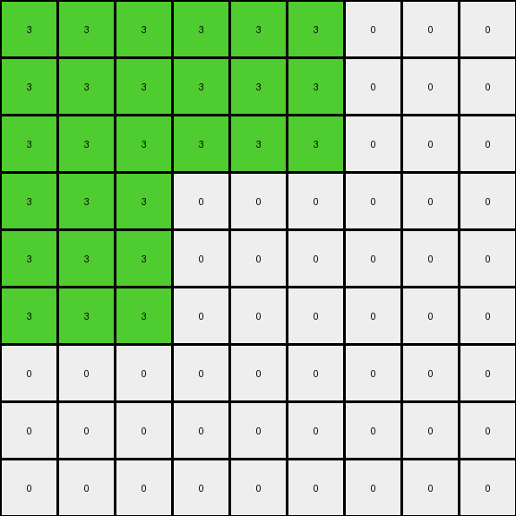
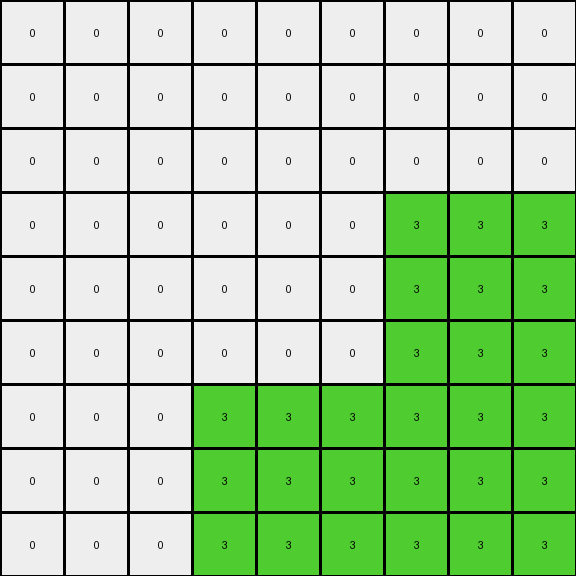

# 4522001f • 003 • refine_dreamer

---

Previous Code:
```python
"""
The transformation expands the input grid by a factor of 3 in both dimensions. 
It replicates the shape formed by adjacent green (3) pixels in the input to the output, 
with coordinate of the object multiplied by 3.
Other pixels in output is filled by white (0) color.
"""

import numpy as np

def expand_shape(input_grid):
    """
    Identifies the shape formed by adjacent green pixels and its coordinates.
    """
    green_pixels = []
    rows, cols = input_grid.shape
    for r in range(rows):
        for c in range(cols):
            if input_grid[r, c] == 3:
                green_pixels.append((r, c))

    return green_pixels

def transform(input_grid):
    # initialize output_grid
    input_rows, input_cols = input_grid.shape
    output_rows, output_cols = input_rows * 3, input_cols * 3
    output_grid = np.zeros((output_rows, output_cols), dtype=int)

    # Find the green shape
    green_pixels = expand_shape(input_grid)

    # Replicate the green shape in the output grid, scaled by 3.
    for r, c in green_pixels:
        for i in range(3):
            for j in range(3):
                output_grid[r*3 + i, c*3 + j] = 3

    return output_grid
```

Train Set Results:

## Example 1:

Input:
```
3 3 0
3 2 0
0 0 0
```
Expected Output:
```
3 3 3 3 0 0 0 0 0
3 3 3 3 0 0 0 0 0
3 3 3 3 0 0 0 0 0
3 3 3 3 0 0 0 0 0
0 0 0 0 3 3 3 3 0
0 0 0 0 3 3 3 3 0
0 0 0 0 3 3 3 3 0
0 0 0 0 3 3 3 3 0
0 0 0 0 0 0 0 0 0
```
Transformed Output:
```
3 3 3 3 3 3 0 0 0
3 3 3 3 3 3 0 0 0
3 3 3 3 3 3 0 0 0
3 3 3 0 0 0 0 0 0
3 3 3 0 0 0 0 0 0
3 3 3 0 0 0 0 0 0
0 0 0 0 0 0 0 0 0
0 0 0 0 0 0 0 0 0
0 0 0 0 0 0 0 0 0
```

match: False
pixels_off: 29
size_correct: True
color_palette_correct: True
correct_pixel_counts: False

## Example 2:

Input:
```
0 0 0
0 2 3
0 3 3
```
Expected Output:
```
0 0 0 0 0 0 0 0 0
0 3 3 3 3 0 0 0 0
0 3 3 3 3 0 0 0 0
0 3 3 3 3 0 0 0 0
0 3 3 3 3 0 0 0 0
0 0 0 0 0 3 3 3 3
0 0 0 0 0 3 3 3 3
0 0 0 0 0 3 3 3 3
0 0 0 0 0 3 3 3 3
```
Transformed Output:
```
0 0 0 0 0 0 0 0 0
0 0 0 0 0 0 0 0 0
0 0 0 0 0 0 0 0 0
0 0 0 0 0 0 3 3 3
0 0 0 0 0 0 3 3 3
0 0 0 0 0 0 3 3 3
0 0 0 3 3 3 3 3 3
0 0 0 3 3 3 3 3 3
0 0 0 3 3 3 3 3 3
```

match: False
pixels_off: 29
size_correct: True
color_palette_correct: True
correct_pixel_counts: False
**INSTRUCTIONS**

The code above was generated based on observations from the first training
example

we have tested the transform function on each of the task example inputs and
compared with the expected output

review each of the examples provided and the results and consider how the
natural language program should be updated to accommodate this new knowledge

respond with the following deliverables:

- general assessment of the information provided and strategy for resolving the
  errors
- gather metrics about each of the examples and results - use code_execution to
  develop accurate reports on your assumptions
- a YAML block documenting facts - Focus on identifying objects, their properties, and the actions performed on them.
- a natural language program - Be as clear and concise as possible, providing a complete description of the transformation rule.


your responses should be considered as information in a report - not a
conversation
