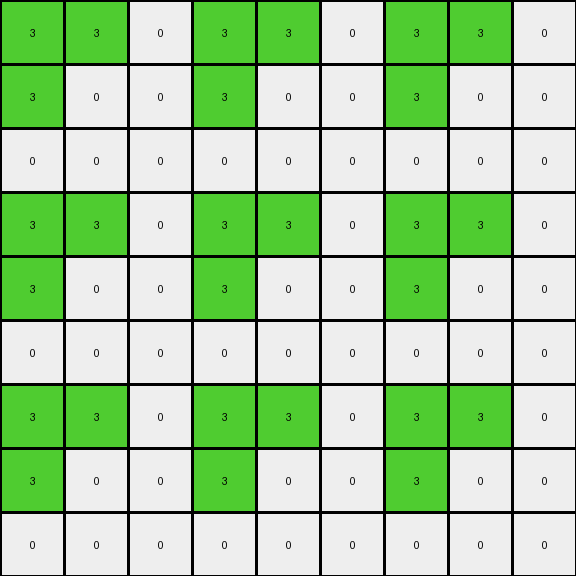
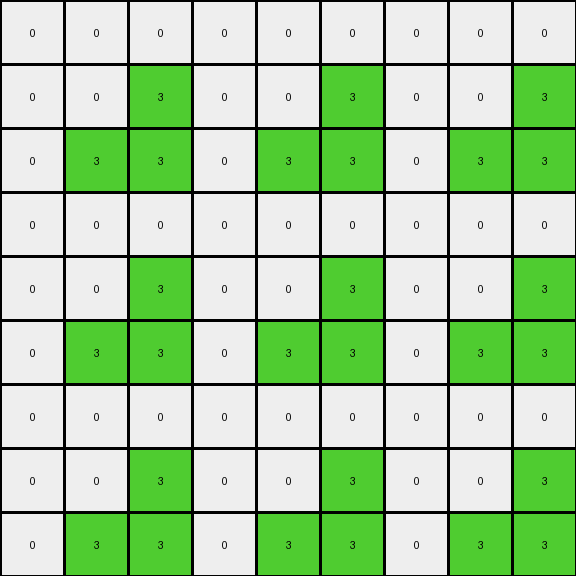

# 4522001f • 009 • refine_dreamer

---


Previous Code:
```python
"""
The input grid is expanded into a 9x9 grid. The connected region of green (3) pixels in the input is identified.
This green region is then replicated to form four quadrants within the output grid, where each quadrant corresponds to a scaled green area of the same dimension as input.
The remaining cells in the output grid are filled with white (0) pixels.
"""

import numpy as np

def transform(input_grid):
    # Initialize the output grid as a 9x9 array filled with white (0).
    output_grid = np.zeros((9, 9), dtype=int)

    # Get the dimensions of the input grid.
    input_rows, input_cols = input_grid.shape

    # Iterate through the input grid to find green pixels.
    for i in range(input_rows):
        for j in range(input_cols):
            if input_grid[i, j] == 3:  # Check for green pixel
                # Calculate the corresponding quadrant coordinates in the output grid.
                for row_mult in range(3):
                    for col_mult in range(3):
                      output_grid[i + row_mult * input_rows, j + col_mult* input_cols] = 3

    return output_grid
```

Train Set Results:

## Example 1:

Input:
```
3 3 0
3 2 0
0 0 0
```
Expected Output:
```
3 3 3 3 0 0 0 0 0
3 3 3 3 0 0 0 0 0
3 3 3 3 0 0 0 0 0
3 3 3 3 0 0 0 0 0
0 0 0 0 3 3 3 3 0
0 0 0 0 3 3 3 3 0
0 0 0 0 3 3 3 3 0
0 0 0 0 3 3 3 3 0
0 0 0 0 0 0 0 0 0
```
Transformed Output:
```
3 3 0 3 3 0 3 3 0
3 0 0 3 0 0 3 0 0
0 0 0 0 0 0 0 0 0
3 3 0 3 3 0 3 3 0
3 0 0 3 0 0 3 0 0
0 0 0 0 0 0 0 0 0
3 3 0 3 3 0 3 3 0
3 0 0 3 0 0 3 0 0
0 0 0 0 0 0 0 0 0
```

match: False
pixels_off: 33
size_correct: True
color_palette_correct: True
correct_pixel_counts: False

## Example 2:

Input:
```
0 0 0
0 2 3
0 3 3
```
Expected Output:
```
0 0 0 0 0 0 0 0 0
0 3 3 3 3 0 0 0 0
0 3 3 3 3 0 0 0 0
0 3 3 3 3 0 0 0 0
0 3 3 3 3 0 0 0 0
0 0 0 0 0 3 3 3 3
0 0 0 0 0 3 3 3 3
0 0 0 0 0 3 3 3 3
0 0 0 0 0 3 3 3 3
```
Transformed Output:
```
0 0 0 0 0 0 0 0 0
0 0 3 0 0 3 0 0 3
0 3 3 0 3 3 0 3 3
0 0 0 0 0 0 0 0 0
0 0 3 0 0 3 0 0 3
0 3 3 0 3 3 0 3 3
0 0 0 0 0 0 0 0 0
0 0 3 0 0 3 0 0 3
0 3 3 0 3 3 0 3 3
```

match: False
pixels_off: 33
size_correct: True
color_palette_correct: True
correct_pixel_counts: False

**INSTRUCTIONS**

The code above was generated based on observations from the first training
example

we have tested the transform function on each of the task example inputs and
compared with the expected output

review each of the examples provided and the results and consider how the
natural language program should be updated to accommodate this new knowledge

respond with the following deliverables:

- general assessment of the information provided and strategy for resolving the
  errors
- gather metrics about each of the examples and results - use code_execution to
  develop accurate reports on your assumptions
- a YAML block documenting facts - Focus on identifying objects, their properties, and the actions performed on them.
- a natural language program - Be as clear and concise as possible, providing a complete description of the transformation rule.


your responses should be considered as information in a report - not a
conversation
