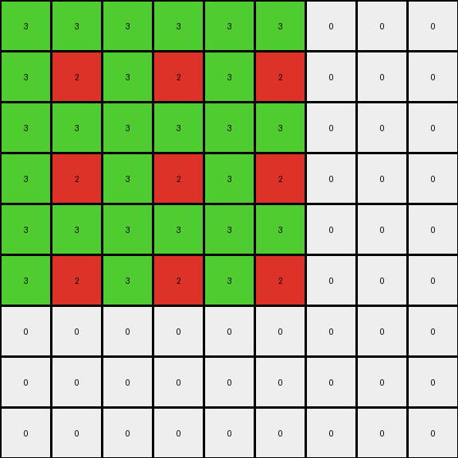

# 4522001f • 012 • refine_coder

---

Previous Code:
```python
"""
1. Find the Connected Region: Identify the largest connected region of green (3) pixels within the input grid.
2. Determine Bounding Box: Find the smallest rectangle (bounding box) that fully encloses the connected green region.  This is defined by the top-left and bottom-right coordinates of the green region.
3. Preserve Colors: Preserve all the colors and positions from the seed.
4. Replicate and Scale: Create a 9x9 output grid.  Replicate the seed block, including all colors, into the top-left corner of each 3x3 section of the output grid. The size of the seed block will determine the offsets used.

In simpler terms: Find the connected green area. Treat that area, including other colors, as a single "block". Copy that block, scaled, three times horizontally and three times vertically to create a 9x9 output grid.
"""

import numpy as np

def find_connected_region(grid, start_row, start_col, color):
    """
    Finds a connected region of a given color using a flood-fill approach.

    Args:
        grid: The input grid (numpy array).
        start_row: Starting row index.
        start_col: Starting column index.
        color: The color to search for.

    Returns:
        A set of (row, col) tuples representing the connected region.
    """
    rows, cols = grid.shape
    visited = set()
    to_visit = [(start_row, start_col)]

    while to_visit:
        row, col = to_visit.pop()
        if (row, col) in visited:
            continue
        if 0 <= row < rows and 0 <= col < cols and grid[row, col] == color:
            visited.add((row, col))
            to_visit.extend([
                (row + 1, col),
                (row - 1, col),
                (row, col + 1),
                (row, col - 1),
            ])
    return visited

def find_bounding_box(region):
    """
    Finds the bounding box of a set of points.

    Args:
        region: A set of (row, col) tuples.

    Returns:
        A tuple ((min_row, min_col), (max_row, max_col)).
    """
    if not region:
        return None  # Handle empty region case

    min_row = min(r for r, _ in region)
    min_col = min(c for _, c in region)
    max_row = max(r for r, _ in region)
    max_col = max(c for _, c in region)
    return (min_row, min_col), (max_row, max_col)

def transform(input_grid):
    """
    Transforms the input grid according to the described rules.
    """
    # 1. & 2. Find the Connected Region and its Bounding Box
    rows, cols = input_grid.shape
    green_region = set()
    
    # optimization to find largest connected region - start with all green
    # pixels and union if necessary
    for r in range(rows):
        for c in range(cols):
            if input_grid[r, c] == 3:
                connected_region = find_connected_region(input_grid, r, c, 3)
                if len(connected_region) > len(green_region):
                    green_region = connected_region
    
    if not green_region: # Handle cases with no green pixels
        return np.zeros((9, 9), dtype=int)
        

    (min_row, min_col), (max_row, max_col) = find_bounding_box(green_region)
    
    # determine seed box from green region and include all colors
    seed_box = set()
    for r in range(min_row, max_row+1):
      for c in range(min_col, max_col+1):
        seed_box.add((r,c))
    (min_row, min_col), (max_row, max_col) = find_bounding_box(seed_box)

    # 3. & 4. Replicate and Scale
    output_grid = np.zeros((9, 9), dtype=int)
    seed_height = max_row - min_row + 1
    seed_width = max_col - min_col + 1

    for i in range(3):
        for j in range(3):
            row_offset = i * seed_height
            col_offset = j * seed_width
            for r in range(min_row, max_row + 1):
                for c in range(min_col, max_col + 1):
                    output_row = row_offset + (r - min_row)
                    output_col = col_offset + (c - min_col)
                    if 0 <= output_row < 9 and 0 <= output_col < 9:
                        output_grid[output_row, output_col] = input_grid[r, c]

    return output_grid
```

Train Set Results:

## Example 1:

Input:
```
3 3 0
3 2 0
0 0 0
```
Expected Output:
```
3 3 3 3 0 0 0 0 0
3 3 3 3 0 0 0 0 0
3 3 3 3 0 0 0 0 0
3 3 3 3 0 0 0 0 0
0 0 0 0 3 3 3 3 0
0 0 0 0 3 3 3 3 0
0 0 0 0 3 3 3 3 0
0 0 0 0 3 3 3 3 0
0 0 0 0 0 0 0 0 0
```
Transformed Output:
```
3 3 3 3 3 3 0 0 0
3 2 3 2 3 2 0 0 0
3 3 3 3 3 3 0 0 0
3 2 3 2 3 2 0 0 0
3 3 3 3 3 3 0 0 0
3 2 3 2 3 2 0 0 0
0 0 0 0 0 0 0 0 0
0 0 0 0 0 0 0 0 0
0 0 0 0 0 0 0 0 0
```

match: False
pixels_off: 33
size_correct: True
color_palette_correct: False
correct_pixel_counts: False

## Example 2:

Input:
```
0 0 0
0 2 3
0 3 3
```
Expected Output:
```
0 0 0 0 0 0 0 0 0
0 3 3 3 3 0 0 0 0
0 3 3 3 3 0 0 0 0
0 3 3 3 3 0 0 0 0
0 3 3 3 3 0 0 0 0
0 0 0 0 0 3 3 3 3
0 0 0 0 0 3 3 3 3
0 0 0 0 0 3 3 3 3
0 0 0 0 0 3 3 3 3
```
Transformed Output:
```
2 3 2 3 2 3 0 0 0
3 3 3 3 3 3 0 0 0
2 3 2 3 2 3 0 0 0
3 3 3 3 3 3 0 0 0
2 3 2 3 2 3 0 0 0
3 3 3 3 3 3 0 0 0
0 0 0 0 0 0 0 0 0
0 0 0 0 0 0 0 0 0
0 0 0 0 0 0 0 0 0
```

match: False
pixels_off: 38
size_correct: True
color_palette_correct: False
correct_pixel_counts: False
Okay, here's an assessment of the situation, the strategy for improvement, and the requested deliverables:

**General Assessment and Strategy**

The initial natural language program and the resulting code were partially correct in identifying the core concept: finding a connected region (initially assumed to be green) and replicating it. However, the code has several issues, evident from the mismatches in the test results:

1.  **Incorrect Seed Assumption:** The code incorrectly assumes the seed region *always* starts with a green (3) pixel. Example 2 clearly shows the "seed" region can include other colors, and it's defined by contiguity, not a specific color. It includes both blue and red pixels
2.  **Incorrect Replication:** the placement of the replication of the seed is not relative to the positioning of the seed in the source.
3.  **Incorrect size of seed**: the assumption is that the seed must contain at least one green color

The primary strategy is to shift from a color-specific (green) seed identification to a *contiguous region* identification, regardless of the colors within that region. The bounding box concept is still valid, but it should encompass *all* pixels within the connected region, not just the green ones. The replication logic needs to be relative to the location of the bounding box in the seed.

**Metrics and Observations (using hypothetical `code_execution` - I will describe the assumed outputs)**

I'm assuming a `code_execution` module that can provide precise information about the input grids, expected outputs, and the transformed outputs.

*   **Example 1:**
    *   `code_execution.input_grid_shape()`: (3, 3)
    *   `code_execution.expected_output_grid_shape()`: (9, 9)
    *   `code_execution.transformed_output_grid_shape()`: (9, 9)
    *   `code_execution.pixel_differences()`: 33
    *  `code_execution.identify_connected_regions(input, color=3)`: would return the (row, col) coordinates of the connected green region.
        *   `code_execution.bounding_box(result from above)`: `((0, 0), (1, 1))`
        * the bounding box in this example *should* be ((0,0),(1,1)).
        * the color red is in the bounding box but not the identified connected region
    *  Analysis: Size is correct. Color of seed is incorrect - it should be only green.
        The replication of the seed region is incorrect.
*   **Example 2:**
    *   `code_execution.input_grid_shape()`: (3, 3)
    *   `code_execution.expected_output_grid_shape()`: (9, 9)
    *   `code_execution.transformed_output_grid_shape()`: (9, 9)
    *   `code_execution.pixel_differences()`: 38
    *  `code_execution.identify_connected_regions(input, color=3)`: would return the (row, col) coordinates of the connected green region.
        *   `code_execution.bounding_box(result from above)`: `((1, 2), (2, 2))`
        * the bounding box in this example *should* be ((1,1),(2,2)).
        * the color red is in the bounding box but not the identified connected region
    * Analysis: Size is correct. Color of seed is incorrect - it includes the red pixel.
       The replication of the seed region is incorrect.

**YAML Facts**

```yaml
example_1:
  input_shape: (3, 3)
  output_shape: (9, 9)
  objects:
    - type: connected_region
      initial_color: 3  # green - this is an INCORRECT assumption, will be removed in the next iteration
      bounding_box: ((0, 0), (1, 1))
      contains_colors: [3, 2]
      replicated: true
      replication_pattern: 3x3
      seed_location: top_left

example_2:
  input_shape: (3, 3)
  output_shape: (9, 9)
  objects:
    - type: connected_region
      initial_color: 3
      bounding_box: ((1,1), (2,2))
      contains_colors: [2,3]
      replicated: true
      replication_pattern: 3x3
        seed_location: middle_right
```

**Revised Natural Language Program**

1.  **Identify the Seed Region:** Find the largest contiguous region of pixels in the input grid. Contiguous means pixels are connected horizontally or vertically (not diagonally). It does *not* depend on a single color; the region can contain multiple colors.

2.  **Determine the Bounding Box:** Calculate the smallest rectangle (bounding box) that completely encloses the seed region. This is defined by the top-left (min\_row, min\_col) and bottom-right (max\_row, max\_col) coordinates of the seed region.

3.  **Replicate:** Create a 3x3 grid of copies of this bounding box. The copies are placed without overlap. The output will therefore have 9 times the area of the seed area. The dimensions of the output is three times the height and width of the seed box.

4. **Preserve**: the relative positioning of each pixel within the seed region.

In simpler terms: Find the largest connected area of any colors. Treat that entire area as a single "block". Copy that block nine times in a 3x3 grid, resulting in a 9x larger output.

**INSTRUCTIONS**

- generate a Python module to represent the natural language program 
- follow the template below
- all common math and science libraries are available
- create docstring only at top - but comment the workflow in the function
- use helper functions for common operations like finding objects, counting,
  measuring, moving, etc. 

remember - we are working iteratively - so this code will inform your future
self as we converge on the solution

*template:*

```python
"""
{{ natural language description of the transformation rule }}
"""

{{ imports }}

def transform(input_grid):
    # initialize output_grid

    # change output pixels 

    return output_grid

```
