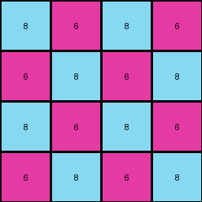

# 46442a0e • 003 • refine_dreamer

---


Previous Code:
```python
"""
Replicate a 2x2 input grid to create a 4x4 output grid, maintaining the checkerboard pattern.
"""

import numpy as np

def transform(input_grid):
    # Initialize the output grid as a 4x4 array filled with zeros.
    output_grid = np.zeros((4, 4), dtype=int)

    # Fill the output grid by replicating the input grid.
    # Iterate through each cell of the output grid.
    for i in range(4):
        for j in range(4):
            # Map the output grid indices to input grid indices using modulo.
            input_row = i % 2
            input_col = j % 2
            output_grid[i, j] = input_grid[input_row, input_col]

    return output_grid
```

Train Set Results:

## Example 1:

Input:
```
8 6
6 8
```
Expected Output:
```
8 6 6 8
6 8 8 6
6 8 8 6
8 6 6 8
```
Transformed Output:
```
8 6 8 6
6 8 6 8
8 6 8 6
6 8 6 8
```

match: False
pixels_off: 8
size_correct: True
color_palette_correct: True
correct_pixel_counts: True

## Example 2:

Input:
```
7 7 8
7 7 8
8 8 8
```
Expected Output:
```
7 7 8 8 7 7
7 7 8 8 7 7
8 8 8 8 8 8
8 8 8 8 8 8
7 7 8 8 7 7
7 7 8 8 7 7
```
Transformed Output:
```
7 7 7 7
7 7 7 7
7 7 7 7
7 7 7 7
```

match: False
pixels_off: None
size_correct: False
color_palette_correct: True
correct_pixel_counts: False

## Example 3:

Input:
```
6 9 9
6 4 4
6 4 4
```
Expected Output:
```
6 9 9 6 6 6
6 4 4 4 4 9
6 4 4 4 4 9
9 4 4 4 4 6
9 4 4 4 4 6
6 6 6 9 9 6
```
Transformed Output:
```
6 9 6 9
6 4 6 4
6 9 6 9
6 4 6 4
```

match: False
pixels_off: None
size_correct: False
color_palette_correct: True
correct_pixel_counts: False

**INSTRUCTIONS**

The code above was generated based on observations from the first training
example

we have tested the transform function on each of the task example inputs and
compared with the expected output

review each of the examples provided and the results and consider how the
natural language program should be updated to accommodate this new knowledge

respond with the following deliverables:

- general assessment of the information provided and strategy for resolving the
  errors
- gather metrics about each of the examples and results - use code_execution to
  develop accurate reports on your assumptions
- a YAML block documenting facts - Focus on identifying objects, their properties, and the actions performed on them.
- a natural language program - Be as clear and concise as possible, providing a complete description of the transformation rule.


your responses should be considered as information in a report - not a
conversation
