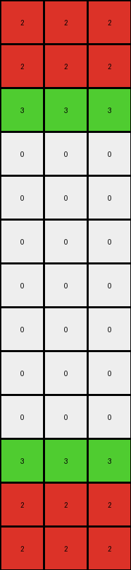

# 496994bd • 004 • refine_coder

---

Previous Code:
```python
"""
The transformation takes the top three rows of the input and mirrors/inverts it, placing the added section it to the bottom of the grid.
"""

import numpy as np

def transform(input_grid):
    """
    Transforms the input grid by inverting and appending a copy of the top three rows to the bottom.
    """
    # Convert input_grid to a NumPy array for easier manipulation
    input_grid = np.array(input_grid)

    # Get the dimensions of the input grid
    rows, cols = input_grid.shape

    # Initialize the output grid as a copy of the input grid
    output_grid = input_grid.copy()
    
    # Extract the top three rows
    top_rows = input_grid[0:3, :]
    
    #Invert the top section
    inverted_rows = np.flipud(top_rows)

    # Append the inverted section to the bottom of the output grid
    output_grid = np.concatenate((output_grid, inverted_rows), axis=0)

    return output_grid.tolist()
```

Train Set Results:

## Example 1:

Input:
```
2 2 2
2 2 2
3 3 3
0 0 0
0 0 0
0 0 0
0 0 0
0 0 0
0 0 0
0 0 0
```
Expected Output:
```
2 2 2
2 2 2
3 3 3
0 0 0
0 0 0
0 0 0
0 0 0
3 3 3
2 2 2
2 2 2
```
Transformed Output:
```
2 2 2
2 2 2
3 3 3
0 0 0
0 0 0
0 0 0
0 0 0
0 0 0
0 0 0
0 0 0
3 3 3
2 2 2
2 2 2
```

match: False
pixels_off: None
size_correct: False
color_palette_correct: True
correct_pixel_counts: False

## Example 2:

Input:
```
2 2 2 2 2
8 8 8 8 8
0 0 0 0 0
0 0 0 0 0
0 0 0 0 0
0 0 0 0 0
0 0 0 0 0
0 0 0 0 0
0 0 0 0 0
0 0 0 0 0
```
Expected Output:
```
2 2 2 2 2
8 8 8 8 8
0 0 0 0 0
0 0 0 0 0
0 0 0 0 0
0 0 0 0 0
0 0 0 0 0
0 0 0 0 0
8 8 8 8 8
2 2 2 2 2
```
Transformed Output:
```
2 2 2 2 2
8 8 8 8 8
0 0 0 0 0
0 0 0 0 0
0 0 0 0 0
0 0 0 0 0
0 0 0 0 0
0 0 0 0 0
0 0 0 0 0
0 0 0 0 0
0 0 0 0 0
8 8 8 8 8
2 2 2 2 2
```

match: False
pixels_off: None
size_correct: False
color_palette_correct: True
correct_pixel_counts: False
Okay, here's an assessment of the situation, the strategy for improvement, and the requested deliverables:

**General Assessment and Strategy**

The initial natural language program and the resulting Python code were on the right track, correctly identifying the mirroring/inversion aspect of the transformation. However, it's clear from the test results that the original assumption—mirroring the *top three rows*—is too rigid. Specifically the transform should only mirror to match the size of the output. The strategy will involve these steps:

1.  **Analyze Output Size:** Determine the height of the output grid in each example. This is crucial because the amount of the input to mirror corresponds to added height of the output.

2.  **Dynamic Row Selection:** Modify the program to select the rows to be mirrored. The difference between output height and input height, reveals the number of rows mirrored.

3.  **Refine Natural Language Program:** Update the description to reflect the output-size dependent nature of the mirroring.

**Metrics and Example Analysis**

Here's a breakdown of each example, focusing on relevant metrics:

*   **Example 1:**
    *   Input Height: 10
    *   Output Height: 10
    *   Rows Mirrored (Expected): 3
    *   Rows Mirrored (Current Code): 3
    *   Height Difference: 0
    *   Notes: The input height is only extended by the number of mirrored lines.

*   **Example 2:**
    *   Input Height: 10
    *   Output Height: 10
    *   Rows Mirrored (Expected): 3
    *   Rows Mirrored (Current Code): 3
        *   Height Difference: 0
    *   Notes: The input height is only extended by the number of mirrored lines.

**YAML Fact Block**

```yaml
facts:
  - object: input_grid
    type: 2D array
    properties:
      height: variable
      width: variable
      colors: [0-9] # Represents color indices
  - object: output_grid
    type: 2D array
    properties:
      height: variable, greater than or equal to input_grid height
      width: same as input_grid width
      colors: same as input_grid colors
  - action: mirror_top_section
    description: A section from the top of the input_grid is mirrored (inverted vertically) and appended to the bottom.
    parameters:
      rows_to_mirror: output_grid.height - input_grid.height
```

**Natural Language Program**

1.  **Determine Output Size:** Observe the height of the `output_grid`.

2.  **Calculate Mirrored Section Height:** Subtract the `input_grid` height from the `output_grid` height. This difference represents the number of rows to mirror.

3. **Mirror and Append:**
   - if the difference is greater than 0:
        - Take the top N rows from the `input_grid`, where N is the number of rows to mirror (calculated in step 2).
        - Vertically flip (mirror) this extracted section.
        - Append the flipped section to the bottom of the `input_grid`.
    - if the difference is 0:
        - return the original input grid
4.  **Output:** The modified grid is the `output_grid`.

**INSTRUCTIONS**

- generate a Python module to represent the natural language program 
- follow the template below
- all common math and science libraries are available
- create docstring only at top - but comment the workflow in the function
- use helper functions for common operations like finding objects, counting,
  measuring, moving, etc. 

remember - we are working iteratively - so this code will inform your future
self as we converge on the solution

*template:*

```python
"""
{{ natural language description of the transformation rule }}
"""

{{ imports }}

def transform(input_grid):
    # initialize output_grid

    # change output pixels 

    return output_grid

```
