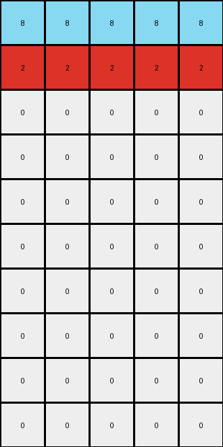

# 496994bd • 009 • refine_dreamer

---


Previous Code:
```python
"""
The transformation rule is a selective vertical reflection. It swaps the positions of the rows containing only 'azure' (8) and 'red' (2) pixels, while leaving the rows containing only 'white' (0) pixels unchanged.
"""

import numpy as np

def find_rows_by_color(grid, color):
    """Finds rows that are entirely a specific color."""
    rows = []
    for i, row in enumerate(grid):
        if np.all(row == color):
            rows.append(i)
    return rows

def transform(input_grid):
    """
    Transforms the input grid by swapping the positions of rows containing only azure (8) and red (2) pixels.
    Rows with only white (0) remain unchanged.
    """
    # Initialize output grid as a copy of the input grid
    output_grid = np.copy(input_grid)
    
    # Find the indices of rows that are all azure (8) or all red (2)
    azure_rows = find_rows_by_color(input_grid, 8)
    red_rows = find_rows_by_color(input_grid, 2)
    
    # Check if we have the same number of azure and red rows (as expected in a swap)
    if len(azure_rows) != len(red_rows):
      # cannot perform reflection if numbers of rows don't match
      return None

    # Swap the rows in the output grid
    for i in range(len(azure_rows)):
        output_grid[azure_rows[i]] = input_grid[red_rows[i]]
        output_grid[red_rows[i]] = input_grid[azure_rows[i]]

    return output_grid
```

Train Set Results:

## Example 1:

Input:
```
2 2 2
2 2 2
3 3 3
0 0 0
0 0 0
0 0 0
0 0 0
0 0 0
0 0 0
0 0 0
```
Expected Output:
```
2 2 2
2 2 2
3 3 3
0 0 0
0 0 0
0 0 0
0 0 0
3 3 3
2 2 2
2 2 2
```
match: ERROR: transform function returned None
pixels_off: None
size_correct: None
color_palette_correct: None
correct_pixel_counts: None

## Example 2:

Input:
```
2 2 2 2 2
8 8 8 8 8
0 0 0 0 0
0 0 0 0 0
0 0 0 0 0
0 0 0 0 0
0 0 0 0 0
0 0 0 0 0
0 0 0 0 0
0 0 0 0 0
```
Expected Output:
```
2 2 2 2 2
8 8 8 8 8
0 0 0 0 0
0 0 0 0 0
0 0 0 0 0
0 0 0 0 0
0 0 0 0 0
0 0 0 0 0
8 8 8 8 8
2 2 2 2 2
```
Transformed Output:
```
8 8 8 8 8
2 2 2 2 2
0 0 0 0 0
0 0 0 0 0
0 0 0 0 0
0 0 0 0 0
0 0 0 0 0
0 0 0 0 0
0 0 0 0 0
0 0 0 0 0
```

match: False
pixels_off: 20
size_correct: True
color_palette_correct: True
correct_pixel_counts: False

**INSTRUCTIONS**

The code above was generated based on observations from the first training
example

we have tested the transform function on each of the task example inputs and
compared with the expected output

review each of the examples provided and the results and consider how the
natural language program should be updated to accommodate this new knowledge

respond with the following deliverables:

- general assessment of the information provided and strategy for resolving the
  errors
- gather metrics about each of the examples and results - use code_execution to
  develop accurate reports on your assumptions
- a YAML block documenting facts - Focus on identifying objects, their properties, and the actions performed on them.
- a natural language program - Be as clear and concise as possible, providing a complete description of the transformation rule.


your responses should be considered as information in a report - not a
conversation
