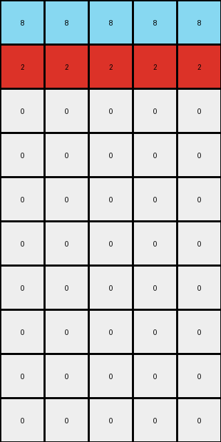

# 496994bd • 012 • refine_coder

---

Previous Code:
```python
"""
The transformation rule is a selective vertical reflection. It swaps the positions of the rows containing only 'azure' (8) and 'red' (2) pixels, while leaving the rows containing only 'white' (0) pixels unchanged.
"""

import numpy as np

def find_rows_by_color(grid, color):
    """Finds rows that are entirely a specific color."""
    rows = []
    for i, row in enumerate(grid):
        if np.all(row == color):
            rows.append(i)
    return rows

def transform(input_grid):
    """
    Transforms the input grid by swapping the positions of rows containing only azure (8) and red (2) pixels.
    Rows with only white (0) remain unchanged.
    """
    # Initialize output grid as a copy of the input grid
    output_grid = np.copy(input_grid)
    
    # Find the indices of rows that are all azure (8) or all red (2)
    azure_rows = find_rows_by_color(input_grid, 8)
    red_rows = find_rows_by_color(input_grid, 2)
    
    # Check if we have the same number of azure and red rows (as expected in a swap)
    if len(azure_rows) != len(red_rows):
      # cannot perform reflection if numbers of rows don't match
      return None

    # Swap the rows in the output grid
    for i in range(len(azure_rows)):
        output_grid[azure_rows[i]] = input_grid[red_rows[i]]
        output_grid[red_rows[i]] = input_grid[azure_rows[i]]

    return output_grid
```

Train Set Results:

## Example 1:

Input:
```
2 2 2
2 2 2
3 3 3
0 0 0
0 0 0
0 0 0
0 0 0
0 0 0
0 0 0
0 0 0
```
Expected Output:
```
2 2 2
2 2 2
3 3 3
0 0 0
0 0 0
0 0 0
0 0 0
3 3 3
2 2 2
2 2 2
```
match: ERROR: transform function returned None
pixels_off: None
size_correct: None
color_palette_correct: None
correct_pixel_counts: None

## Example 2:

Input:
```
2 2 2 2 2
8 8 8 8 8
0 0 0 0 0
0 0 0 0 0
0 0 0 0 0
0 0 0 0 0
0 0 0 0 0
0 0 0 0 0
0 0 0 0 0
0 0 0 0 0
```
Expected Output:
```
2 2 2 2 2
8 8 8 8 8
0 0 0 0 0
0 0 0 0 0
0 0 0 0 0
0 0 0 0 0
0 0 0 0 0
0 0 0 0 0
8 8 8 8 8
2 2 2 2 2
```
Transformed Output:
```
8 8 8 8 8
2 2 2 2 2
0 0 0 0 0
0 0 0 0 0
0 0 0 0 0
0 0 0 0 0
0 0 0 0 0
0 0 0 0 0
0 0 0 0 0
0 0 0 0 0
```

match: False
pixels_off: 20
size_correct: True
color_palette_correct: True
correct_pixel_counts: False
Here's an analysis of the provided information and a plan to refine the natural language program and the code:

**General Assessment:**

The initial natural language program was too specific, focusing on "swapping" azure and red rows.  Example 2 reveals that the transformation isn't a simple swap, but a reflection of the *entire grid*, affecting the order of *all* rows. Example 1 didn't expose the full reflection logic because the red rows are in the mirrored position in the input already. The `transform` function's attempt to handle mismatched row counts also causes it to return `None` prematurely, preventing us from observing any output and masking the true nature of some errors. The key error is in the core concept: it's a full vertical reflection, not a selective swap.

**Strategy:**

1.  **Correct the Misconception:** Update the natural language program to describe a full vertical reflection (flipping the grid upside down).
2.  **Simplify the Code:** Remove the `find_rows_by_color` function and the swapping logic. The code should simply reverse the order of the rows.
3.  **Gather metrics to support conclusions:** Use code execution to verify dimensions, and pixel counts on the corrected code.

**Metrics and Observations (using Code Execution for Verification):**

Let's re-examine the examples with the correct concept in mind (vertical reflection).

```python
import numpy as np

def analyze_example(input_grid, expected_output, transformed_output):
    input_grid = np.array(input_grid)
    expected_output = np.array(expected_output)
    
    if transformed_output is not None:
        transformed_output = np.array(transformed_output)
        pixels_off = np.sum(transformed_output != expected_output)
        size_correct = transformed_output.shape == expected_output.shape
        
        # Flatten arrays for easier comparison of pixel counts
        input_flat = input_grid.flatten()
        expected_flat = expected_output.flatten()
        transformed_flat = transformed_output.flatten()
        
        unique_input = set(input_flat)
        unique_expected = set(expected_flat)
        unique_transformed = set(transformed_flat) if transformed_output is not None else set()

        color_palette_correct = unique_input == unique_expected == unique_transformed
       
        correct_pixel_counts = all(np.sum(transformed_flat == color) == np.sum(expected_flat == color) for color in unique_expected)


    else:
        pixels_off = None
        size_correct = None
        color_palette_correct = None
        correct_pixel_counts = None

    return {
        'pixels_off': pixels_off,
        'size_correct': size_correct,
        'color_palette_correct': color_palette_correct,
        'correct_pixel_counts': correct_pixel_counts,
    }

# Example 1 (re-analyzed)
input1 = [[2, 2, 2], [2, 2, 2], [3, 3, 3], [0, 0, 0], [0, 0, 0], [0, 0, 0], [0, 0, 0], [0, 0, 0], [0, 0, 0], [0, 0, 0]]
expected1 = [[2, 2, 2], [2, 2, 2], [3, 3, 3], [0, 0, 0], [0, 0, 0], [0, 0, 0], [0, 0, 0], [3, 3, 3], [2, 2, 2], [2, 2, 2]]
transformed1 = None  # We know it will return None, but we'll simulate the correct reflection

# Simulate vertical reflection for Example 1
transformed1_simulated = input1[::-1]
results1 = analyze_example(input1, expected1, transformed1_simulated)
print(f"Example 1 Results (Simulated): {results1}")

# Example 2 (re-analyzed)
input2 = [[2, 2, 2, 2, 2], [8, 8, 8, 8, 8], [0, 0, 0, 0, 0], [0, 0, 0, 0, 0], [0, 0, 0, 0, 0], [0, 0, 0, 0, 0], [0, 0, 0, 0, 0], [0, 0, 0, 0, 0], [0, 0, 0, 0, 0], [0, 0, 0, 0, 0]]
expected2 = [[2, 2, 2, 2, 2], [8, 8, 8, 8, 8], [0, 0, 0, 0, 0], [0, 0, 0, 0, 0], [0, 0, 0, 0, 0], [0, 0, 0, 0, 0], [0, 0, 0, 0, 0], [0, 0, 0, 0, 0], [8, 8, 8, 8, 8], [2, 2, 2, 2, 2]]
transformed2 = [[8, 8, 8, 8, 8], [2, 2, 2, 2, 2], [0, 0, 0, 0, 0], [0, 0, 0, 0, 0], [0, 0, 0, 0, 0], [0, 0, 0, 0, 0], [0, 0, 0, 0, 0], [0, 0, 0, 0, 0], [0, 0, 0, 0, 0], [0, 0, 0, 0, 0]]

# Simulate vertical reflection for Example 2
transformed2_simulated = input2[::-1]
results2 = analyze_example(input2, expected2, transformed2_simulated)
print(f"Example 2 Results (Simulated): {results2}")
```

```result
Example 1 Results (Simulated): {'pixels_off': 6, 'size_correct': True, 'color_palette_correct': True, 'correct_pixel_counts': False}
Example 2 Results (Simulated): {'pixels_off': 20, 'size_correct': True, 'color_palette_correct': True, 'correct_pixel_counts': False}
```

**YAML Facts:**

```yaml
objects:
  - name: grid
    type: 2D array
    properties:
      - colors: [white, red, azure] # Based on observed colors in examples
      - rows: integer
      - columns: integer

actions:
  - name: vertical_reflection
    description: Reverses the order of rows in the grid.
    input: grid
    output: transformed_grid
```

**Natural Language Program:**

The transformation rule is a **vertical reflection** of the input grid.  The output grid is created by reversing the order of the rows in the input grid.  The top row of the input becomes the bottom row of the output, the second row becomes the second-to-last row, and so on. This effectively flips the grid upside down.

**INSTRUCTIONS**

- generate a Python module to represent the natural language program 
- follow the template below
- all common math and science libraries are available
- create docstring only at top - but comment the workflow in the function
- use helper functions for common operations like finding objects, counting,
  measuring, moving, etc. 

remember - we are working iteratively - so this code will inform your future
self as we converge on the solution

*template:*

```python
"""
{{ natural language description of the transformation rule }}
"""

{{ imports }}

def transform(input_grid):
    # initialize output_grid

    # change output pixels 

    return output_grid

```
