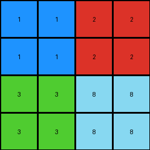
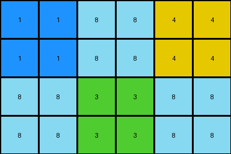

# 49d1d64f • 003 • refine_dreamer

---

Previous Code:
```python
"""
1.  **Initialization:** Create an output grid that is twice the dimensions of the input grid (2x width, 2x height).
2.  **Replication:** For each pixel in the input grid:
    *   Copy the pixel's value.
    *   Create a 2x2 block in the output grid, starting at the position (2 \* row, 2 \* column) where row and column are the coordinates of the current input pixel.
    *  Fill all four cells of this 2x2 block with the copied pixel value.
3. **Padding**: Fill the remaining cells (those not part of any 2x2 replication) of output grid with 0.
"""

import numpy as np

def transform(input_grid):
    # initialize output_grid
    input_height, input_width = input_grid.shape
    output_height, output_width = 2 * input_height, 2* input_width
    output_grid = np.zeros((output_height, output_width), dtype=int)

    # change output pixels
    for row in range(input_height):
        for col in range(input_width):
            # replication
            pixel_value = input_grid[row, col]
            output_grid[2*row:2*row+2, 2*col:2*col+2] = pixel_value

    return output_grid
```

Train Set Results:

## Example 1:

Input:
```
1 2
3 8
```
Expected Output:
```
0 1 2 0
1 1 2 2
3 3 8 8
0 3 8 0
```
Transformed Output:
```
1 1 2 2
1 1 2 2
3 3 8 8
3 3 8 8
```

match: False
pixels_off: 4
size_correct: True
color_palette_correct: True
correct_pixel_counts: False

## Example 2:

Input:
```
1 8 4
8 3 8
```
Expected Output:
```
0 1 8 4 0
1 1 8 4 4
8 8 3 8 8
0 8 3 8 0
```
Transformed Output:
```
1 1 8 8 4 4
1 1 8 8 4 4
8 8 3 3 8 8
8 8 3 3 8 8
```

match: False
pixels_off: None
size_correct: False
color_palette_correct: True
correct_pixel_counts: False

## Example 3:

Input:
```
2 1 4
8 0 2
3 2 8
```
Expected Output:
```
0 2 1 4 0
2 2 1 4 4
8 8 0 2 2
3 3 2 8 8
0 3 2 8 0
```
Transformed Output:
```
2 2 1 1 4 4
2 2 1 1 4 4
8 8 0 0 2 2
8 8 0 0 2 2
3 3 2 2 8 8
3 3 2 2 8 8
```

match: False
pixels_off: None
size_correct: False
color_palette_correct: True
correct_pixel_counts: False
**INSTRUCTIONS**

The code above was generated based on observations from the first training
example

we have tested the transform function on each of the task example inputs and
compared with the expected output

review each of the examples provided and the results and consider how the
natural language program should be updated to accommodate this new knowledge

respond with the following deliverables:

- general assessment of the information provided and strategy for resolving the
  errors
- gather metrics about each of the examples and results - use code_execution to
  develop accurate reports on your assumptions
- a YAML block documenting facts - Focus on identifying objects, their properties, and the actions performed on them.
- a natural language program - Be as clear and concise as possible, providing a complete description of the transformation rule.


your responses should be considered as information in a report - not a
conversation
