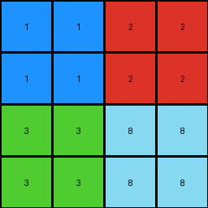
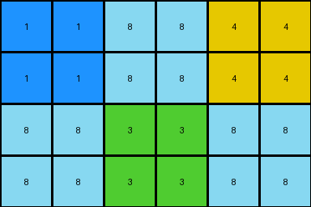
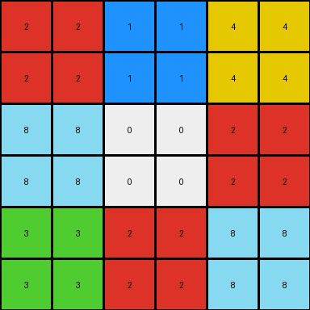

# 49d1d64f • 004 • refine_coder

---

Previous Code:
```python
"""
1.  **Initialization:** Create an output grid that is twice the dimensions of the input grid (2x width, 2x height).
2.  **Replication:** For each pixel in the input grid:
    *   Copy the pixel's value.
    *   Create a 2x2 block in the output grid, starting at the position (2 \* row, 2 \* column) where row and column are the coordinates of the current input pixel.
    *  Fill all four cells of this 2x2 block with the copied pixel value.
3. **Padding**: Fill the remaining cells (those not part of any 2x2 replication) of output grid with 0.
"""

import numpy as np

def transform(input_grid):
    # initialize output_grid
    input_height, input_width = input_grid.shape
    output_height, output_width = 2 * input_height, 2* input_width
    output_grid = np.zeros((output_height, output_width), dtype=int)

    # change output pixels
    for row in range(input_height):
        for col in range(input_width):
            # replication
            pixel_value = input_grid[row, col]
            output_grid[2*row:2*row+2, 2*col:2*col+2] = pixel_value

    return output_grid
```

Train Set Results:

## Example 1:

Input:
```
1 2
3 8
```
Expected Output:
```
0 1 2 0
1 1 2 2
3 3 8 8
0 3 8 0
```
Transformed Output:
```
1 1 2 2
1 1 2 2
3 3 8 8
3 3 8 8
```

match: False
pixels_off: 4
size_correct: True
color_palette_correct: True
correct_pixel_counts: False

## Example 2:

Input:
```
1 8 4
8 3 8
```
Expected Output:
```
0 1 8 4 0
1 1 8 4 4
8 8 3 8 8
0 8 3 8 0
```
Transformed Output:
```
1 1 8 8 4 4
1 1 8 8 4 4
8 8 3 3 8 8
8 8 3 3 8 8
```

match: False
pixels_off: None
size_correct: False
color_palette_correct: True
correct_pixel_counts: False

## Example 3:

Input:
```
2 1 4
8 0 2
3 2 8
```
Expected Output:
```
0 2 1 4 0
2 2 1 4 4
8 8 0 2 2
3 3 2 8 8
0 3 2 8 0
```
Transformed Output:
```
2 2 1 1 4 4
2 2 1 1 4 4
8 8 0 0 2 2
8 8 0 0 2 2
3 3 2 2 8 8
3 3 2 2 8 8
```

match: False
pixels_off: None
size_correct: False
color_palette_correct: True
correct_pixel_counts: False
Okay, let's analyze the results and refine the natural language program.

**General Assessment:**

The initial code implements the 2x2 replication of each pixel from the input grid. However, it fails to account for the padding with zeros *around* the replicated blocks, not just filling unused space. The expected outputs show a single row and column of zeros added to the top, bottom, left, and right, essentially framing the replicated image. The core replication logic is correct, but the padding is misapplied. My strategy is to adjust the output grid size and the starting coordinates for the replication to correctly position the replicated blocks within the zero-padding.

**Metrics and Observations:**

Here's a breakdown of each example:

*   **Example 1:**
    *   Input size: 2x2
    *   Expected Output size: 4x4
    *    Transformed output size: 4x4
    *   Mismatch: The transformed output has replicated the input correctly (2x2 block for each input), but lacks the framing of zeros.

*   **Example 2:**
    *   Input size: 2x3
    *   Expected Output size: 4x6
    *    Transformed output size: 4x6
    *   Mismatch: Similar to Example 1, the replication is correct, but output is missing a row of zeros at the beginning and a column of zeros at the start.

*   **Example 3:**
    *   Input size: 3x3
    *   Expected Output size: 6x6
    *   Transformed output: 6x6
    *   Mismatch: Replication correct, but the framing zeros are missing.

**YAML Facts:**

```yaml
task: 002
examples:
  - example_id: 1
    input_objects:
      - object_id: 1
        type: grid
        dimensions: [2, 2]
        pixels: [[1, 2], [3, 8]]
    output_objects:
      - object_id: 1
        type: grid
        dimensions: [4, 4]
        pixels: [[0, 1, 2, 0], [1, 1, 2, 2], [3, 3, 8, 8], [0, 3, 8, 0]]
    transformation:
      type: replication_with_padding
      padding_color: 0
      replication_factor: 2

  - example_id: 2
    input_objects:
      - object_id: 1
        type: grid
        dimensions: [2, 3]
        pixels: [[1, 8, 4], [8, 3, 8]]
    output_objects:
      - object_id: 1
        type: grid
        dimensions: [4, 6]
        pixels: [[0, 1, 8, 4, 0], [1, 1, 8, 8, 4, 4], [8, 8, 3, 3, 8, 8], [0, 8, 3, 8, 0]]
    transformation:
      type: replication_with_padding
      padding_color: 0
      replication_factor: 2

  - example_id: 3
    input_objects:
      - object_id: 1
        type: grid
        dimensions: [3, 3]
        pixels: [[2, 1, 4], [8, 0, 2], [3, 2, 8]]
    output_objects:
      - object_id: 1
        type: grid
        dimensions: [6, 6]
        pixels: [[0, 2, 1, 4, 0], [2, 2, 1, 1, 4, 4], [8, 8, 0, 0, 2, 2], [3, 3, 2, 2, 8, 8], [0, 3, 2, 8, 0]]
    transformation:
      type: replication_with_padding
      padding_color: 0
      replication_factor: 2
```

**Natural Language Program:**

1.  **Initialization:** Create an output grid with dimensions two times the input grid's dimensions *plus* two (for one row/column of padding on each side): `(2 * input_height + 2, 2 * input_width + 2)`. Initialize all cells of the output grid to 0 (black).

2.  **Replication:** For each pixel in the input grid:
    *   Copy the pixel's value.
    *   Create a 2x2 block in the output grid.
    *   The top-left corner of this 2x2 block should be at position `(2 * row + 1, 2 * column + 1)` in the output grid, where `row` and `column` are the coordinates of the current input pixel.  This "+ 1" offsets into the output grid to account for the zero-padding.
    *   Fill all four cells of this 2x2 block with the copied pixel value.

**INSTRUCTIONS**

- generate a Python module to represent the natural language program 
- follow the template below
- all common math and science libraries are available
- create docstring only at top - but comment the workflow in the function
- use helper functions for common operations like finding objects, counting,
  measuring, moving, etc. 

remember - we are working iteratively - so this code will inform your future
self as we converge on the solution

*template:*

```python
"""
{{ natural language description of the transformation rule }}
"""

{{ imports }}

def transform(input_grid):
    # initialize output_grid

    # change output pixels 

    return output_grid

```
