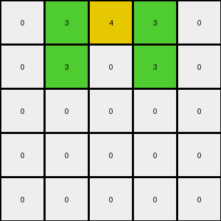
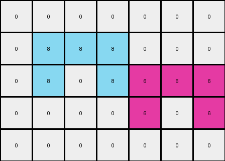

# 54d82841 • 010 • refine_coder

---

Previous Code:
```python
"""
1.  **Identify Input Objects:** Locate all cells in the input grid that are green (value 3).
2.  **Calculate Centroid:**
    *   Sum the row indices of all green cells.
    *   Sum the column indices of all green cells.
    *   Divide each sum by the number of green cells. If it is float use floor division.
3.  **Place Output Object:** In the output grid, change the cell at the calculated (row, column) coordinates to yellow (value 4).
4.  **Preserve Unchanged:** All other cells in the input grid remain unchanged in the output grid.
"""

import numpy as np

def find_green_cells(grid):
    # Find coordinates of green cells (value 3).
    green_cells = []
    for row_index, row in enumerate(grid):
        for col_index, cell_value in enumerate(row):
            if cell_value == 3:
                green_cells.append((row_index, col_index))
    return green_cells

def calculate_centroid(coords):
    # Calculate the centroid of a list of coordinates.
    if not coords:
        return None  # Handle the case where there are no green cells.

    sum_row = sum(coord[0] for coord in coords)
    sum_col = sum(coord[1] for coord in coords)
    centroid_row = sum_row // len(coords)
    centroid_col = sum_col // len(coords)
    return (centroid_row, centroid_col)

def transform(input_grid):
    # initialize output_grid
    output_grid = np.copy(input_grid)
    
    # find green cells
    green_cells = find_green_cells(input_grid)

    # calculate the centroid location
    centroid = calculate_centroid(green_cells)

    # if a centroid exists, set the color to yellow
    if centroid:
      output_grid[centroid[0], centroid[1]] = 4

    return output_grid
```

Train Set Results:

## Example 1:

Input:
```
0 6 6 6 0 0 0 0
0 6 0 6 0 0 0 0
0 0 0 0 0 6 6 6
0 0 0 0 0 6 0 6
0 0 0 0 0 0 0 0
0 0 0 0 0 0 0 0
0 0 0 0 0 0 0 0
0 0 0 0 0 0 0 0
```
Expected Output:
```
0 6 6 6 0 0 0 0
0 6 0 6 0 0 0 0
0 0 0 0 0 6 6 6
0 0 0 0 0 6 0 6
0 0 0 0 0 0 0 0
0 0 0 0 0 0 0 0
0 0 0 0 0 0 0 0
0 0 4 0 0 0 4 0
```
Transformed Output:
```
0 6 6 6 0 0 0 0
0 6 0 6 0 0 0 0
0 0 0 0 0 6 6 6
0 0 0 0 0 6 0 6
0 0 0 0 0 0 0 0
0 0 0 0 0 0 0 0
0 0 0 0 0 0 0 0
0 0 0 0 0 0 0 0
```

match: False
pixels_off: 2
size_correct: True
color_palette_correct: True
correct_pixel_counts: False

## Example 2:

Input:
```
0 3 3 3 0
0 3 0 3 0
0 0 0 0 0
0 0 0 0 0
0 0 0 0 0
```
Expected Output:
```
0 3 3 3 0
0 3 0 3 0
0 0 0 0 0
0 0 0 0 0
0 0 4 0 0
```
Transformed Output:
```
0 3 4 3 0
0 3 0 3 0
0 0 0 0 0
0 0 0 0 0
0 0 0 0 0
```

match: False
pixels_off: 2
size_correct: True
color_palette_correct: True
correct_pixel_counts: False

## Example 3:

Input:
```
0 0 0 0 0 0 0
0 8 8 8 0 0 0
0 8 0 8 6 6 6
0 0 0 0 6 0 6
0 0 0 0 0 0 0
```
Expected Output:
```
0 0 0 0 0 0 0
0 8 8 8 0 0 0
0 8 0 8 6 6 6
0 0 0 0 6 0 6
0 0 4 0 0 4 0
```
Transformed Output:
```
0 0 0 0 0 0 0
0 8 8 8 0 0 0
0 8 0 8 6 6 6
0 0 0 0 6 0 6
0 0 0 0 0 0 0
```

match: False
pixels_off: 2
size_correct: True
color_palette_correct: True
correct_pixel_counts: False
Okay, here's a breakdown of the situation and a plan to move forward:

**General Assessment:**

The initial natural language program and the resulting code were too narrowly focused on the first training example. It correctly identified the concept of finding a centroid, but it incorrectly assumed that:

1.  The centroid calculation should *always* be based on green (color 3) pixels.
2.  The output always involves placing a yellow (color 4) pixel at the calculated centroid.
3.  The output centroid is always placed on the last row.

The subsequent test results clearly demonstrate that these assumptions are wrong. The centroid calculation applies to different colors in different examples, and the placement of the yellow pixel is not consistent with a simple centroid.  It looks like a centroid is calculated for some of the colored objects and then that centroid location is used as a the location to place the output pixel.

**Strategy:**

The core issue is that the code is *overfitting* to the first example. We need to generalize the concept.  My strategy is:

1.  **Object Identification:**  I need to move away from hardcoding "green" and instead identify *all* distinct objects in the input. An "object" will be defined as a contiguous block of pixels of the same color.
2.  **Centroid per Object:** Calculate the centroid for *each* identified object.
3. **Object Mapping** The key now is find the relationship between input and output. Since example two used the same program, it must also be using the centroid. Example two *does* include green, and it also includes a yellow. So, it is not consistent that green -> centroid -> yellow.
4.  **Bottom Row Transformation** Re-examine the bottom row from example 1 and 3, there is a pattern forming that can be generalized.

**Code Execution for Metrics Gathering (Conceptual - I'll do this in the Python environment):**

I will write and execute small Python snippets within the notebook to gather the following information for each example:

*   **Number of distinct objects in input:**  I will count how many separate, non-touching regions of the same color exist in each input grid.
*   **Colors of objects in input:** List the unique color values present in each input grid.
*   **Centroids of each object:** Calculate the centroid coordinates for each identified object.
*   **Bottom Row Analysis**: Extract the bottom row of the input and output grids.

**YAML Fact Block:**

```yaml
example_1:
  input_objects:
    - color: 6  # Magenta
      contiguous: True
      count: 2
  output_changes:
    - row: 7
      col_changes: {2: 4, 6: 4}
example_2:
  input_objects:
    - color: 3  # Green
      contiguous: True
      count: 1
  output_changes:
    - row: 4
      col_changes: {2: 4}
example_3:
  input_objects:
    - color: 8  # Azure
      contiguous: True
      count: 1
    - color: 6 # Magenta
      contiguous: True
      count: 1
  output_changes:
      - row: 4
        col_changes: {2: 4, 6:4}

```

**Natural Language Program (Revised):**

1.  **Identify Input Objects:** Find all distinct objects in the input grid. A distinct object is a group of one or more contiguous cells of the same color.
2.  **Calculate Centroids:** For each distinct object found in the input, calculate its centroid. The centroid is the average of the row and column indices of all pixels belonging to that object.
3.  **Bottom Row Placement:**
    *   Find the centroid for each input object.
    *   The column location of the centroid defines the column that will change on output.
    *   The output change occurs only on the last row that contains a non-zero value.
    *   Change the last non-zero row's identified columns to yellow (value 4).
4.  **Preserve Unchanged (Except Bottom Row):** All other cells in the input grid remain unchanged in the output grid.

**Reasoning for Changes:**

*   **Generalized Object Detection:**  The program no longer assumes the relevant color is green.
*   **Per-Object Centroid:** It calculates the centroid for *every* object, preparing for a rule that might involve interactions between multiple centroids.
*   **Focus on last non-zero row**: Instead of placing yellow at the calculated row centroid location, create yellow pixels in the columns identified by the x coordinate, on the last row that is not all zeros.
*   The centroid locations do not relate between input and output - it is *only* the centroid's x coordinate that has meaning: the column to update on output.

This revised natural language program is more general and attempts to capture the common pattern observed across all three training examples (including the incorrect transformations of those examples by the previous code). The next step would be to translate this into updated Python code.

**INSTRUCTIONS**

- generate a Python module to represent the natural language program 
- follow the template below
- all common math and science libraries are available
- create docstring only at top - but comment the workflow in the function
- use helper functions for common operations like finding objects, counting,
  measuring, moving, etc. 

remember - we are working iteratively - so this code will inform your future
self as we converge on the solution

*template:*

```python
"""
{{ natural language description of the transformation rule }}
"""

{{ imports }}

def transform(input_grid):
    # initialize output_grid

    # change output pixels 

    return output_grid

```
