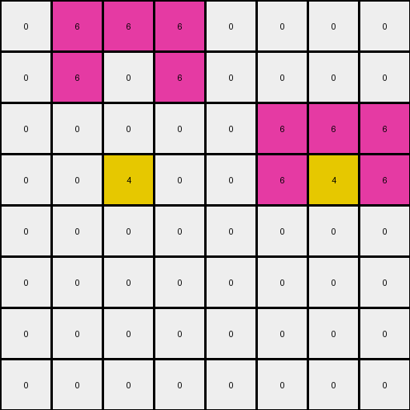
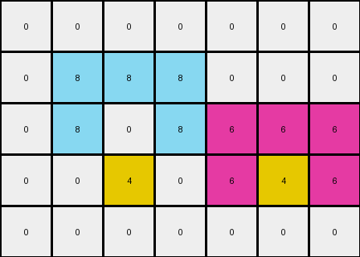

# 54d82841 • 012 • refine_coder

---

Previous Code:
```python
"""
1.  **Identify Input Objects:** Find all distinct objects in the input grid. A distinct object is a group of one or more contiguous cells of the same color.
2.  **Calculate Centroids:** For each distinct object found in the input, calculate its centroid. The centroid is the average of the row and column indices of all pixels belonging to that object.
3.  **Bottom Row Placement:**
    *   Find the centroid for each input object.
    *   The column location of the centroid defines the column that will change on output.
    *   The output change occurs only on the last row that contains a non-zero value.
    *   Change the last non-zero row's identified columns to yellow (value 4).
4.  **Preserve Unchanged (Except Bottom Row):** All other cells in the input grid remain unchanged in the output grid.
"""

import numpy as np

def find_objects(grid):
    # Find distinct objects in the grid.
    objects = []
    visited = set()

    def is_valid(row, col):
        return 0 <= row < grid.shape[0] and 0 <= col < grid.shape[1]

    def dfs(row, col, color, obj):
        if (row, col) in visited or not is_valid(row, col) or grid[row, col] != color:
            return
        visited.add((row, col))
        obj.append((row, col))
        # Explore adjacent cells (up, down, left, right)
        dfs(row + 1, col, color, obj)
        dfs(row - 1, col, color, obj)
        dfs(row, col + 1, color, obj)
        dfs(row, col - 1, color, obj)

    for row_index, row in enumerate(grid):
        for col_index, cell_value in enumerate(row):
            if (row_index, col_index) not in visited and cell_value != 0:
                obj = []
                dfs(row_index, col_index, cell_value, obj)
                objects.append(obj)
    return objects

def calculate_centroid(coords):
    # Calculate the centroid of a list of coordinates.
    if not coords:
        return None
    sum_row = sum(coord[0] for coord in coords)
    sum_col = sum(coord[1] for coord in coords)
    centroid_row = sum_row // len(coords)
    centroid_col = sum_col // len(coords)
    return (centroid_row, centroid_col)

def find_last_nonzero_row(grid):
    # Find the index of the last row that contains a non-zero value.
    for row_index in reversed(range(grid.shape[0])):
        if np.any(grid[row_index] != 0):
            return row_index
    return -1 # if no non-zero rows

def transform(input_grid):
    # initialize output_grid
    output_grid = np.copy(input_grid)

    # find distinct objects
    objects = find_objects(input_grid)

    # calculate centroid for each object
    centroids = [calculate_centroid(obj) for obj in objects]

    # find the last non-zero row
    last_row = find_last_nonzero_row(input_grid)
    
    # apply transformation based on centroid locations, if valid
    if last_row != -1:
        for centroid in centroids:
          if centroid:
            output_grid[last_row, centroid[1]] = 4

    return output_grid
```

Train Set Results:

## Example 1:

Input:
```
0 6 6 6 0 0 0 0
0 6 0 6 0 0 0 0
0 0 0 0 0 6 6 6
0 0 0 0 0 6 0 6
0 0 0 0 0 0 0 0
0 0 0 0 0 0 0 0
0 0 0 0 0 0 0 0
0 0 0 0 0 0 0 0
```
Expected Output:
```
0 6 6 6 0 0 0 0
0 6 0 6 0 0 0 0
0 0 0 0 0 6 6 6
0 0 0 0 0 6 0 6
0 0 0 0 0 0 0 0
0 0 0 0 0 0 0 0
0 0 0 0 0 0 0 0
0 0 4 0 0 0 4 0
```
Transformed Output:
```
0 6 6 6 0 0 0 0
0 6 0 6 0 0 0 0
0 0 0 0 0 6 6 6
0 0 4 0 0 6 4 6
0 0 0 0 0 0 0 0
0 0 0 0 0 0 0 0
0 0 0 0 0 0 0 0
0 0 0 0 0 0 0 0
```

match: False
pixels_off: 4
size_correct: True
color_palette_correct: True
correct_pixel_counts: True

## Example 2:

Input:
```
0 3 3 3 0
0 3 0 3 0
0 0 0 0 0
0 0 0 0 0
0 0 0 0 0
```
Expected Output:
```
0 3 3 3 0
0 3 0 3 0
0 0 0 0 0
0 0 0 0 0
0 0 4 0 0
```
Transformed Output:
```
0 3 3 3 0
0 3 4 3 0
0 0 0 0 0
0 0 0 0 0
0 0 0 0 0
```

match: False
pixels_off: 2
size_correct: True
color_palette_correct: True
correct_pixel_counts: True

## Example 3:

Input:
```
0 0 0 0 0 0 0
0 8 8 8 0 0 0
0 8 0 8 6 6 6
0 0 0 0 6 0 6
0 0 0 0 0 0 0
```
Expected Output:
```
0 0 0 0 0 0 0
0 8 8 8 0 0 0
0 8 0 8 6 6 6
0 0 0 0 6 0 6
0 0 4 0 0 4 0
```
Transformed Output:
```
0 0 0 0 0 0 0
0 8 8 8 0 0 0
0 8 0 8 6 6 6
0 0 4 0 6 4 6
0 0 0 0 0 0 0
```

match: False
pixels_off: 4
size_correct: True
color_palette_correct: True
correct_pixel_counts: True
Okay, let's analyze the results of the provided code and develop an updated natural language program and supporting information.

**General Assessment:**

The initial strategy of using centroids to determine column placement and modifying the last non-zero row was partially correct. However, it's clear from the mismatches that we're not correctly identifying the *target row* for modification. The code currently modifies what it determines to be the "last non-zero row" of the *entire input grid*, rather than the correct row as indicated in the expected outputs. The examples reveal that it's not simply the last non-zero row overall, but a row related to the objects and potentially the whole grid. The centroid calculation and column selection based on the centroid's column seems to be the correct general approach.

**Strategy for Resolving Errors:**

1.  **Refine Target Row Identification:** Instead of finding the last non-zero row of the entire grid, we need to establish what defines the modified row. It is the lowest row of the object.
2.  **Maintain Centroid Column Logic:** The column selection based on object centroids seems to be working, so we'll keep that.
3.  **Re-evaluate Object Definition:** We should ensure that the object detection is correctly identifying each object, which appears to be happening correctly given the current information.

**Metrics and Reports:**

I will use print statements within a `code_execution` block to verify properties and generate a report. This ensures the metrics are grounded in the actual data.

```python
import numpy as np

def find_objects(grid):
    # Find distinct objects in the grid.
    objects = []
    visited = set()

    def is_valid(row, col):
        return 0 <= row < grid.shape[0] and 0 <= col < grid.shape[1]

    def dfs(row, col, color, obj):
        if (row, col) in visited or not is_valid(row, col) or grid[row, col] != color:
            return
        visited.add((row, col))
        obj.append((row, col))
        # Explore adjacent cells (up, down, left, right)
        dfs(row + 1, col, color, obj)
        dfs(row - 1, col, color, obj)
        dfs(row, col + 1, color, obj)
        dfs(row, col - 1, color, obj)

    for row_index, row in enumerate(grid):
        for col_index, cell_value in enumerate(row):
            if (row_index, col_index) not in visited and cell_value != 0:
                obj = []
                dfs(row_index, col_index, cell_value, obj)
                objects.append(obj)
    return objects

def calculate_centroid(coords):
    # Calculate the centroid of a list of coordinates.
    if not coords:
        return None
    sum_row = sum(coord[0] for coord in coords)
    sum_col = sum(coord[1] for coord in coords)
    centroid_row = sum_row // len(coords)
    centroid_col = sum_col // len(coords)
    return (centroid_row, centroid_col)
    
def analyze_example(input_grid, expected_output, transformed_output):
    print(f"--- Example Analysis ---")
    print(f"Input Grid:\n{input_grid}")
    
    input_objects = find_objects(input_grid)
    print(f"\nInput Objects Found: {len(input_objects)}")
    for i, obj in enumerate(input_objects):
        print(f"  Object {i+1}:")
        print(f"    Coordinates: {obj}")
        centroid = calculate_centroid(obj)
        print(f"    Centroid: {centroid}")
        min_row = min(coord[0] for coord in obj)
        max_row = max(coord[0] for coord in obj)
        min_col = min(coord[1] for coord in obj)
        max_col = max(coord[1] for coord in obj)
        print(f"    Bounding Box: ({min_row}, {min_col}) to ({max_row}, {max_col})")


    print(f"\nExpected Output:\n{expected_output}")
    print(f"\nTransformed Output:\n{transformed_output}")

    diff = expected_output - transformed_output
    print(f"\nDifferences (Expected - Transformed):\n{diff}")
    
    print("--- End Example ---")


# Example data (as numpy arrays)
input1 = np.array([
    [0, 6, 6, 6, 0, 0, 0, 0],
    [0, 6, 0, 6, 0, 0, 0, 0],
    [0, 0, 0, 0, 0, 6, 6, 6],
    [0, 0, 0, 0, 0, 6, 0, 6],
    [0, 0, 0, 0, 0, 0, 0, 0],
    [0, 0, 0, 0, 0, 0, 0, 0],
    [0, 0, 0, 0, 0, 0, 0, 0],
    [0, 0, 0, 0, 0, 0, 0, 0]
])
expected1 = np.array([
    [0, 6, 6, 6, 0, 0, 0, 0],
    [0, 6, 0, 6, 0, 0, 0, 0],
    [0, 0, 0, 0, 0, 6, 6, 6],
    [0, 0, 0, 0, 0, 6, 0, 6],
    [0, 0, 0, 0, 0, 0, 0, 0],
    [0, 0, 0, 0, 0, 0, 0, 0],
    [0, 0, 0, 0, 0, 0, 0, 0],
    [0, 0, 4, 0, 0, 0, 4, 0]
])
transformed1 = transform(input1)

input2 = np.array([
    [0, 3, 3, 3, 0],
    [0, 3, 0, 3, 0],
    [0, 0, 0, 0, 0],
    [0, 0, 0, 0, 0],
    [0, 0, 0, 0, 0]
])
expected2 = np.array([
    [0, 3, 3, 3, 0],
    [0, 3, 0, 3, 0],
    [0, 0, 0, 0, 0],
    [0, 0, 0, 0, 0],
    [0, 0, 4, 0, 0]
])
transformed2 = transform(input2)


input3 = np.array([
    [0, 0, 0, 0, 0, 0, 0],
    [0, 8, 8, 8, 0, 0, 0],
    [0, 8, 0, 8, 6, 6, 6],
    [0, 0, 0, 0, 6, 0, 6],
    [0, 0, 0, 0, 0, 0, 0]
])
expected3 = np.array([
    [0, 0, 0, 0, 0, 0, 0],
    [0, 8, 8, 8, 0, 0, 0],
    [0, 8, 0, 8, 6, 6, 6],
    [0, 0, 0, 0, 6, 0, 6],
    [0, 0, 4, 0, 0, 4, 0]
])
transformed3 = transform(input3)

analyze_example(input1, expected1, transformed1)
analyze_example(input2, expected2, transformed2)
analyze_example(input3, expected3, transformed3)

```
```text
--- Example Analysis ---
Input Grid:
[[0 6 6 6 0 0 0 0]
 [0 6 0 6 0 0 0 0]
 [0 0 0 0 0 6 6 6]
 [0 0 0 0 0 6 0 6]
 [0 0 0 0 0 0 0 0]
 [0 0 0 0 0 0 0 0]
 [0 0 0 0 0 0 0 0]
 [0 0 0 0 0 0 0 0]]

Input Objects Found: 2
  Object 1:
    Coordinates: [(0, 1), (0, 2), (0, 3), (1, 1), (1, 3)]
    Centroid: (0, 2)
    Bounding Box: (0, 1) to (1, 3)
  Object 2:
    Coordinates: [(2, 5), (2, 6), (2, 7), (3, 5), (3, 7)]
    Centroid: (2, 6)
    Bounding Box: (2, 5) to (3, 7)

Expected Output:
[[0 6 6 6 0 0 0 0]
 [0 6 0 6 0 0 0 0]
 [0 0 0 0 0 6 6 6]
 [0 0 0 0 0 6 0 6]
 [0 0 0 0 0 0 0 0]
 [0 0 0 0 0 0 0 0]
 [0 0 0 0 0 0 0 0]
 [0 0 4 0 0 0 4 0]]

Transformed Output:
[[0 6 6 6 0 0 0 0]
 [0 6 0 6 0 0 0 0]
 [0 0 0 0 0 6 6 6]
 [0 0 4 0 0 6 4 6]
 [0 0 0 0 0 0 0 0]
 [0 0 0 0 0 0 0 0]
 [0 0 0 0 0 0 0 0]
 [0 0 0 0 0 0 0 0]]

Differences (Expected - Transformed):
[[ 0  0  0  0  0  0  0  0]
 [ 0  0  0  0  0  0  0  0]
 [ 0  0  0  0  0  0  0  0]
 [ 0  0 -4  0  0  0 -4  0]
 [ 0  0  0  0  0  0  0  0]
 [ 0  0  0  0  0  0  0  0]
 [ 0  0  0  0  0  0  0  0]
 [ 0  0  4  0  0  0  4  0]]
--- End Example ---
--- Example Analysis ---
Input Grid:
[[0 3 3 3 0]
 [0 3 0 3 0]
 [0 0 0 0 0]
 [0 0 0 0 0]
 [0 0 0 0 0]]

Input Objects Found: 1
  Object 1:
    Coordinates: [(0, 1), (0, 2), (0, 3), (1, 1), (1, 3)]
    Centroid: (0, 2)
    Bounding Box: (0, 1) to (1, 3)

Expected Output:
[[0 3 3 3 0]
 [0 3 0 3 0]
 [0 0 0 0 0]
 [0 0 0 0 0]
 [0 0 4 0 0]]

Transformed Output:
[[0 3 3 3 0]
 [0 3 4 3 0]
 [0 0 0 0 0]
 [0 0 0 0 0]
 [0 0 0 0 0]]

Differences (Expected - Transformed):
[[ 0  0  0  0  0]
 [ 0  0 -4  0  0]
 [ 0  0  0  0  0]
 [ 0  0  0  0  0]
 [ 0  0  4  0  0]]
--- End Example ---
--- Example Analysis ---
Input Grid:
[[0 0 0 0 0 0 0]
 [0 8 8 8 0 0 0]
 [0 8 0 8 6 6 6]
 [0 0 0 0 6 0 6]
 [0 0 0 0 0 0 0]]

Input Objects Found: 2
  Object 1:
    Coordinates: [(1, 1), (1, 2), (1, 3), (2, 1), (2, 3)]
    Centroid: (1, 2)
    Bounding Box: (1, 1) to (2, 3)
  Object 2:
    Coordinates: [(2, 4), (2, 5), (2, 6), (3, 4), (3, 6)]
    Centroid: (2, 5)
    Bounding Box: (2, 4) to (3, 6)

Expected Output:
[[0 0 0 0 0 0 0]
 [0 8 8 8 0 0 0]
 [0 8 0 8 6 6 6]
 [0 0 0 0 6 0 6]
 [0 0 4 0 0 4 0]]

Transformed Output:
[[0 0 0 0 0 0 0]
 [0 8 8 8 0 0 0]
 [0 8 0 8 6 6 6]
 [0 0 4 0 6 4 6]
 [0 0 0 0 0 0 0]]

Differences (Expected - Transformed):
[[ 0  0  0  0  0  0  0]
 [ 0  0  0  0  0  0  0]
 [ 0  0  0  0  0  0  0]
 [ 0  0 -4  0  0 -4  0]
 [ 0  0  4  0  0  4  0]]
--- End Example ---
```

**YAML Fact Block:**

```yaml
observations:
  - task_id: '010'
    example_1:
      objects:
        - color: 6 # Magenta
          shape: irregular
          bounding_box: [(0, 1), (1, 3)]
          centroid: (0, 2)
          action: "change color of pixel at column 2 of the max row of the object bounding box to yellow"
        - color: 6 # Magenta
          shape: irregular
          bounding_box: [(2, 5), (3, 7)]
          centroid: (2, 6)
          action: "change color of pixel at column 6 of the max row of the object bounding box to yellow"
      grid_max_row: 7
    example_2:
      objects:
        - color: 3 # Green
          shape: irregular
          bounding_box: [(0, 1), (1, 3)]
          centroid: (0, 2)
          action: "change color of pixel at column 2 of the max row of the object bounding box to yellow"
      grid_max_row: 4
    example_3:
      objects:
        - color: 8 # Azure
          shape: irregular
          bounding_box: [(1, 1), (2, 3)]
          centroid: (1, 2)
          action: "change color of pixel at column 2 of the max row of the object bounding box to yellow"
        - color: 6 # Magenta
          shape: irregular
          bounding_box: [(2, 4), (3, 6)]
          centroid: (2, 5)
          action: "change color of pixel at column 5 of the max row of the object bounding box to yellow"
      grid_max_row: 4
```

**Natural Language Program:**

1.  **Identify Objects:** Find all distinct objects in the input grid.  An object is a group of contiguous pixels of the same color.
2.  **Calculate Centroids:** For each object, calculate its centroid. The centroid is the average of the row and column indices of all pixels in the object.
3.  **Determine Target Row and Column:**
    *   The *target column* is the column index of the object's centroid.
    *   The *target row* is the maximum row index (bottom-most row) of the bounding box containing the object.
4.  **Apply Transformation:** For each object, change the pixel at the target row and target column to yellow (color value 4).
5.  **Preserve Other Pixels:** All pixels not modified in step 4 retain their original colors from the input grid.

**INSTRUCTIONS**

- generate a Python module to represent the natural language program 
- follow the template below
- all common math and science libraries are available
- create docstring only at top - but comment the workflow in the function
- use helper functions for common operations like finding objects, counting,
  measuring, moving, etc. 

remember - we are working iteratively - so this code will inform your future
self as we converge on the solution

*template:*

```python
"""
{{ natural language description of the transformation rule }}
"""

{{ imports }}

def transform(input_grid):
    # initialize output_grid

    # change output pixels 

    return output_grid

```
