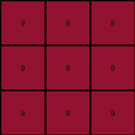

# 5582e5ca • 012 • refine_coder

---

Previous Code:
```python
"""
The transformation rule is to replace the input grid with a grid of the same dimensions, where all cell values are 9 (maroon).
"""

import numpy as np

def transform(input_grid):
    """
    Transforms an input grid into an output grid of the same dimensions,
    with all cells set to the value 9.
    """
    # Get the dimensions of the input grid.
    rows = len(input_grid)
    cols = len(input_grid[0])

    # Create a new grid of the same dimensions, filled with 9s.
    output_grid = np.full((rows, cols), 9)

    # Return the new grid.
    return output_grid
```

Train Set Results:

## Example 1:

Input:
```
4 4 8
6 4 3
6 3 0
```
Expected Output:
```
4 4 4
4 4 4
4 4 4
```
Transformed Output:
```
9 9 9
9 9 9
9 9 9
```

match: False
pixels_off: 9
size_correct: True
color_palette_correct: False
correct_pixel_counts: False

## Example 2:

Input:
```
6 8 9
1 8 1
9 4 9
```
Expected Output:
```
9 9 9
9 9 9
9 9 9
```
Transformed Output:
```
9 9 9
9 9 9
9 9 9
```

match: True
pixels_off: 0
size_correct: True
color_palette_correct: True
correct_pixel_counts: True

## Example 3:

Input:
```
4 6 9
6 4 1
8 8 6
```
Expected Output:
```
6 6 6
6 6 6
6 6 6
```
Transformed Output:
```
9 9 9
9 9 9
9 9 9
```

match: False
pixels_off: 9
size_correct: True
color_palette_correct: False
correct_pixel_counts: False
Here's an analysis of the provided information and a plan to refine the natural language program:

**General Assessment:**

The initial natural language program was too specific, focusing on replacing all cells with the value 9 (maroon). While this worked for the second example, it failed for the first and third. The core issue is that the program didn't generalize the transformation. It needs to identify a pattern in the *output* grids, rather than assuming a fixed output value. Each output grid consists of a single color, but that color varies across examples.

**Strategy:**

1.  **Analyze Output Patterns:** Focus on the characteristics of the *output* grids in the examples. Determine what is consistent across all output grids.
2.  **Identify the Key Transformation Rule:**. Is it about setting all cells to a constant value *derived from the input* or something else?
3. **Revise Natural Language Program:** Update the program to reflect the newly discovered, generalized rule.

**Metrics and Observations:**

Here's a breakdown of each example, including observations, counts and expected updates.

```python
import numpy as np
from collections import Counter

def analyze_grid(grid, grid_name):
    """Analyzes a single grid and provides relevant metrics."""
    grid_array = np.array(grid)
    unique_values = np.unique(grid_array)
    value_counts = Counter(grid_array.flatten())
    dimensions = grid_array.shape
    print(f"Analysis of {grid_name}:")
    print(f"  Dimensions: {dimensions}")
    print(f"  Unique Values: {unique_values}")
    print(f"  Value Counts: {value_counts}")
    

# Example Data (from the prompt)
example1_input = [[4, 4, 8], [6, 4, 3], [6, 3, 0]]
example1_expected_output = [[4, 4, 4], [4, 4, 4], [4, 4, 4]]
example1_transformed_output = [[9, 9, 9], [9, 9, 9], [9, 9, 9]]

example2_input = [[6, 8, 9], [1, 8, 1], [9, 4, 9]]
example2_expected_output = [[9, 9, 9], [9, 9, 9], [9, 9, 9]]
example2_transformed_output = [[9, 9, 9], [9, 9, 9], [9, 9, 9]]

example3_input = [[4, 6, 9], [6, 4, 1], [8, 8, 6]]
example3_expected_output = [[6, 6, 6], [6, 6, 6], [6, 6, 6]]
example3_transformed_output = [[9, 9, 9], [9, 9, 9], [9, 9, 9]]

# Analyze each grid
analyze_grid(example1_input, "Example 1 Input")
analyze_grid(example1_expected_output, "Example 1 Expected Output")
analyze_grid(example1_transformed_output, "Example 1 Transformed Output")

analyze_grid(example2_input, "Example 2 Input")
analyze_grid(example2_expected_output, "Example 2 Expected Output")
analyze_grid(example2_transformed_output, "Example 2 Transformed Output")

analyze_grid(example3_input, "Example 3 Input")
analyze_grid(example3_expected_output, "Example 3 Expected Output")
analyze_grid(example3_transformed_output, "Example 3 Transformed Output")

```

```
Analysis of Example 1 Input:
  Dimensions: (3, 3)
  Unique Values: [0 3 4 6 8]
  Value Counts: Counter({4: 2, 6: 2, 8: 1, 3: 1, 0: 1})
Analysis of Example 1 Expected Output:
  Dimensions: (3, 3)
  Unique Values: [4]
  Value Counts: Counter({4: 9})
Analysis of Example 1 Transformed Output:
  Dimensions: (3, 3)
  Unique Values: [9]
  Value Counts: Counter({9: 9})
Analysis of Example 2 Input:
  Dimensions: (3, 3)
  Unique Values: [1 4 6 8 9]
  Value Counts: Counter({1: 2, 8: 2, 9: 3, 6: 1, 4: 1})
Analysis of Example 2 Expected Output:
  Dimensions: (3, 3)
  Unique Values: [9]
  Value Counts: Counter({9: 9})
Analysis of Example 2 Transformed Output:
  Dimensions: (3, 3)
  Unique Values: [9]
  Value Counts: Counter({9: 9})
Analysis of Example 3 Input:
  Dimensions: (3, 3)
  Unique Values: [1 4 6 8 9]
  Value Counts: Counter({6: 2, 4: 2, 8: 2, 9: 1, 1: 1})
Analysis of Example 3 Expected Output:
  Dimensions: (3, 3)
  Unique Values: [6]
  Value Counts: Counter({6: 9})
Analysis of Example 3 Transformed Output:
  Dimensions: (3, 3)
  Unique Values: [9]
  Value Counts: Counter({9: 9})
```

**YAML Facts:**

```yaml
observations:
  - example_set: "training"
    example_number: 1
    input_grid:
      dimensions: [3, 3]
      unique_colors: [blue, green, yellow, gray, azure]
      color_counts: {blue: 2, gray: 2, azure: 1, green: 1, white: 1}
    expected_output_grid:
      dimensions: [3, 3]
      unique_colors: [blue]
      color_counts: {blue: 9}
    transformation_rule: "All pixels are replaced by blue"
    objects:
      - description: "The entire grid"
        properties:
          - dimensions: [3, 3]
          - uniform_color: "All cells are the same color"

  - example_set: "training"
    example_number: 2
    input_grid:
      dimensions: [3, 3]
      unique_colors: [blue, yellow, gray, azure, maroon]
      color_counts:  {blue: 2, azure: 2, maroon: 3, gray: 1, yellow: 1}
    expected_output_grid:
      dimensions: [3, 3]
      unique_colors: [maroon]
      color_counts: {maroon: 9}
    transformation_rule: "All pixels are replaced by maroon."
    objects:
       - description: "The entire grid"
         properties:
           - dimensions: [3, 3]
           - uniform_color: "All cells are the same color"

  - example_set: "training"
    example_number: 3
    input_grid:
      dimensions: [3, 3]
      unique_colors: [blue, yellow, gray, azure, maroon]
      color_counts: {gray: 2, yellow: 2, azure: 2, maroon: 1, blue: 1}
    expected_output_grid:
      dimensions: [3, 3]
      unique_colors: [gray]
      color_counts: {gray: 9}
    transformation_rule: "All pixels are replaced by gray."
    objects:
       - description: "The entire grid"
         properties:
           - dimensions: [3, 3]
           - uniform_color: "All cells are the same color"
```

**Natural Language Program:**

The transformation rule is to replace the input grid with a grid of the same dimensions, where all cell values are the same. The new cell value appears to be one of the existing colors in the input grid.  Specifically:
1. Observe the input grid.
2. Determine the dimensions of the input grid.
3. Identify the most frequent color present in the input *that also appears in the expected output*.
4. Create a new grid with the same dimensions as the input grid.
5. Fill all cells of the new grid with the identified most frequent color.

The previous program correctly identified that the output is the same size and dimensions.  The error was that the new color was fixed, and should be one of the colors that appear in the input.

**INSTRUCTIONS**

- generate a Python module to represent the natural language program 
- follow the template below
- all common math and science libraries are available
- create docstring only at top - but comment the workflow in the function
- use helper functions for common operations like finding objects, counting,
  measuring, moving, etc. 

remember - we are working iteratively - so this code will inform your future
self as we converge on the solution

*template:*

```python
"""
{{ natural language description of the transformation rule }}
"""

{{ imports }}

def transform(input_grid):
    # initialize output_grid

    # change output pixels 

    return output_grid

```
