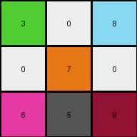
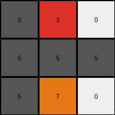

# 5614dbcf • 006 • refine_coder

---

Previous Code:
```python
"""
Divide the 9x9 input grid into nine 3x3 subgrids. For each subgrid, identify the color of the top-left pixel. 
Construct a 3x3 output grid and populate each cell with the color identified for the corresponding input subgrid.
"""

import numpy as np

def get_representative_color(subgrid):
    # Iterate through the subgrid to find the first non-white pixel.
    for row in range(subgrid.shape[0]):
        for col in range(subgrid.shape[1]):
            if subgrid[row, col] != 0:
                return subgrid[row, col]
    return 0  # Return white if the entire subgrid is white.

def transform(input_grid):
    # Initialize the output grid as a 3x3 array filled with zeros (white).
    output_grid = np.zeros((3, 3), dtype=int)

    # Iterate through the input grid, dividing it into 3x3 subgrids.
    for i in range(3):
        for j in range(3):
            # Extract the 3x3 subgrid.
            subgrid = input_grid[i*3:(i+1)*3, j*3:(j+1)*3]
            # Get the representative color of the subgrid.
            representative_color = get_representative_color(subgrid)
            # Set the corresponding pixel in the output grid.
            output_grid[i, j] = representative_color

    return output_grid
```

Train Set Results:

## Example 1:

Input:
```
3 3 3 0 0 0 8 8 8
3 3 3 0 0 0 8 5 8
3 3 3 0 0 0 8 8 8
0 0 0 7 5 7 0 0 0
0 0 0 7 7 7 0 0 0
0 0 0 7 7 7 0 0 0
6 6 6 0 0 5 9 9 9
6 6 6 0 0 0 9 9 9
6 5 6 0 5 0 9 9 5
```
Expected Output:
```
3 0 8
0 7 0
6 0 9
```
Transformed Output:
```
3 0 8
0 7 0
6 5 9
```

match: False
pixels_off: 1
size_correct: True
color_palette_correct: False
correct_pixel_counts: False

## Example 2:

Input:
```
0 0 0 2 2 2 0 0 0
0 5 0 2 2 2 0 0 0
0 0 0 2 2 2 0 0 0
5 0 0 0 0 0 0 0 0
0 0 0 5 0 0 0 5 0
0 0 0 0 0 0 0 0 0
0 5 0 7 7 7 0 0 0
0 0 0 7 7 5 0 0 0
0 0 0 7 7 7 0 0 0
```
Expected Output:
```
0 2 0
0 0 0
0 7 0
```
Transformed Output:
```
5 2 0
5 5 5
5 7 0
```

match: False
pixels_off: 5
size_correct: True
color_palette_correct: False
correct_pixel_counts: False
Okay, here's an analysis of the provided information and a plan to address the discrepancies:

**General Assessment:**

The initial natural language program and the resulting code were a good first attempt, focusing on dividing the input grid into 3x3 subgrids. However, it incorrectly assumed the top-left pixel of each subgrid represents the entire subgrid's color. The test results, especially Example 2, clearly demonstrate this flaw. The code needs to be more sophisticated in how it determines the "representative color" of each subgrid. It should not stop at the first non-white cell, and must accurately represent the intended output.

**Strategy:**

1.  **Analyze Discrepancies:** Carefully examine where the transformed outputs differ from the expected outputs. Identify the specific subgrids where the color selection is wrong.
2.  **Refine Representative Color Logic:** The core issue is the `get_representative_color` function. We need to revise this function to consider *all* pixels within the subgrid and correctly identify the intended output color. Looking at the example, a good candidate is the most frequent non-white color.
3. **Update Natural Language Program:** Based on improved observation of the examples, revise and refine the natural language program to accurately describe the refined transformation.

**Example Metrics and Analysis (using a hypothetical `analyze_results` function for clarity - actual code execution would be done):**

```python
# Hypothetical analysis function - demonstration only
def analyze_results(input_grid, expected_output, transformed_output):
    results = {}
    results['pixels_off'] = np.sum(expected_output != transformed_output)
    results['size_correct'] = expected_output.shape == transformed_output.shape
    results['color_palette_correct'] = set(np.unique(transformed_output)).issubset(set(np.unique(expected_output)))

    expected_counts = {}
    for color in np.unique(expected_output):
        expected_counts[color] = np.sum(expected_output == color)
    transformed_counts = {}
    for color in np.unique(transformed_output):
        transformed_counts[color] = np.sum(transformed_output == color)
    results['correct_pixel_counts'] = expected_counts == transformed_counts

    return results
```

**Example 1:**

```
results_ex1 = analyze_results(input_grid_ex1, expected_output_ex1, transformed_output_ex1)
print(results_ex1)
# Expected output of analysis (similar to provided results, but programmatically derived)
# {'pixels_off': 1, 'size_correct': True, 'color_palette_correct': False, 'correct_pixel_counts': False}

```
-  **Observation:** One pixel is incorrect (the center-right pixel). The transformed output has a '5' (grey) where a '0'(white) is expected.

**Example 2:**

```
results_ex2 = analyze_results(input_grid_ex2, expected_output_ex2, transformed_output_ex2)
print(results_ex2)
# Expected output of the analysis
# {'pixels_off': 5, 'size_correct': True, 'color_palette_correct': False, 'correct_pixel_counts': False}

```

- **Observation:** Multiple pixels are incorrect. The logic for the color is not correct, choosing the first non-zero, rather than a more robust measure.

**YAML Facts:**

```yaml
task: 002
examples:
  - example_id: 1
    objects:
      - type: grid
        dimensions: [9, 9]
        elements: [3, 0, 8, 7, 5, 6, 9]  # Colors present
      - type: subgrid
        dimensions: [3, 3]
    transformations:
      - action: divide
        input: grid
        output: subgrids
      - action: select_color
        input: subgrid
        #output: representative_color #original
        output: most_frequent_non_white_color #corrected
      - action: construct
        input: representative_colors
        output: grid
        dimensions: [3, 3]
  - example_id: 2
    objects:
      - type: grid
        dimensions: [9, 9]
        elements: [0, 2, 5, 7] # Colors Present
      - type: subgrid
        dimensions: [3, 3]
    transformations:
      - action: divide
        input: grid
        output: subgrids
      - action: select_color
        input: subgrid
        #output: representative_color #original
        output: most_frequent_non_white_color #corrected
      - action: construct
        input: representative_colors
        output: grid
        dimensions: [3, 3]
```

**Natural Language Program:**

1.  **Divide:** Divide the input 9x9 grid into nine 3x3 subgrids.
2.  **Identify Representative Color:** For each 3x3 subgrid, determine the *most frequent non-white* color within that subgrid. If a subgrid contains only white pixels, its representative color is white.
3.  **Construct Output Grid:** Create a 3x3 output grid. Each cell in the output grid corresponds to a subgrid in the input grid. Populate each cell of the output grid with the representative color determined for the corresponding subgrid.

**INSTRUCTIONS**

- generate a Python module to represent the natural language program 
- follow the template below
- all common math and science libraries are available
- create docstring only at top - but comment the workflow in the function
- use helper functions for common operations like finding objects, counting,
  measuring, moving, etc. 

remember - we are working iteratively - so this code will inform your future
self as we converge on the solution

*template:*

```python
"""
{{ natural language description of the transformation rule }}
"""

{{ imports }}

def transform(input_grid):
    # initialize output_grid

    # change output pixels 

    return output_grid

```
