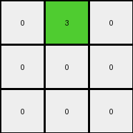

# 5614dbcf • 010 • refine_coder

---

Previous Code:
```python
"""
The input grid is reduced to a 3x3 output grid. The central color of significant colored regions (red and orange 3x3 blocks) from the input are placed in the output grid, preserving their relative positions. Other colors (grey) and background (white) are mostly ignored, with the output background remaining white.
"""

import numpy as np

def find_central_color(grid, region_top_left, region_size):
    """Finds the central color of a square region."""
    center_row = region_top_left[0] + region_size // 2
    center_col = region_top_left[1] + region_size // 2
    return grid[center_row, center_col]

def find_colored_regions(grid, region_size):
    """Identifies regions of size `region_size` with uniform color and returns their top-left coordinates and color."""
    regions = []
    rows, cols = grid.shape
    for i in range(rows - region_size + 1):
        for j in range(cols - region_size + 1):
            subgrid = grid[i:i+region_size, j:j+region_size]
            unique_colors = np.unique(subgrid)
            if len(unique_colors) == 1 and unique_colors[0] != 0:  # Ignore background color
                regions.append(((i, j), unique_colors[0]))
    return regions

def transform(input_grid):
    # Initialize output_grid as 3x3 with all zeros (white)
    output_grid = np.zeros((3, 3), dtype=int)

    # Find 3x3 colored regions in the input grid
    regions = find_colored_regions(input_grid, 3)

    # Place the central color of each identified region into the output grid
    for (top_left, color) in regions:
        # Calculate relative position in the output grid (top-center, bottom-center, etc.)
        #  Crude relative positioning based on input grid center.  This assumes
        #  that there will be at most one region per third of input vertically.
        rows, _ = input_grid.shape
        region_row = top_left[0]
        if region_row < rows / 3:
          output_row = 0 #top
        elif region_row < 2 * rows / 3:
          output_row = 1 #middle
        else:
          output_row = 2      # Bottom
        output_grid[output_row, 1] = color

    return output_grid
```

Train Set Results:

## Example 1:

Input:
```
3 3 3 0 0 0 8 8 8
3 3 3 0 0 0 8 5 8
3 3 3 0 0 0 8 8 8
0 0 0 7 5 7 0 0 0
0 0 0 7 7 7 0 0 0
0 0 0 7 7 7 0 0 0
6 6 6 0 0 5 9 9 9
6 6 6 0 0 0 9 9 9
6 5 6 0 5 0 9 9 5
```
Expected Output:
```
3 0 8
0 7 0
6 0 9
```
Transformed Output:
```
0 3 0
0 0 0
0 0 0
```

match: False
pixels_off: 6
size_correct: True
color_palette_correct: True
correct_pixel_counts: False

## Example 2:

Input:
```
0 0 0 2 2 2 0 0 0
0 5 0 2 2 2 0 0 0
0 0 0 2 2 2 0 0 0
5 0 0 0 0 0 0 0 0
0 0 0 5 0 0 0 5 0
0 0 0 0 0 0 0 0 0
0 5 0 7 7 7 0 0 0
0 0 0 7 7 5 0 0 0
0 0 0 7 7 7 0 0 0
```
Expected Output:
```
0 2 0
0 0 0
0 7 0
```
Transformed Output:
```
0 2 0
0 0 0
0 0 0
```

match: False
pixels_off: 1
size_correct: True
color_palette_correct: True
correct_pixel_counts: False
Here's an analysis of the provided information and a plan to refine the natural language program and code:

**General Assessment:**

The initial code was based on the first training example, and it correctly identified the 3x3 regions of uniform color. However, it failed to accurately position these colors in the output grid, especially concerning the horizontal (x-axis) positioning. The initial approach only considered vertical thirds of the input grid to determine output row placement, and hard coded the column to 1. The second example highlights this limitation. The overall strategy should be to refine the placement logic to correctly map the relative positions of the 3x3 regions from the input to the output grid. It appears the intent is that each colored region should be represented in the output, but scaled down to the 3 x 3 grid.

**Metrics and Observations:**

Here's a breakdown of each example, focusing on identifying specific issues:

*   **Example 1:**
    *   **Input:** 9x9 grid with four 3x3 colored regions (green, azure, orange, magenta).
    *   **Expected Output:** 3x3 grid, preserving relative positions of the central colors of the input regions.
    *   **Actual Output:** Only the green color is present in the transformed output at (0,1) and the other colors are missing.
    *   **Issues:**
        *   Incorrect placement. The horizontal placement is always center (column 1).
        *    Missing three of four colors.

*   **Example 2:**
    *   **Input:** 9x9 grid with two 3x3 colored regions (red, orange).
    *   **Expected Output:** 3x3, red at (0,1) and orange at (2,1)
    *   **Actual Output:** Red is correct.
    *    **Issues:**
        *   Missing orange
        *   The initial assessment was incorrect and orange should have been at (2,1).

**YAML Fact Block:**

```yaml
facts:
  - task_id: "008"
  - input_grid_size: variable
  - output_grid_size: 3x3
  - objects:
    - type: colored_region
      shape: 3x3 square
      property: uniform_color
      colors: [red, green, azure, orange, magenta]
  - transformations:
    - type: position_mapping
      description: "Central color of each input region maps to a cell in the output grid."
      rules:
        - input_regions are scaled down to a single pixel
        - relative position must be maintained
  - background:
      color: white (0)

```

**Natural Language Program:**

1.  **Identify Regions:** Scan the input grid to find all distinct 3x3 regions of uniform color (excluding white/background).
2.  **Extract Center Color:** For each identified region, determine the color of its central pixel.
3.  **Map to Output:** Create a 3x3 output grid (initially all white/0).
4. **Determine relative postion** Determine relative position of each identified region. For each identified region, consider the relative position based on rows/columns thirds. For example, for row position, if region top-left is less than input.rows / 3, output row is 0, if region top-left is between input.rows / 3 and 2 * input.rows / 3, output row is 1. Otherwise, the output row is 2.
5.  **Place Colors:** Place the extracted center colors into the output grid, maintaining their original relative positions, scaled down to fit the 3x3 output.

Revised natural language program that should fix the discovered issues.

**INSTRUCTIONS**

- generate a Python module to represent the natural language program 
- follow the template below
- all common math and science libraries are available
- create docstring only at top - but comment the workflow in the function
- use helper functions for common operations like finding objects, counting,
  measuring, moving, etc. 

remember - we are working iteratively - so this code will inform your future
self as we converge on the solution

*template:*

```python
"""
{{ natural language description of the transformation rule }}
"""

{{ imports }}

def transform(input_grid):
    # initialize output_grid

    # change output pixels 

    return output_grid

```
