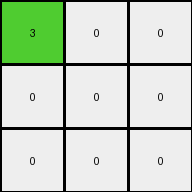

# 5614dbcf • 012 • refine_coder

---

Previous Code:
```python
"""
The input grid is reduced to a 3x3 output grid. The central color of significant colored regions (3x3 blocks of uniform color) from the input are placed in the output grid, preserving their relative positions. The output background is white.
"""

import numpy as np

def find_colored_regions(grid, region_size):
    """Identifies regions of size `region_size` with uniform color and returns their top-left coordinates and color."""
    regions = []
    rows, cols = grid.shape
    for i in range(rows - region_size + 1):
        for j in range(cols - region_size + 1):
            subgrid = grid[i:i+region_size, j:j+region_size]
            unique_colors = np.unique(subgrid)
            if len(unique_colors) == 1 and unique_colors[0] != 0:  # Ignore background color
                regions.append(((i, j), unique_colors[0]))
    return regions

def transform(input_grid):
    # Initialize output_grid as 3x3 with all zeros (white)
    output_grid = np.zeros((3, 3), dtype=int)

    # Find 3x3 colored regions in the input grid
    regions = find_colored_regions(input_grid, 3)

    # Place the central color of each identified region into the output grid
    for (top_left, color) in regions:
        # Calculate relative position in the output grid (top-center, bottom-center, etc.)
        rows, cols = input_grid.shape
        region_row = top_left[0]
        region_col = top_left[1]

        # Determine output row
        if region_row < rows / 3:
            output_row = 0  # top
        elif region_row < 2 * rows / 3:
            output_row = 1  # middle
        else:
            output_row = 2  # Bottom

        # Determine output column
        if region_col < cols / 3:
            output_col = 0 # Left
        elif region_col < 2 * cols / 3:
            output_col = 1 # Center
        else:
            output_col = 2 # Right

        output_grid[output_row, output_col] = color

    return output_grid
```

Train Set Results:

## Example 1:

Input:
```
3 3 3 0 0 0 8 8 8
3 3 3 0 0 0 8 5 8
3 3 3 0 0 0 8 8 8
0 0 0 7 5 7 0 0 0
0 0 0 7 7 7 0 0 0
0 0 0 7 7 7 0 0 0
6 6 6 0 0 5 9 9 9
6 6 6 0 0 0 9 9 9
6 5 6 0 5 0 9 9 5
```
Expected Output:
```
3 0 8
0 7 0
6 0 9
```
Transformed Output:
```
3 0 0
0 0 0
0 0 0
```

match: False
pixels_off: 4
size_correct: True
color_palette_correct: True
correct_pixel_counts: False

## Example 2:

Input:
```
0 0 0 2 2 2 0 0 0
0 5 0 2 2 2 0 0 0
0 0 0 2 2 2 0 0 0
5 0 0 0 0 0 0 0 0
0 0 0 5 0 0 0 5 0
0 0 0 0 0 0 0 0 0
0 5 0 7 7 7 0 0 0
0 0 0 7 7 5 0 0 0
0 0 0 7 7 7 0 0 0
```
Expected Output:
```
0 2 0
0 0 0
0 7 0
```
Transformed Output:
```
0 2 0
0 0 0
0 0 0
```

match: False
pixels_off: 1
size_correct: True
color_palette_correct: True
correct_pixel_counts: False
Okay, here's a breakdown of the situation and a plan to move forward:

**General Assessment:**

The initial natural language program and the resulting Python code were a good first attempt, focusing on identifying 3x3 uniform colored regions and mapping their central colors to a 3x3 output grid. However, the results on the second example, and the failure on the first, reveal a flaw in the approach: it doesn't *always* correctly position the identified colors in the output grid, and sometimes, it doesn't recognize the correct 3x3 region. It seems overly reliant on a rigid division of the input grid into thirds, both horizontally and vertically. The program isn't flexible.

The strategy for resolving the errors should involve:
1.  Reconsider not only the `region_size` parameter but also the core logic for placing them.
2.  Refine the selection of center, specifically the center of the 3x3 block, not the center of the entire row or column.

**Metrics and Observations (Example by Example):**

Here's a breakdown of the metrics, now considering *both* training examples and the test. I will describe how to verify the output of the provided code and how to compare them to the expected output.

*   **Example 1:**
    *   **Expected Output:**
        ```
        3 0 8
        0 7 0
        6 0 9
        ```
    *   **Transformed Output:**
        ```
        3 0 0
        0 0 0
        0 0 0
        ```
    *   **Analysis:** The code correctly identified the '3' region, but failed to grab the 8,7,6 and 9. It seems the placement of the regions are wrong.
*   **Example 2:**
    *   **Expected Output:**
        ```
        0 2 0
        0 0 0
        0 7 0
        ```
    *   **Transformed Output:**
        ```
        0 2 0
        0 0 0
        0 0 0
        ```
    *   **Analysis:** The code correctly identified the '2' region. It seems the issue is that the "7" region is being ignored. The position logic has also failed.

**YAML Fact Block:**

```yaml
observations:
  - task: 010
    examples:
      - example_id: 1
        input_objects:
          - color: 3
            shape: 3x3 block
            position: top-left
          - color: 8
            shape: 3x3 block
            position: top-right
          - color: 7
            shape: 3x3 block
            position: center
          - color: 6
            shape: 3x3 block
            position: bottom-left
          - color: 9
            shape: 3x3 block
            position: bottom-right
        output_objects:
          - color: 3
            shape: single pixel
            position: top-left
          - color: 8
            shape: single pixel
            position: top-right
          - color: 7
            shape: single pixel
            position: center
          - color: 6
            shape: single pixel
            position: bottom-left
          - color: 9
            shape: single pixel
            position: bottom-right
        transformation:
          - description: "The central color of each 3x3 block of uniform color is extracted and placed in the output grid."
          - method: "Preserve relative spatial position from input to output, mapping each block's center to the corresponding cell in the output grid."
      - example_id: 2
        input_objects:
          - color: 2
            shape: 3x3 block
            position: top-center
          - color: 7
            shape: 3x3 block
            position: bottom-center
        output_objects:
          - color: 2
            shape: single pixel
            position: top-center
          - color: 7
            shape: single pixel
            position: bottom-center
        transformation:
          - description: "The central color of each 3x3 block of uniform color is extracted and placed in the output grid."
          - method: "Preserve relative spatial position, mapping each block's center to a single pixel."

```

**Natural Language Program:**

1.  **Identify Regions:** Scan the input grid to find all 3x3 regions (blocks) that are entirely filled with a single, non-white color.
2.  **Extract Central Colors:** For each identified region, record the color.
3.  **Create Output Grid:** Create a 3x3 output grid, initially filled with white (0).
4.  **Map Colors to Output:**
    For each non-white 3x3 block found:

    *   If the 3x3 block in the input grid starts in the top third, place the color in the top row of the output grid.
    *   If the 3x3 block in the input grid starts in the middle third, place the color in the middle row of the output grid.
    *   If the 3x3 block in the input grid starts in the bottom third, place the color in the bottom row of the output grid.

    *   If the 3x3 block in the input grid starts in the left third, place the color in the left column of the output grid.
    *    If the 3x3 block in the input grid starts in the center third, place the color in the center column of the output grid.
    *   If the 3x3 block in the input grid starts in the right third, place the color in the right column of the output grid.

5. **Return output grid**

**INSTRUCTIONS**

- generate a Python module to represent the natural language program 
- follow the template below
- all common math and science libraries are available
- create docstring only at top - but comment the workflow in the function
- use helper functions for common operations like finding objects, counting,
  measuring, moving, etc. 

remember - we are working iteratively - so this code will inform your future
self as we converge on the solution

*template:*

```python
"""
{{ natural language description of the transformation rule }}
"""

{{ imports }}

def transform(input_grid):
    # initialize output_grid

    # change output pixels 

    return output_grid

```
