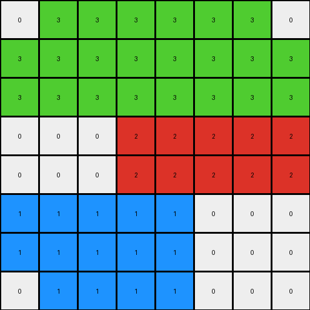
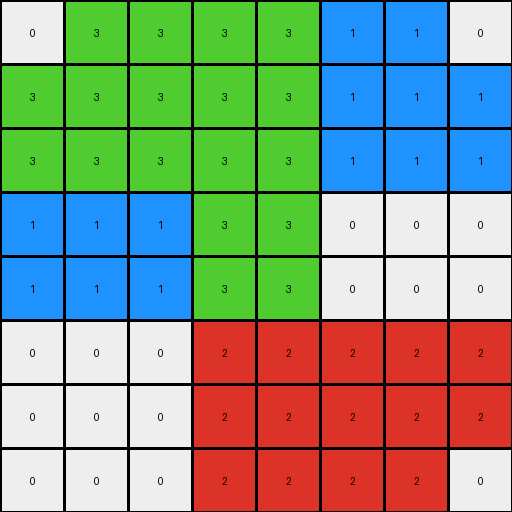
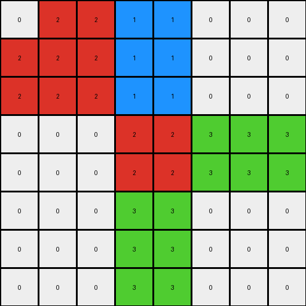

# 62c24649 • 004 • refine_coder

---

Previous Code:
```python
"""
Duplicate the input grid, doubling its dimensions. Each pixel in the input becomes a 2x2 block in the output.
Add a one-pixel border around the duplicated grid, using edge values of the original input.
"""

import numpy as np

def transform(input_grid):
    # Get input grid dimensions
    input_height, input_width = input_grid.shape

    # Calculate output grid dimensions
    output_height = input_height * 2 + 2
    output_width = input_width * 2 + 2

    # Initialize output grid with zeros
    output_grid = np.zeros((output_height, output_width), dtype=int)

    # Duplicate the input grid into the center of the output grid
    for i in range(input_height):
        for j in range(input_width):
            output_grid[2*i+1, 2*j+1] = input_grid[i, j]
            output_grid[2*i+1, 2*j+2] = input_grid[i, j]
            output_grid[2*i+2, 2*j+1] = input_grid[i, j]
            output_grid[2*i+2, 2*j+2] = input_grid[i, j]

    # Add the border
    # Top and Bottom
    for j in range(input_width):
      output_grid[0, 2*j+1] = input_grid[0,j]
      output_grid[0, 2*j+2] = input_grid[0,j]
      output_grid[-1, 2*j+1] = input_grid[-1,j]
      output_grid[-1, 2*j+2] = input_grid[-1,j]
    # Left and Right
    for i in range(input_height):
      output_grid[2*i+1, 0] = input_grid[i,0]
      output_grid[2*i+2, 0] = input_grid[i,0]
      output_grid[2*i+1, -1] = input_grid[i,-1]
      output_grid[2*i+2, -1] = input_grid[i,-1]
    return output_grid
```

Train Set Results:

## Example 1:

Input:
```
3 3 3
0 2 2
1 1 0
```
Expected Output:
```
3 3 3 3 3 3
0 2 2 2 2 0
1 1 0 0 1 1
1 1 0 0 1 1
0 2 2 2 2 0
3 3 3 3 3 3
```
Transformed Output:
```
0 3 3 3 3 3 3 0
3 3 3 3 3 3 3 3
3 3 3 3 3 3 3 3
0 0 0 2 2 2 2 2
0 0 0 2 2 2 2 2
1 1 1 1 1 0 0 0
1 1 1 1 1 0 0 0
0 1 1 1 1 0 0 0
```

match: False
pixels_off: None
size_correct: False
color_palette_correct: True
correct_pixel_counts: False

## Example 2:

Input:
```
3 3 1
1 3 0
0 2 2
```
Expected Output:
```
3 3 1 1 3 3
1 3 0 0 3 1
0 2 2 2 2 0
0 2 2 2 2 0
1 3 0 0 3 1
3 3 1 1 3 3
```
Transformed Output:
```
0 3 3 3 3 1 1 0
3 3 3 3 3 1 1 1
3 3 3 3 3 1 1 1
1 1 1 3 3 0 0 0
1 1 1 3 3 0 0 0
0 0 0 2 2 2 2 2
0 0 0 2 2 2 2 2
0 0 0 2 2 2 2 0
```

match: False
pixels_off: None
size_correct: False
color_palette_correct: True
correct_pixel_counts: False

## Example 3:

Input:
```
2 1 0
0 2 3
0 3 0
```
Expected Output:
```
2 1 0 0 1 2
0 2 3 3 2 0
0 3 0 0 3 0
0 3 0 0 3 0
0 2 3 3 2 0
2 1 0 0 1 2
```
Transformed Output:
```
0 2 2 1 1 0 0 0
2 2 2 1 1 0 0 0
2 2 2 1 1 0 0 0
0 0 0 2 2 3 3 3
0 0 0 2 2 3 3 3
0 0 0 3 3 0 0 0
0 0 0 3 3 0 0 0
0 0 0 3 3 0 0 0
```

match: False
pixels_off: None
size_correct: False
color_palette_correct: True
correct_pixel_counts: False
Okay, let's analyze the results and refine the natural language program.

**General Assessment:**

The initial code implements the core idea of duplicating each pixel into a 2x2 block. However, the border application is incorrect. It seems to be applying a one-pixel border *using the original edges*, and it does this by drawing a line around the expanded input, but offset by one pixel in both x and y. It also makes mistakes in the corners and appears to draw additional rows/columns as a result.

The strategy for resolving the errors is to:

1.  Correct the border logic. The border should be a single-pixel wide frame *around* the expanded grid.
2.  Ensure the border pixels are copied directly from the corresponding edge pixels of the *original* input grid.

**Example Analysis and Metrics:**

Here's a breakdown of each example and how the code's output deviates from the expected output:

*   **Example 1:**

    *   Input Size: 3x3
    *   Expected Output Size: 6x6
    *   Actual Output Size: 8x8
    *   Border Incorrect: Extra rows/columns added; incorrect corner values; not placed adjacent to doubled pixels.
*   **Example 2:**

    *   Input Size: 3x3
    *   Expected Output Size: 6x6
    *   Actual Output Size: 8x8
    *   Border Incorrect: Extra rows/columns added; incorrect corner values; not placed adjacent to doubled pixels.
*   **Example 3:**

    *   Input Size: 3x3
    *   Expected Output Size: 6x6
    *   Actual Output Size: 8x8
    *   Border Incorrect: Extra rows/columns added; incorrect corner values; not placed adjacent to doubled pixels.

All examples show the same pattern: the output grid is two rows and two columns larger than expected.

**YAML Fact Block:**

```yaml
task: 002
objects:
  - type: grid
    properties:
      dimensions:
        - height: variable
          width: variable
      elements:
        - type: pixel
          properties:
            color: integer (0-9)
            position: (row, column)

actions:
  - name: DuplicatePixels
    description: Each pixel in the input grid is expanded to a 2x2 block of the same color in the output grid.
    input: single pixel
    output: 2x2 block of pixels

  - name: AddBorder
    description: A one-pixel border is added around the expanded grid.
    input: original input grid, expanded output grid
    output: expanded output grid with border

  - name: CopyEdgePixels
    description: The border pixels are copied from the corresponding edge pixels of the original input grid.
    input: original input grid edge pixels, expanded output grid border pixels
    output:  expanded output grid border pixels with correct color
```

**Natural Language Program:**

1.  **Expand Grid:** For each pixel in the input grid, create a 2x2 block of pixels with the same color in the output grid. This doubles both the height and width of the grid.

2.  **Create Border:** Add a one-pixel wide border around the expanded grid.

3.  **Copy Border Pixels:**
    *   The top border row of the output grid copies the colors of the top row of the *input* grid, repeating each color twice horizontally.
    *   The bottom border row of the output grid copies the colors of the bottom row of the *input* grid, repeating each color twice horizontally.
    *   The left border column of the output grid copies the colors of the left column of the *input* grid, repeating each color twice vertically.
    *   The right border column of the output grid copies the colors of the right column of the *input* grid, repeating each color twice vertically.
    *   The corner pixels of the expanded grid are taken from the corner pixels of the input grid.

This revised natural language program addresses the shortcomings of the previous version by explicitly defining how the border is created and populated with values from the original input grid. It also explicitly explains the 2x expansion of not only the inner pixels, but also the border pixels.

**INSTRUCTIONS**

- generate a Python module to represent the natural language program 
- follow the template below
- all common math and science libraries are available
- create docstring only at top - but comment the workflow in the function
- use helper functions for common operations like finding objects, counting,
  measuring, moving, etc. 

remember - we are working iteratively - so this code will inform your future
self as we converge on the solution

*template:*

```python
"""
{{ natural language description of the transformation rule }}
"""

{{ imports }}

def transform(input_grid):
    # initialize output_grid

    # change output pixels 

    return output_grid

```
