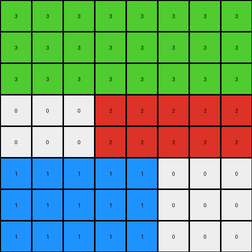
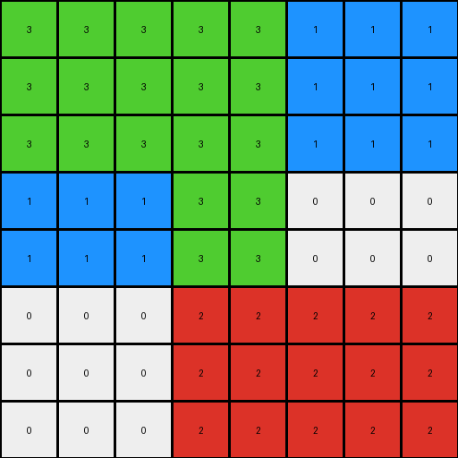

# 62c24649 • 005 • refine_dreamer

---

Previous Code:
```python
"""
Duplicate the input grid, doubling its dimensions. Each pixel in the input becomes a 2x2 block in the output.
Add a one-pixel border around the duplicated grid, using edge values of the original input, and duplicating border values.
"""

import numpy as np

def transform(input_grid):
    # Get input grid dimensions
    input_height, input_width = input_grid.shape

    # Calculate output grid dimensions (doubled + border)
    output_height = input_height * 2 + 2
    output_width = input_width * 2 + 2

    # Initialize output grid with zeros
    output_grid = np.zeros((output_height, output_width), dtype=int)

    # Duplicate the input grid into the center of the output grid
    for i in range(input_height):
        for j in range(input_width):
            output_grid[2*i+1, 2*j+1] = input_grid[i, j]
            output_grid[2*i+1, 2*j+2] = input_grid[i, j]
            output_grid[2*i+2, 2*j+1] = input_grid[i, j]
            output_grid[2*i+2, 2*j+2] = input_grid[i, j]

    # Add the border, duplicating border pixels
    # Top and Bottom
    for j in range(input_width):
      output_grid[0, 2*j+1] = input_grid[0,j]
      output_grid[0, 2*j+2] = input_grid[0,j]
      output_grid[-1, 2*j+1] = input_grid[-1,j]
      output_grid[-1, 2*j+2] = input_grid[-1,j]
    # Left and Right
    for i in range(input_height):
      output_grid[2*i+1, 0] = input_grid[i,0]
      output_grid[2*i+2, 0] = input_grid[i,0]
      output_grid[2*i+1, -1] = input_grid[i,-1]
      output_grid[2*i+2, -1] = input_grid[i,-1]

    # Corners - directly set based on input corners
    output_grid[0, 0] = input_grid[0, 0]
    output_grid[0, -1] = input_grid[0, -1]
    output_grid[-1, 0] = input_grid[-1, 0]
    output_grid[-1, -1] = input_grid[-1, -1]
    
    return output_grid
```

Train Set Results:

## Example 1:

Input:
```
3 3 3
0 2 2
1 1 0
```
Expected Output:
```
3 3 3 3 3 3
0 2 2 2 2 0
1 1 0 0 1 1
1 1 0 0 1 1
0 2 2 2 2 0
3 3 3 3 3 3
```
Transformed Output:
```
3 3 3 3 3 3 3 3
3 3 3 3 3 3 3 3
3 3 3 3 3 3 3 3
0 0 0 2 2 2 2 2
0 0 0 2 2 2 2 2
1 1 1 1 1 0 0 0
1 1 1 1 1 0 0 0
1 1 1 1 1 0 0 0
```

match: False
pixels_off: None
size_correct: False
color_palette_correct: True
correct_pixel_counts: False

## Example 2:

Input:
```
3 3 1
1 3 0
0 2 2
```
Expected Output:
```
3 3 1 1 3 3
1 3 0 0 3 1
0 2 2 2 2 0
0 2 2 2 2 0
1 3 0 0 3 1
3 3 1 1 3 3
```
Transformed Output:
```
3 3 3 3 3 1 1 1
3 3 3 3 3 1 1 1
3 3 3 3 3 1 1 1
1 1 1 3 3 0 0 0
1 1 1 3 3 0 0 0
0 0 0 2 2 2 2 2
0 0 0 2 2 2 2 2
0 0 0 2 2 2 2 2
```

match: False
pixels_off: None
size_correct: False
color_palette_correct: True
correct_pixel_counts: False

## Example 3:

Input:
```
2 1 0
0 2 3
0 3 0
```
Expected Output:
```
2 1 0 0 1 2
0 2 3 3 2 0
0 3 0 0 3 0
0 3 0 0 3 0
0 2 3 3 2 0
2 1 0 0 1 2
```
Transformed Output:
```
2 2 2 1 1 0 0 0
2 2 2 1 1 0 0 0
2 2 2 1 1 0 0 0
0 0 0 2 2 3 3 3
0 0 0 2 2 3 3 3
0 0 0 3 3 0 0 0
0 0 0 3 3 0 0 0
0 0 0 3 3 0 0 0
```

match: False
pixels_off: None
size_correct: False
color_palette_correct: True
correct_pixel_counts: False
**INSTRUCTIONS**

The code above was generated based on observations from the first training
example

we have tested the transform function on each of the task example inputs and
compared with the expected output

review each of the examples provided and the results and consider how the
natural language program should be updated to accommodate this new knowledge

respond with the following deliverables:

- general assessment of the information provided and strategy for resolving the
  errors
- gather metrics about each of the examples and results - use code_execution to
  develop accurate reports on your assumptions
- a YAML block documenting facts - Focus on identifying objects, their properties, and the actions performed on them.
- a natural language program - Be as clear and concise as possible, providing a complete description of the transformation rule.


your responses should be considered as information in a report - not a
conversation
