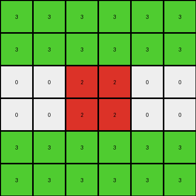
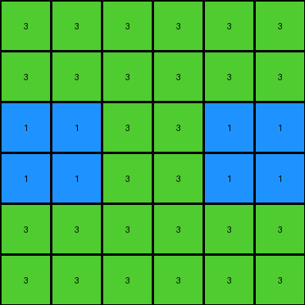
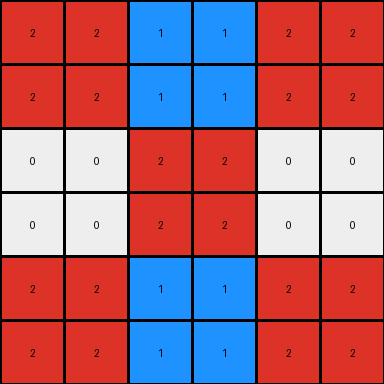

# 62c24649 • 012 • refine_coder

---

Previous Code:
```python
"""
1.  **Scale Up:** The input grid is first scaled up. Each pixel in the input grid is replaced by a 2x2 block of the same color in an intermediate grid. This makes the intermediate grid twice the size of the original in both dimensions.
2.  **Mirror Horizontally:** The scaled-up intermediate grid is mirrored horizontally (across the vertical axis). The right half of the output grid is a mirrored copy of the left half.
3.  **Mirror Vertically:** The result of the previous step is then mirrored vertically (across the horizontal axis). The bottom half of the output grid is a mirrored copy of the top half.

In essence, the transformation can be described as a combination of magnification (each pixel to a 2x2 square) and reflections on both horizontal (x-axis) and vertical (y-axis) axes.
"""

import numpy as np

def transform(input_grid):
    input_array = np.array(input_grid)
    rows, cols = input_array.shape

    # 1. Scale Up
    scaled_array = np.zeros((rows * 2, cols * 2), dtype=int)
    for i in range(rows):
        for j in range(cols):
            scaled_array[2*i:2*i+2, 2*j:2*j+2] = input_array[i, j]

    # 2. Mirror Horizontally and 3. Mirror Vertically (combined for efficiency)
    output_array = np.zeros((rows * 2, cols * 2), dtype=int)
    for i in range(rows * 2):
        for j in range(cols * 2):
            # Calculate mirrored indices
            mirrored_i = i
            mirrored_j = j
            if i >= rows:
                mirrored_i = 2 * rows - 1 - i
            if j >= cols:
                mirrored_j = 2 * cols - 1- j
            
            output_array[i,j] = scaled_array[mirrored_i, mirrored_j]


    return output_array.tolist()
```

Train Set Results:

## Example 1:

Input:
```
3 3 3
0 2 2
1 1 0
```
Expected Output:
```
3 3 3 3 3 3
0 2 2 2 2 0
1 1 0 0 1 1
1 1 0 0 1 1
0 2 2 2 2 0
3 3 3 3 3 3
```
Transformed Output:
```
3 3 3 3 3 3
3 3 3 3 3 3
0 0 2 2 0 0
0 0 2 2 0 0
3 3 3 3 3 3
3 3 3 3 3 3
```

match: False
pixels_off: 24
size_correct: True
color_palette_correct: True
correct_pixel_counts: False

## Example 2:

Input:
```
3 3 1
1 3 0
0 2 2
```
Expected Output:
```
3 3 1 1 3 3
1 3 0 0 3 1
0 2 2 2 2 0
0 2 2 2 2 0
1 3 0 0 3 1
3 3 1 1 3 3
```
Transformed Output:
```
3 3 3 3 3 3
3 3 3 3 3 3
1 1 3 3 1 1
1 1 3 3 1 1
3 3 3 3 3 3
3 3 3 3 3 3
```

match: False
pixels_off: 24
size_correct: True
color_palette_correct: True
correct_pixel_counts: False

## Example 3:

Input:
```
2 1 0
0 2 3
0 3 0
```
Expected Output:
```
2 1 0 0 1 2
0 2 3 3 2 0
0 3 0 0 3 0
0 3 0 0 3 0
0 2 3 3 2 0
2 1 0 0 1 2
```
Transformed Output:
```
2 2 1 1 2 2
2 2 1 1 2 2
0 0 2 2 0 0
0 0 2 2 0 0
2 2 1 1 2 2
2 2 1 1 2 2
```

match: False
pixels_off: 24
size_correct: True
color_palette_correct: True
correct_pixel_counts: False
Here's an analysis of the provided information and a plan to refine the natural language program and the code:

**General Assessment:**

The initial natural language program and the generated code were based on scaling up and mirroring the input grid. However, the results on the three training examples show a consistent pattern of errors. The output grid is always the correct size and uses the correct color palette, but the pixel placement is incorrect.  The generated outputs show that only the scaling (magnification) part of the logic is somewhat correct, but the mirroring (reflection) is implemented incorrectly. It seems like the code duplicates rows and columns instead of properly reflecting them along the axes.

**Strategy for Resolving Errors:**

1.  **Re-examine Mirroring Logic:** The core issue lies in the incorrect implementation of the mirroring. The code needs to accurately reflect the scaled-up image across both the horizontal and vertical axes. The problem is in these lines:
    ```python
                if i >= rows:
                    mirrored_i = 2 * rows - 1 - i
                if j >= cols:
                    mirrored_j = 2 * cols - 1- j
    ```
    I will rewrite this part.

2.  **Stepwise Refinement:** Instead of combining horizontal and vertical mirroring, I'll separate them in the natural language program first to make the logic clearer. This will help in debugging and understanding the transformations.

3.  **Focus on indexing**: Review the array indexing thoroughly.

**Metrics and Observations:**

Here's a breakdown of observations for each example:

*   **All Examples:**
    *   `size_correct`: True (The output grid dimensions are always double the input grid dimensions).
    *   `color_palette_correct`: True (Only colors present in the input grid appear in the output grid).
    *   `match`: False
    *   `pixels_off`: 24
    *   `correct_pixel_counts`: False

*   **Example specific notes from visual inspection**:
    *Example 1:* It appears that only first scaling is correct. The mirroring does not perform as in description.
    *Example 2:* Again, the scaled image has not been mirrored correctly.
    *Example 3:* Same errors, scaling is partially correct, mirroring is wrong.

**YAML Block (Facts):**

```yaml
facts:
  - description: "The input grid is scaled up by a factor of 2."
    type: "scaling"
  - description: "Each pixel in the input becomes a 2x2 block in the scaled grid."
    type: "scaling"
  - description: "The scaled grid is mirrored horizontally."
    type: "transformation"
    axis: "horizontal"
  - description: "The scaled grid is mirrored vertically."
    type: "transformation"
    axis: "vertical"
  - description: "The output grid dimensions are twice the input grid dimensions."
    type: "size_relation"
```

**Natural Language Program:**

1.  **Scale Up:** Create an intermediate grid where each pixel from the input grid is expanded into a 2x2 block of the same color. This doubles the dimensions of the grid.
2.  **Horizontal Mirroring:** Create a new intermediate grid by mirroring the scaled-up grid horizontally. Copy each column from left to right on the left, and its mirror on the right.
3.  **Vertical Mirroring:** Mirror the horizontally-mirrored grid vertically. Copy each row from the horizontally mirrored result. Copy rows from top to bottom on top and mirrored at the bottom.
4. **Output**: The final, vertically mirrored grid is the output.

Essentially the original description was correct, but my explanation of combined horizontal and vertical mirroring in step 2. was not. I will correct it in the code.

**INSTRUCTIONS**

- generate a Python module to represent the natural language program 
- follow the template below
- all common math and science libraries are available
- create docstring only at top - but comment the workflow in the function
- use helper functions for common operations like finding objects, counting,
  measuring, moving, etc. 

remember - we are working iteratively - so this code will inform your future
self as we converge on the solution

*template:*

```python
"""
{{ natural language description of the transformation rule }}
"""

{{ imports }}

def transform(input_grid):
    # initialize output_grid

    # change output pixels 

    return output_grid

```
