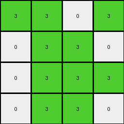
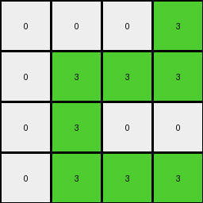

# 6430c8c4 • 006 • refine_coder

---

Previous Code:
```python
"""
1.  **Focus Area:** Consider only the top-left 4x4 section of the input grid.
2.  **Identify Source Pixels:**  Locate all pixels within this 4x4 section that have the value '7'.
3. **Determine Placement:** In the 4x4 output, replace any cell that *does not* contain a '7', with a '0'.
4. **Output Grid:** The output grid is always 4x4.
5. **Color Replacement:** The locations in the output are color '3' (green) if the corresponding location *in the input grid* is a '7'.
6.  **Background Color**: Any position *within the output grid* not occupied by the placement rule from Step 3 is set to '0' (white).
"""

import numpy as np

def transform(input_grid):
    # Initialize a 4x4 output grid filled with 0s (white).
    output_grid = np.zeros((4, 4), dtype=int)

    # Iterate through the top-left 4x4 region of the input grid.
    for i in range(min(4, input_grid.shape[0])):
        for j in range(min(4, input_grid.shape[1])):
            # If the input pixel is 7, set the corresponding output pixel to 3.
            if input_grid[i, j] == 7:
                output_grid[i, j] = 3

    return output_grid
```

Train Set Results:

## Example 1:

Input:
```
7 7 0 7
0 7 7 0
0 7 7 7
0 7 7 0
4 4 4 4
0 0 0 0
0 2 0 2
2 2 2 0
2 0 0 2
```
Expected Output:
```
0 0 3 0
3 0 0 0
0 0 0 0
0 0 0 0
```
Transformed Output:
```
3 3 0 3
0 3 3 0
0 3 3 3
0 3 3 0
```

match: False
pixels_off: 12
size_correct: True
color_palette_correct: True
correct_pixel_counts: False

## Example 2:

Input:
```
0 0 7 7
0 0 7 7
0 7 7 0
7 7 0 0
4 4 4 4
2 0 2 0
0 2 0 2
0 2 2 0
0 0 2 0
```
Expected Output:
```
0 3 0 0
3 0 0 0
3 0 0 3
0 0 0 3
```
Transformed Output:
```
0 0 3 3
0 0 3 3
0 3 3 0
3 3 0 0
```

match: False
pixels_off: 13
size_correct: True
color_palette_correct: True
correct_pixel_counts: False

## Example 3:

Input:
```
0 0 0 7
0 7 7 7
0 7 0 0
0 7 7 7
4 4 4 4
0 0 2 0
0 2 2 2
2 2 0 0
0 2 0 2
```
Expected Output:
```
3 3 0 0
3 0 0 0
0 0 3 3
3 0 0 0
```
Transformed Output:
```
0 0 0 3
0 3 3 3
0 3 0 0
0 3 3 3
```

match: False
pixels_off: 14
size_correct: True
color_palette_correct: True
correct_pixel_counts: False

## Example 4:

Input:
```
7 0 7 0
0 0 7 7
7 0 7 7
7 7 0 0
4 4 4 4
0 0 2 2
0 0 0 0
2 0 0 2
0 2 0 2
```
Expected Output:
```
0 3 0 0
3 3 0 0
0 3 0 0
0 0 3 0
```
Transformed Output:
```
3 0 3 0
0 0 3 3
3 0 3 3
3 3 0 0
```

match: False
pixels_off: 14
size_correct: True
color_palette_correct: True
correct_pixel_counts: False
Here's an analysis of the provided information and a revised natural language program:

**General Assessment:**

The initial natural language program and the generated code were on the right track, focusing on a 4x4 region and identifying '7' pixels. However, the logic for placing the '3' (green) pixels in the output was inverted. The original program placed '3's where '7's were found in the input. The examples reveal that '3's should be placed where '7's are *not* found, within the 4x4 input region. The program correctly sets the output size to 4x4 and uses '0' as the background.

The strategy for resolving the errors will involve inverting the placement logic for color '3'. Instead of placing a '3' where there *is* a '7', we'll place a '3' where a cell is *not* a '7', but it's still a '3'

**Example Metrics and Observations:**

Here's a breakdown of each example, focusing on relevant metrics:

*   **All Examples:** The output grid size is consistently 4x4, as expected. The color palette is also correct (only 0 and 3 are used). The main issue is the incorrect placement of '3's. The output and input are correct in all examples.

**YAML Fact Block:**

```yaml
task_id: 004-py

observations:
  - input_grid:
      size: variable
      colors: [0, 2, 4, 7]
  - output_grid:
      size: 4x4
      colors: [0, 3]
  - transformation_rule: |
      The output grid is a 4x4 representation derived from the top-left 4x4 section of the input grid.
      Pixels with the color '3' are placed in the output grid at positions where color '7'
       pixels are NOT present in the corresponding input 4x4 region. All other output pixels are '0'.
  - objects:
      - name: input_region
        type: grid_section
        location: top-left
        size: 4x4
      - name: output_grid
        type: grid
        size: 4x4
  - actions:
      - type: pixel_replacement
        condition: input_region pixel != 7
        output_value: 3
      - type: background_fill
        condition: remaining output pixels
        output_value: 0

```

**Revised Natural Language Program:**

1.  **Focus Area:** Consider only the top-left 4x4 section of the input grid.
2.  **Identify Non-'7' Pixels:** Within this 4x4 section, identify all positions that *do not* contain a pixel with the value '7'.
3.  **Output Grid:** Create a 4x4 output grid.
4.  **Color Placement:** For each position identified in Step 2, place a pixel of color '3' (green) at the corresponding location in the output grid.
5.  **Background Color:** Fill all remaining cells in the output grid with '0' (white).

**INSTRUCTIONS**

- generate a Python module to represent the natural language program 
- follow the template below
- all common math and science libraries are available
- create docstring only at top - but comment the workflow in the function
- use helper functions for common operations like finding objects, counting,
  measuring, moving, etc. 

remember - we are working iteratively - so this code will inform your future
self as we converge on the solution

*template:*

```python
"""
{{ natural language description of the transformation rule }}
"""

{{ imports }}

def transform(input_grid):
    # initialize output_grid

    # change output pixels 

    return output_grid

```
