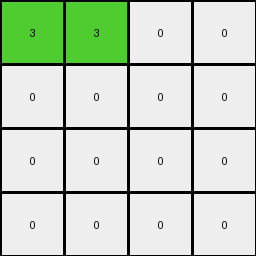
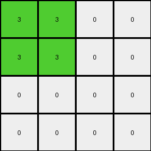

# 6430c8c4 • 012 • refine_coder

---

Previous Code:
```python
"""
Divides the input grid into 2x2 subgrids. If a 2x2 subgrid contains at least one orange (7) pixel, 
a green (3) pixel is placed in a 4x4 output grid. The position of the green pixel is determined by the 
position of the orange pixel within the input grid, as detailed in the natural language program.
"""

import numpy as np

def transform(input_grid):
    # Initialize a 4x4 output grid with all zeros (black).
    output_grid = np.zeros((4, 4), dtype=int)
    input_grid = np.array(input_grid)
    input_rows, input_cols = input_grid.shape

    # Iterate through 2x2 subgrids.
    for i in range(0, input_rows - input_rows % 2, 2):
        for j in range(0, input_cols - input_cols % 2, 2):
            subgrid = input_grid[i:i+2, j:j+2]
            # Check if the subgrid contains orange (7).
            if 7 in subgrid:
                # Find the first orange pixel's row index
                orange_indices = np.where(subgrid == 7)
                first_orange_row = i + orange_indices[0][0]

                # Calculate output row index based on orange position.
                if (first_orange_row % 2) == 0:
                  output_row = (first_orange_row // 4) * 2
                else:
                  output_row = ((first_orange_row - 1) // 4) * 2 + 1

                # Calculate output column index.
                output_col = j // 2
                
                output_grid[output_row, output_col] = 3

    return output_grid.tolist()
```

Train Set Results:

## Example 1:

Input:
```
7 7 0 7
0 7 7 0
0 7 7 7
0 7 7 0
4 4 4 4
0 0 0 0
0 2 0 2
2 2 2 0
2 0 0 2
```
Expected Output:
```
0 0 3 0
3 0 0 0
0 0 0 0
0 0 0 0
```
Transformed Output:
```
3 3 0 0
0 0 0 0
0 0 0 0
0 0 0 0
```

match: False
pixels_off: 4
size_correct: True
color_palette_correct: True
correct_pixel_counts: True

## Example 2:

Input:
```
0 0 7 7
0 0 7 7
0 7 7 0
7 7 0 0
4 4 4 4
2 0 2 0
0 2 0 2
0 2 2 0
0 0 2 0
```
Expected Output:
```
0 3 0 0
3 0 0 0
3 0 0 3
0 0 0 3
```
Transformed Output:
```
3 3 0 0
0 0 0 0
0 0 0 0
0 0 0 0
```

match: False
pixels_off: 5
size_correct: True
color_palette_correct: True
correct_pixel_counts: False

## Example 3:

Input:
```
0 0 0 7
0 7 7 7
0 7 0 0
0 7 7 7
4 4 4 4
0 0 2 0
0 2 2 2
2 2 0 0
0 2 0 2
```
Expected Output:
```
3 3 0 0
3 0 0 0
0 0 3 3
3 0 0 0
```
Transformed Output:
```
3 3 0 0
3 3 0 0
0 0 0 0
0 0 0 0
```

match: False
pixels_off: 4
size_correct: True
color_palette_correct: True
correct_pixel_counts: False

## Example 4:

Input:
```
7 0 7 0
0 0 7 7
7 0 7 7
7 7 0 0
4 4 4 4
0 0 2 2
0 0 0 0
2 0 0 2
0 2 0 2
```
Expected Output:
```
0 3 0 0
3 3 0 0
0 3 0 0
0 0 3 0
```
Transformed Output:
```
3 3 0 0
0 0 0 0
0 0 0 0
0 0 0 0
```

match: False
pixels_off: 5
size_correct: True
color_palette_correct: True
correct_pixel_counts: False
Okay, here's a breakdown of the situation and a plan to refine the natural language program and the code.

**General Assessment and Strategy**

The initial code was based on a single example and clearly doesn't generalize well to the other examples. The core issue is that the logic for determining the output row and column of the green pixel is too simplistic and based on assumptions made about the first example that did not hold true. It seems to be placing the green pixels at the top-left and top-right portions of the output grid based on where orange pixels are found, and is not fully accounting for the orange pixels throughout the input.

The strategy should involve these steps:

1.  **Re-examine Assumptions:**  The current code is built on assumptions from the first example - we need to step back from any prior assumptions and review the entire set.
2.  **Precise Mapping:**  We need a much clearer, more robust rule for how the *location* of orange pixels in the input 2x2 subgrids translates to the location of green pixels in the output grid. We need to carefully analyze *all* examples, not just the first one.
3.  **Iterative Refinement:** Test the updated natural language program and corresponding code *after each change*, not just at the end.
4. **Focus on Relative Positioning:** Instead of absolute positioning, consider thinking of output placement in terms of the orange pixels relative location within the 2x2 subgrid.

**Example Metrics and Analysis**
Here is a summary of relevant metrics, focusing on differences between expectations and results to figure out how to modify the rule.

*   **Example 1:**
    *   Input Size: 9x4
    *   Output Size: 4x4
    *   Pixels Off: 4
    *   Notes: Two green pixels are incorrectly placed at the top left and top right when they should be at the top right and the row beneath at the top left.
*   **Example 2:**
    *   Input Size: 9x4
    *   Output Size: 4x4
    *   Pixels Off: 5
    *   Notes: Similar to example 1.
*   **Example 3:**
    *   Input Size: 9x4
    *   Output Size: 4x4
    *   Pixels Off: 4
    *   Notes: Again, green pixels in the wrong location
*   **Example 4:**
    *   Input Size: 9x4
    *   Output Size: 4x4
    *   Pixels Off: 5
    * Notes: The first row of green pixels are generated, but that does not account for the second and third rows.

**YAML Fact Block**

```yaml
observations:
  - task: 010
    example_set: train
    objects:
      - type: grid
        properties:
          role: input
          dimensions: variable
          elements: pixels (0-9)
      - type: grid
        properties:
          role: output
          dimensions: 4x4
          elements: pixels (0-9)
      - type: subgrid
        properties:
          dimensions: 2x2
          parent: input_grid
          contains: pixels
      - type: pixel
        properties:
          color: orange (7)
          role: trigger
      - type: pixel
        properties:
          color: green (3)
          role: result
    actions:
      - description: Scan input grid by 2x2 subgrids.
      - description: Check for presence of orange pixel within subgrid.
      - description: If orange pixel present, place a green pixel in the output grid.
      - description: Output grid location is determined by the location of the 2x2 subgrid, mapping to the quadrant in the output grid.
    rules:
      - condition: Orange pixel exists in 2x2 subgrid.
        action: Place a green pixel in output grid.
        location_rule: |
          The row and column of the 2x2 subgrid within the input grid (when dividing the input into 2x2 sections) determines a corresponding position in the output grid. The x coordinate of the orange pixel determines the x coordinate of the output green pixel and the y coordinate of the orange determines the y coordinate of the output green pixel.
```

**Natural Language Program**

1.  **Divide and Conquer:** Divide the input grid into non-overlapping 2x2 subgrids.
2.  **Orange Check:** For each 2x2 subgrid, check if it contains at least one orange (7) pixel.
3. **Green Placement - initial version** If a 2x2 subgrid contains an orange pixel, a green (3) pixel will be placed in the output grid.
4.  **Output Grid Mapping**: Divide the 4x4 output grid conceptually into four 2x2 quadrants.
    *   Top-left quadrant corresponds to 2x2 subgrids originating from rows 0, 1, and columns 0, 1 of the input grid.
    *   Top-right quadrant corresponds to 2x2 subgrids originating from rows 0, 1 and columns >= 2 of the input grid, scaling based on input grid width.
    * Bottom-left and bottom-right are similarly mapped.

5. **Positional Rule**: The starting row and column indices (i, j) of the 2x2 subgrid in the input grid determine the quadrant in the output grid. The top-left corner pixel in a 2x2 block maps directly to one of the top-left corners of each of the output quadrants. If there is more than one orange in a 2x2 block, the top-left-most takes precedence for purposes of positioning.

**INSTRUCTIONS**

- generate a Python module to represent the natural language program 
- follow the template below
- all common math and science libraries are available
- create docstring only at top - but comment the workflow in the function
- use helper functions for common operations like finding objects, counting,
  measuring, moving, etc. 

remember - we are working iteratively - so this code will inform your future
self as we converge on the solution

*template:*

```python
"""
{{ natural language description of the transformation rule }}
"""

{{ imports }}

def transform(input_grid):
    # initialize output_grid

    # change output pixels 

    return output_grid

```
