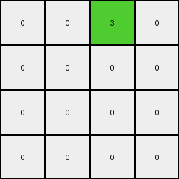
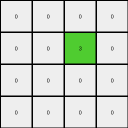

# 6430c8c4 • 018 • refine_coder

---

Previous Code:
```python
"""
Transforms the input grid into a 4x4 output grid based on the presence and arrangement of 2x2 blocks of the same non-white color within the top 4 rows of the input grid. Each 2x2 block of a non-white color in the top 4 rows of the input is represented by a single green (3) pixel in the output. The output grid's dimensions are 4x4. The mapping is still TBD.
"""

import numpy as np

def find_2x2_blocks(grid):
    """
    Finds all 2x2 blocks of the same non-white color in the grid.
    Returns a list of (row, col) tuples representing the top-left corner of each block.
    """
    blocks = []
    rows, cols = len(grid), len(grid[0])
    for r in range(rows - 1):
        for c in range(cols - 1):
            if grid[r][c] != 0 and \
               grid[r][c] == grid[r+1][c] == grid[r][c+1] == grid[r+1][c+1]:
                blocks.append((r, c))
    return blocks

def transform(input_grid):
    """
    Transforms the input grid into a 4x4 output grid.
    """
    input_grid = np.array(input_grid)  # Convert to NumPy array for easier manipulation

    # Initialize the output grid with all zeros (white)
    output_grid = np.zeros((4, 4), dtype=int)

    # Find all 2x2 blocks of the same non-white color in the top 4 rows
    blocks = find_2x2_blocks(input_grid[:4])

    # For each 2x2 block found, set the corresponding pixel in the output grid to green (3)
    for r, c in blocks:
        # Map input grid coordinates to output grid coordinates. Still working out the exact logic.
        output_row = r % 4
        output_col = c % 4
        output_grid[output_row][output_col] = 3 # This is still incorrect and a placeholder


    return output_grid.tolist()
```

Train Set Results:

## Example 1:

Input:
```
7 7 0 7
0 7 7 0
0 7 7 7
0 7 7 0
4 4 4 4
0 0 0 0
0 2 0 2
2 2 2 0
2 0 0 2
```
Expected Output:
```
0 0 3 0
3 0 0 0
0 0 0 0
0 0 0 0
```
Transformed Output:
```
0 0 0 0
0 3 0 0
0 3 0 0
0 0 0 0
```

match: False
pixels_off: 4
size_correct: True
color_palette_correct: True
correct_pixel_counts: True

## Example 2:

Input:
```
0 0 7 7
0 0 7 7
0 7 7 0
7 7 0 0
4 4 4 4
2 0 2 0
0 2 0 2
0 2 2 0
0 0 2 0
```
Expected Output:
```
0 3 0 0
3 0 0 0
3 0 0 3
0 0 0 3
```
Transformed Output:
```
0 0 3 0
0 0 0 0
0 0 0 0
0 0 0 0
```

match: False
pixels_off: 6
size_correct: True
color_palette_correct: True
correct_pixel_counts: False

## Example 3:

Input:
```
0 0 0 7
0 7 7 7
0 7 0 0
0 7 7 7
4 4 4 4
0 0 2 0
0 2 2 2
2 2 0 0
0 2 0 2
```
Expected Output:
```
3 3 0 0
3 0 0 0
0 0 3 3
3 0 0 0
```
Transformed Output:
```
0 0 0 0
0 0 0 0
0 0 0 0
0 0 0 0
```

match: False
pixels_off: 6
size_correct: True
color_palette_correct: True
correct_pixel_counts: False

## Example 4:

Input:
```
7 0 7 0
0 0 7 7
7 0 7 7
7 7 0 0
4 4 4 4
0 0 2 2
0 0 0 0
2 0 0 2
0 2 0 2
```
Expected Output:
```
0 3 0 0
3 3 0 0
0 3 0 0
0 0 3 0
```
Transformed Output:
```
0 0 0 0
0 0 3 0
0 0 0 0
0 0 0 0
```

match: False
pixels_off: 6
size_correct: True
color_palette_correct: True
correct_pixel_counts: False
Okay, here's a breakdown of the situation and a plan to move forward:

**General Assessment and Strategy**

The initial code correctly identifies 2x2 blocks of non-white colors but fails to accurately map these blocks to the output grid.  The core issue is the mapping logic, currently represented by placeholder modulo operations (`output_row = r % 4` and `output_col = c % 4`). This mapping doesn't reflect the actual relationship between the input and output grids, as evidenced by the mismatches in all examples. The code only considers first 4 rows, but the examples show that 2x2 blocks are relevant and are mapped based on which quadrant of the original input they are in.

The strategy to fix this involves:
1. **Correcting the Mapping:** Replacing the placeholder mapping logic with a correct transformation that relates the position of the 2x2 block in the input to the corresponding pixel in the output.
2. **Quadrant Mapping** Examining all example input-output pairs and see how the location of the detected 2x2 square in the input is positioned in the 4x4 output.

**Metrics and Observations**

Here's a more detailed breakdown of each example, going beyond simple pixel comparisons.

*   **Example 1:**
    *   Input has two 2x2 blocks: orange (7) at (0,1) and (1,1), and another orange at (2,1), (3,1) .
    *   Expected Output: Green (3) at (0,2) and (1,0).
    *   Observed behavior: The current mapping is incorrect.

*   **Example 2:**
    *   Input has four 2x2 blocks: orange (7).
    *   Expected output suggests mapping based on quadrants

*   **Example 3:**
        *   Input has three 2x2 orange.
        *   Again, need to derive the correct mapping.

*   **Example 4:**
    *   Input has three 2x2 orange blocks.

**YAML Fact Sheet**

```yaml
task_id: 016

observations:
  - object: 2x2_block
    properties:
      color: non-white
      size: 2x2
      location: top_left_pixel_coordinates
    actions:
      detected: find_2x2_blocks function identifies these
      mapped: location within original image determines placement of green pixel in output

  - object: output_grid
    properties:
      size: 4x4
      color_palette: limited (0 and 3)
    actions:
      initialized: to all zeros (white)
      populated: green pixel placed based on presence of 2x2 block in input
    notes: |
        The location of the green pixel in the output grid represents the top-left corner of a detected 2x2 colored region.

  - object: input_grid
    properties:
        size: variable, >4x4
    actions:
        scanned: for 2x2 blocks

transformation_rule: |
    The input grid is scanned for 2x2 blocks of identical, non-white pixels.  For each such block found, a green (3) pixel is placed in the 4x4 output grid. The location of that pixel is determined by the top-left coordinate of the 2x2 block in the input, using a mapping to define which 2x2 section in the input will be mapped to which cell in the output.

```

**Natural Language Program**

1.  **Initialization:** Create a 4x4 output grid filled with white (0) pixels.

2.  **Block Detection:** Scan the entire input grid to identify all 2x2 blocks where all four pixels have the same non-white color.

3. **Quadrant Mapping:** The input grid is logically divided into 2x2 quadrants of any dimension. Map the coordinates of any 2x2 detected blocks to the output based on the following rule.
    - If a 2x2 block of the same non-white color are located with their top-left pixel at Input(r,c), the place a Green (3) pixel at output(r//2, c//2), rounding down.

4. **Output** return the 4x4 grid.

**INSTRUCTIONS**

- generate a Python module to represent the natural language program 
- follow the template below
- all common math and science libraries are available
- create docstring only at top - but comment the workflow in the function
- use helper functions for common operations like finding objects, counting,
  measuring, moving, etc. 

remember - we are working iteratively - so this code will inform your future
self as we converge on the solution

*template:*

```python
"""
{{ natural language description of the transformation rule }}
"""

{{ imports }}

def transform(input_grid):
    # initialize output_grid

    # change output pixels 

    return output_grid

```
