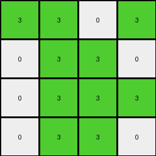
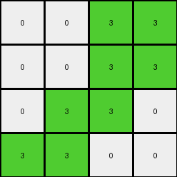

# 6430c8c4 • 021 • refine_dreamer

---


Previous Code:
```python
"""
1. **Identify Divider:** Locate the horizontal line of yellow (4) pixels in the input grid. This line divides the input grid into an "upper region" and "lower region".
2.  **Focus on Upper Region:** Disregard the "lower region" of the input grid (everything at or below the yellow line).
3. **Determine output size:** The output size is the dimensions of the "upper region".
4.  **Map to Output:** Create an output grid of the dimensions determined in the previous step. For each non-white pixel in the "upper region", change the color to green (3). Change all the white pixels to 0.
"""

import numpy as np

def find_horizontal_line(grid, color):
    """Finds the row index of a horizontal line of a given color."""
    for i, row in enumerate(grid):
        if all(pixel == color for pixel in row):
            return i
    return -1  # Not found

def transform(input_grid):
    """Transforms the input grid according to the described rule."""
    input_grid = np.array(input_grid)

    # 1. Identify Divider
    yellow_line_row = find_horizontal_line(input_grid, 4)

    # 2. Focus on Upper Region
    upper_region = input_grid[:yellow_line_row]

    # 3. Determine Output size
    output_height, output_width = upper_region.shape
    
    # Initialize the output_grid
    output_grid = np.zeros((output_height, output_width), dtype=int)


    # 4. Map to Output
    for i in range(output_height):
        for j in range(output_width):
            if upper_region[i,j] != 0:
                output_grid[i,j] = 3
            else:
                output_grid[i, j] = 0


    return output_grid.tolist()
```

Train Set Results:

## Example 1:

Input:
```
7 7 0 7
0 7 7 0
0 7 7 7
0 7 7 0
4 4 4 4
0 0 0 0
0 2 0 2
2 2 2 0
2 0 0 2
```
Expected Output:
```
0 0 3 0
3 0 0 0
0 0 0 0
0 0 0 0
```
Transformed Output:
```
3 3 0 3
0 3 3 0
0 3 3 3
0 3 3 0
```

match: False
pixels_off: 12
size_correct: True
color_palette_correct: True
correct_pixel_counts: False

## Example 2:

Input:
```
0 0 7 7
0 0 7 7
0 7 7 0
7 7 0 0
4 4 4 4
2 0 2 0
0 2 0 2
0 2 2 0
0 0 2 0
```
Expected Output:
```
0 3 0 0
3 0 0 0
3 0 0 3
0 0 0 3
```
Transformed Output:
```
0 0 3 3
0 0 3 3
0 3 3 0
3 3 0 0
```

match: False
pixels_off: 13
size_correct: True
color_palette_correct: True
correct_pixel_counts: False

## Example 3:

Input:
```
0 0 0 7
0 7 7 7
0 7 0 0
0 7 7 7
4 4 4 4
0 0 2 0
0 2 2 2
2 2 0 0
0 2 0 2
```
Expected Output:
```
3 3 0 0
3 0 0 0
0 0 3 3
3 0 0 0
```
Transformed Output:
```
0 0 0 3
0 3 3 3
0 3 0 0
0 3 3 3
```

match: False
pixels_off: 14
size_correct: True
color_palette_correct: True
correct_pixel_counts: False

## Example 4:

Input:
```
7 0 7 0
0 0 7 7
7 0 7 7
7 7 0 0
4 4 4 4
0 0 2 2
0 0 0 0
2 0 0 2
0 2 0 2
```
Expected Output:
```
0 3 0 0
3 3 0 0
0 3 0 0
0 0 3 0
```
Transformed Output:
```
3 0 3 0
0 0 3 3
3 0 3 3
3 3 0 0
```

match: False
pixels_off: 14
size_correct: True
color_palette_correct: True
correct_pixel_counts: False

**INSTRUCTIONS**

The code above was generated based on observations from the first training
example

we have tested the transform function on each of the task example inputs and
compared with the expected output

review each of the examples provided and the results and consider how the
natural language program should be updated to accommodate this new knowledge

respond with the following deliverables:

- general assessment of the information provided and strategy for resolving the
  errors
- gather metrics about each of the examples and results - use code_execution to
  develop accurate reports on your assumptions
- a YAML block documenting facts - Focus on identifying objects, their properties, and the actions performed on them.
- a natural language program - Be as clear and concise as possible, providing a complete description of the transformation rule.


your responses should be considered as information in a report - not a
conversation
