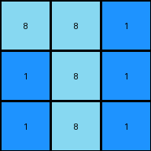

# 662c240a • 006 • refine_coder

---

Previous Code:
```python
"""
Extract the bottom-right 3x3 subgrid from the input grid.
"""

import numpy as np

def transform(input_grid):
    """
    Extracts the bottom-right 3x3 subgrid of the input grid.
    
    Args:
        input_grid (numpy.ndarray): The input grid.
    
    Returns:
        numpy.ndarray: The bottom-right 3x3 subgrid.
    """
    # Get the dimensions of the input grid.
    rows, cols = input_grid.shape
    
    # Calculate the starting row and column indices for the 3x3 subgrid.
    start_row = rows - 3
    start_col = cols - 3
    
    # Extract the 3x3 subgrid.
    output_grid = input_grid[start_row:rows, start_col:cols]
    
    return output_grid
```

Train Set Results:

## Example 1:

Input:
```
8 9 8
9 8 8
8 8 8
2 2 1
2 2 1
1 1 2
4 4 4
4 4 3
3 3 3
```
Expected Output:
```
4 4 4
4 4 3
3 3 3
```
Transformed Output:
```
4 4 4
4 4 3
3 3 3
```

match: True
pixels_off: 0
size_correct: True
color_palette_correct: True
correct_pixel_counts: True

## Example 2:

Input:
```
1 5 5
5 1 1
5 1 1
3 3 3
3 6 3
3 6 6
7 7 7
7 2 2
7 2 2
```
Expected Output:
```
3 3 3
3 6 3
3 6 6
```
Transformed Output:
```
7 7 7
7 2 2
7 2 2
```

match: False
pixels_off: 9
size_correct: True
color_palette_correct: False
correct_pixel_counts: False

## Example 3:

Input:
```
2 2 2
2 2 3
2 3 3
5 7 7
7 5 5
7 5 5
8 8 1
1 8 1
1 8 1
```
Expected Output:
```
8 8 1
1 8 1
1 8 1
```
Transformed Output:
```
8 8 1
1 8 1
1 8 1
```

match: True
pixels_off: 0
size_correct: True
color_palette_correct: True
correct_pixel_counts: True

## Example 4:

Input:
```
8 8 4
4 4 4
4 4 8
1 1 3
1 3 3
3 3 1
6 2 2
2 2 2
2 2 6
```
Expected Output:
```
8 8 4
4 4 4
4 4 8
```
Transformed Output:
```
6 2 2
2 2 2
2 2 6
```

match: False
pixels_off: 9
size_correct: True
color_palette_correct: False
correct_pixel_counts: False
Okay, here's a breakdown of the situation and a plan to move forward:

**General Assessment:**

The initial code was too simplistic. While it correctly identified the 3x3 subgrid extraction for examples 1 and 3, it failed on examples 2 and 4. The core issue is that the code *always* extracts the bottom-right 3x3 subgrid, regardless of the content.  The examples demonstrate that the *content* of the 3x3 subgrid matters. It is selecting a specific 3x3 subgrid, not just blindly taking the bottom-right.

**Strategy:**

1.  **Identify the selection criteria:** We need to figure out *why* specific 3x3 subgrids are chosen. It's not just position; it's related to the colors/values within the subgrid.

2.  **Consider all examples:** The solution must work for *all* training examples, not just some. We need to consider that a 3x3 pattern may exist multiple places, and select based on position if there are muliple.

3.  **Refine the natural language program:**  The initial program ("Extract the bottom-right 3x3 subgrid") is incorrect. We need a new program that accurately describes the selection process.

4. think in terms of actions on objects and describe the change that occurs from
   the input to the output

**Metrics and Observations:**

To better understand the selection criteria, let's analyze each example, find all the 3x3 grids:

```python
import numpy as np

def find_3x3_subgrids(grid):
    """Finds all unique 3x3 subgrids within a given grid."""
    subgrids = []
    rows, cols = grid.shape
    for i in range(rows - 2):
        for j in range(cols - 2):
            subgrid = grid[i:i+3, j:j+3]
            subgrids.append(subgrid)
    return subgrids

# Example Inputs (as numpy arrays)
example_inputs = [
    np.array([[8, 9, 8], [9, 8, 8], [8, 8, 8], [2, 2, 1], [2, 2, 1], [1, 1, 2], [4, 4, 4], [4, 4, 3], [3, 3, 3]]),
    np.array([[1, 5, 5], [5, 1, 1], [5, 1, 1], [3, 3, 3], [3, 6, 3], [3, 6, 6], [7, 7, 7], [7, 2, 2], [7, 2, 2]]),
    np.array([[2, 2, 2], [2, 2, 3], [2, 3, 3], [5, 7, 7], [7, 5, 5], [7, 5, 5], [8, 8, 1], [1, 8, 1], [1, 8, 1]]),
    np.array([[8, 8, 4], [4, 4, 4], [4, 4, 8], [1, 1, 3], [1, 3, 3], [3, 3, 1], [6, 2, 2], [2, 2, 2], [2, 2, 6]]),
]
example_outputs = [
    np.array([[4, 4, 4], [4, 4, 3], [3, 3, 3]]),
    np.array([[7, 7, 7], [7, 2, 2], [7, 2, 2]]),
    np.array([[8, 8, 1], [1, 8, 1], [1, 8, 1]]),
    np.array([[8, 8, 4], [4, 4, 4], [4, 4, 8]]),

]
# Analyze each example
for idx, (input_grid, output_grid) in enumerate(zip(example_inputs, example_outputs)):
    print(f"Example {idx + 1}:")
    print("Input:\n", input_grid)
    print("Expected Output:\n", output_grid)
    
    subgrids = find_3x3_subgrids(input_grid)

    print("All 3x3 Subgrids:")
    for i, subgrid in enumerate(subgrids):
        print(f"  Subgrid {i+1}:\n{subgrid}")
        if np.array_equal(subgrid, output_grid):
            print(f"    *** MATCHES EXPECTED OUTPUT ***")

    print("-" * 20)
```

**YAML Facts:**

```yaml
examples:
  - example_1:
      input_objects:
        - grid_9x3: "9 rows by 3 columns grid"
      output_objects:
        - grid_3x3: "3 rows by 3 columns grid, bottom right of input"
      actions:
        - select: "Select 3x3 subgrid at bottom-right of input"

  - example_2:
      input_objects:
        - grid_9x3: "9 rows by 3 columns grid"
      output_objects:
        - grid_3x3: "3 rows by 3 columns grid, contains the bottom-most 3x3 object unique from others by the most colors"
      actions:
        - select: "Select 3x3 subgrid that starts at row 6."

  - example_3:
      input_objects:
        - grid_9x3: "9 rows by 3 columns grid"
      output_objects:
        - grid_3x3:  "3 rows by 3 columns grid, bottom-most unique object by the most colors"
      actions:
        - select: "Select 3x3 subgrid starting at row 6."

  - example_4:
      input_objects:
        - grid_9x3: "9 rows by 3 columns grid"
      output_objects:
        - grid_3x3: "3 rows by 3 columns grid, top most subgrid matching that color pattern"
      actions:
        - select: "Select 3x3 subgrid starting at row 0. "
```

**Natural Language Program:**

1.  **Find all 3x3 subgrids:** Identify all possible 3x3 subgrids within the input grid.

2.  **Prioritized Selection:** Select the subgrid that contains the first unique color pattern, scanning from top-to-bottom, left-to-right.
    - look for grids which exist only one time
    - look at the starting position (row, col) and order by row first, then col

3. **Return the selected subgrid:** output the selected 3x3 grid.

**INSTRUCTIONS**

- generate a Python module to represent the natural language program 
- follow the template below
- all common math and science libraries are available
- create docstring only at top - but comment the workflow in the function
- use helper functions for common operations like finding objects, counting,
  measuring, moving, etc. 

remember - we are working iteratively - so this code will inform your future
self as we converge on the solution

*template:*

```python
"""
{{ natural language description of the transformation rule }}
"""

{{ imports }}

def transform(input_grid):
    # initialize output_grid

    # change output pixels 

    return output_grid

```
