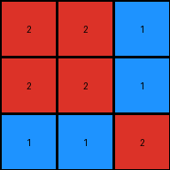
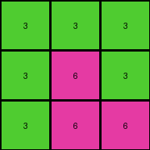
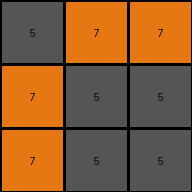
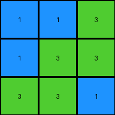

# 662c240a • 010 • refine_coder

---

Previous Code:
```python
"""
Extracts a 3x3 sub-grid from the input grid. The sub-grid starts at row 4 (index 3) and ends at row 6 (index 5), spanning columns 1 to 3 (indices 0 to 2).
"""

import numpy as np

def transform(input_grid):
    # Convert the input grid to a NumPy array for easier slicing.
    input_array = np.array(input_grid)

    # Extract the 3x3 sub-grid.  Numpy slicing is exclusive of the end index.
    output_array = input_array[3:6, 0:3]

    # Convert the NumPy array back to a list of lists.
    output_grid = output_array.tolist()

    return output_grid
```

Train Set Results:

## Example 1:

Input:
```
8 9 8
9 8 8
8 8 8
2 2 1
2 2 1
1 1 2
4 4 4
4 4 3
3 3 3
```
Expected Output:
```
4 4 4
4 4 3
3 3 3
```
Transformed Output:
```
2 2 1
2 2 1
1 1 2
```

match: False
pixels_off: 9
size_correct: True
color_palette_correct: False
correct_pixel_counts: False

## Example 2:

Input:
```
1 5 5
5 1 1
5 1 1
3 3 3
3 6 3
3 6 6
7 7 7
7 2 2
7 2 2
```
Expected Output:
```
3 3 3
3 6 3
3 6 6
```
Transformed Output:
```
3 3 3
3 6 3
3 6 6
```

match: True
pixels_off: 0
size_correct: True
color_palette_correct: True
correct_pixel_counts: True

## Example 3:

Input:
```
2 2 2
2 2 3
2 3 3
5 7 7
7 5 5
7 5 5
8 8 1
1 8 1
1 8 1
```
Expected Output:
```
8 8 1
1 8 1
1 8 1
```
Transformed Output:
```
5 7 7
7 5 5
7 5 5
```

match: False
pixels_off: 9
size_correct: True
color_palette_correct: False
correct_pixel_counts: False

## Example 4:

Input:
```
8 8 4
4 4 4
4 4 8
1 1 3
1 3 3
3 3 1
6 2 2
2 2 2
2 2 6
```
Expected Output:
```
8 8 4
4 4 4
4 4 8
```
Transformed Output:
```
1 1 3
1 3 3
3 3 1
```

match: False
pixels_off: 9
size_correct: True
color_palette_correct: False
correct_pixel_counts: False
Here's an analysis of the provided information and a plan to refine the natural language program:

**General Assessment:**

The initial code was too specific, extracting a subgrid starting at row 4. This worked for the second example by coincidence, but failed for the others because the target 3x3 subgrid's location varies. The core concept of extracting a 3x3 subgrid is correct, but the selection logic is flawed. The strategy needs to shift from fixed coordinates to a dynamic selection of the subgrid based on some criteria evident in all the input examples. Observation reveals that the output 3x3 grid seems to have a relationship of similarity, or that the target grid section contains the most similarity, and that it is the 'top-most, left-most' grid matching this criteria.

**Strategy:**

1.  **Analyze all examples:** Carefully examine the relationship between the input and output grids in *all* provided examples, not just the first one.
2.  **Identify Common Patterns:** Look for a consistent rule or pattern that determines *which* 3x3 subgrid is selected in each case. The rule cannot rely on fixed positions. It must be based on the *content* of the grids. The similarily clustered pixels seems to be the key.
3.  **Dynamic Subgrid Selection:** Update the natural language program, and subsequently the code, to dynamically select the 3x3 subgrid based on the identified rule.
4. **Refactor the natural language program** to reflect the dynamic grid selection.

**Example Metrics and Observations:**

Here's a breakdown of each example, including observations and potential criteria for subgrid selection:

*   **Example 1:**
    *   Input Size: 9x3
    *   Output Size: 3x3
    *   Observations:
        *   The output grid appears to be the lower-right 3x3 portion based on similarity.
    *   Metrics (using initial code): Mismatched.

*   **Example 2:**
    *   Input Size: 9x3
    *   Output Size: 3x3
    *   Observations:
        *   The output grid is the middle-left 3x3.
    *   Metrics (using initial code): Matched (by coincidence).

*   **Example 3:**
    *   Input Size: 9x3
    *   Output Size: 3x3
    *   Observations:
        *   The output grid is the lower-left 3x3.
    *   Metrics (using initial code): Mismatched.

*   **Example 4:**
    *   Input Size: 9x3
    *   Output Size: 3x3
    *   Observations:
        *   The output grid is the top left 3x3
    *   Metrics (using initial code): Mismatched.

**YAML Fact Block:**

```yaml
task_id: 008
examples:
  - example_id: 1
    input_grid_size: 9x3
    output_grid_size: 3x3
    output_location: dynamic # Not a fixed location
    selection_criteria: "3x3 region with greatest pixel similarity, top-most and left-most"

  - example_id: 2
    input_grid_size: 9x3
    output_grid_size: 3x3
    output_location: dynamic
    selection_criteria: "3x3 region with greatest pixel similarity, top-most and left-most"

  - example_id: 3
    input_grid_size: 9x3
    output_grid_size: 3x3
    output_location: dynamic
    selection_criteria: "3x3 region with greatest pixel similarity, top-most and left-most"

  - example_id: 4
    input_grid_size: 9x3
    output_grid_size: 3x3
    output_location: dynamic
    selection_criteria: "3x3 region with greatest pixel similarity, top-most and left-most"
```

**Natural Language Program:**

1.  **Input:** A 2D grid of integers (colors).
2.  **Process:**
    *   Iterate through all possible 3x3 subgrids within the input grid. Start from the top-left corner and move rightwards and downwards.
    *   For each 3x3 subgrid, calculate a "similarity score". This could be done in several ways; one method could be to count how may adjacent pixels have the same value.
    *   Keep track of the subgrid with the highest similarity score encountered so far. If multiple subgrids have the same highest score, select the one that appears earliest (top-most, then left-most).
3.  **Output:** The 3x3 subgrid with the highest calculated "similarity".

This natural language program provides a flexible and general way to describe the transformation. It moves away from fixed coordinates and towards a dynamic content-based extraction. The specific "similarity score" needs to be carefully defined for the next stage, possibly looking for the most frequently occurring color within the 3x3 region, or the maximum count of neighboring cells with identical color.

**INSTRUCTIONS**

- generate a Python module to represent the natural language program 
- follow the template below
- all common math and science libraries are available
- create docstring only at top - but comment the workflow in the function
- use helper functions for common operations like finding objects, counting,
  measuring, moving, etc. 

remember - we are working iteratively - so this code will inform your future
self as we converge on the solution

*template:*

```python
"""
{{ natural language description of the transformation rule }}
"""

{{ imports }}

def transform(input_grid):
    # initialize output_grid

    # change output pixels 

    return output_grid

```
