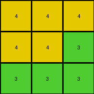

# 662c240a • 015 • refine_dreamer

---


Previous Code:
```python
"""
1.  **Identify the bottom-most section of the input grid.** This section is defined as contiguous rows, up to the point where the next upper row contains different colors.
2.  **Output this section.** The output grid has the same dimensions as the bottom area.

In simpler terms, extract the last "unique colored block" of rows from the bottom.
"""

import numpy as np

def get_bottom_unique_block(grid):
    """
    Identifies the bottom-most section of the grid consisting of
    contiguous rows with the same color composition, up to the point
    where the next upper row contains different colors.
    """
    rows, cols = grid.shape
    bottom_block_start = rows - 1

    # Start from the bottom and move up
    while bottom_block_start > 0:
        current_row_colors = set(grid[bottom_block_start])
        prev_row_colors = set(grid[bottom_block_start - 1])

        if current_row_colors != prev_row_colors:
            #check to make sure that they are not completely different colors
            if len(current_row_colors.intersection(prev_row_colors)) == 0:
                break  # Found a row with diff colors
            else:
                bottom_block_start -=1 #the rows contain some of the same colors
        else:
            bottom_block_start -= 1


    return grid[bottom_block_start:]

def transform(input_grid):
    """
    Transforms the input grid by extracting the bottom-most uniquely colored block.
    """
    # Convert input grid to numpy array for easier manipulation
    input_grid = np.array(input_grid)

    # Get the bottom unique block
    output_grid = get_bottom_unique_block(input_grid)

    return output_grid.tolist()
```

Train Set Results:

## Example 1:

Input:
```
8 9 8
9 8 8
8 8 8
2 2 1
2 2 1
1 1 2
4 4 4
4 4 3
3 3 3
```
Expected Output:
```
4 4 4
4 4 3
3 3 3
```
Transformed Output:
```
4 4 4
4 4 3
3 3 3
```

match: True
pixels_off: 0
size_correct: True
color_palette_correct: True
correct_pixel_counts: True

## Example 2:

Input:
```
1 5 5
5 1 1
5 1 1
3 3 3
3 6 3
3 6 6
7 7 7
7 2 2
7 2 2
```
Expected Output:
```
3 3 3
3 6 3
3 6 6
```
Transformed Output:
```
7 7 7
7 2 2
7 2 2
```

match: False
pixels_off: 9
size_correct: True
color_palette_correct: False
correct_pixel_counts: False

## Example 3:

Input:
```
2 2 2
2 2 3
2 3 3
5 7 7
7 5 5
7 5 5
8 8 1
1 8 1
1 8 1
```
Expected Output:
```
8 8 1
1 8 1
1 8 1
```
Transformed Output:
```
8 8 1
1 8 1
1 8 1
```

match: True
pixels_off: 0
size_correct: True
color_palette_correct: True
correct_pixel_counts: True

## Example 4:

Input:
```
8 8 4
4 4 4
4 4 8
1 1 3
1 3 3
3 3 1
6 2 2
2 2 2
2 2 6
```
Expected Output:
```
8 8 4
4 4 4
4 4 8
```
Transformed Output:
```
6 2 2
2 2 2
2 2 6
```

match: False
pixels_off: 9
size_correct: True
color_palette_correct: False
correct_pixel_counts: False

**INSTRUCTIONS**

The code above was generated based on observations from the first training
example

we have tested the transform function on each of the task example inputs and
compared with the expected output

review each of the examples provided and the results and consider how the
natural language program should be updated to accommodate this new knowledge

respond with the following deliverables:

- general assessment of the information provided and strategy for resolving the
  errors
- gather metrics about each of the examples and results - use code_execution to
  develop accurate reports on your assumptions
- a YAML block documenting facts - Focus on identifying objects, their properties, and the actions performed on them.
- a natural language program - Be as clear and concise as possible, providing a complete description of the transformation rule.


your responses should be considered as information in a report - not a
conversation
