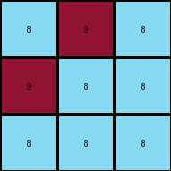
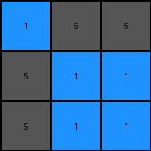
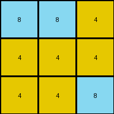

# 662c240a • 022 • refine_coder

---

Previous Code:
```python
"""
The output is a direct copy of the upper-left 3x3 portion (the top three rows) of the input grid.
"""

import numpy as np

def transform(input_grid):
    """
    Extracts the top 3x3 subgrid from the input grid.
    """
    # Convert the input grid to a NumPy array for easier manipulation.
    input_array = np.array(input_grid)

    # Extract the top 3x3 subgrid.
    output_array = input_array[:3, :3]

    # Convert the NumPy array back to a list of lists.
    output_grid = output_array.tolist()

    return output_grid
```

Train Set Results:

## Example 1:

Input:
```
8 9 8
9 8 8
8 8 8
2 2 1
2 2 1
1 1 2
4 4 4
4 4 3
3 3 3
```
Expected Output:
```
4 4 4
4 4 3
3 3 3
```
Transformed Output:
```
8 9 8
9 8 8
8 8 8
```

match: False
pixels_off: 9
size_correct: True
color_palette_correct: False
correct_pixel_counts: False

## Example 2:

Input:
```
1 5 5
5 1 1
5 1 1
3 3 3
3 6 3
3 6 6
7 7 7
7 2 2
7 2 2
```
Expected Output:
```
3 3 3
3 6 3
3 6 6
```
Transformed Output:
```
1 5 5
5 1 1
5 1 1
```

match: False
pixels_off: 9
size_correct: True
color_palette_correct: False
correct_pixel_counts: False

## Example 3:

Input:
```
2 2 2
2 2 3
2 3 3
5 7 7
7 5 5
7 5 5
8 8 1
1 8 1
1 8 1
```
Expected Output:
```
8 8 1
1 8 1
1 8 1
```
Transformed Output:
```
2 2 2
2 2 3
2 3 3
```

match: False
pixels_off: 9
size_correct: True
color_palette_correct: False
correct_pixel_counts: False

## Example 4:

Input:
```
8 8 4
4 4 4
4 4 8
1 1 3
1 3 3
3 3 1
6 2 2
2 2 2
2 2 6
```
Expected Output:
```
8 8 4
4 4 4
4 4 8
```
Transformed Output:
```
8 8 4
4 4 4
4 4 8
```

match: True
pixels_off: 0
size_correct: True
color_palette_correct: True
correct_pixel_counts: True
Here's an analysis of the provided information and a plan to refine the natural language program:

**General Assessment:**

The initial hypothesis (taking the upper-left 3x3 portion) was incorrect for most cases, as it only matched the expected output in the last example. The core issue is that the selected 3x3 region is wrong. Instead of always taking the top-left, it seems to copy a 3x3 block of from the bottom of the input.

**Strategy:**

1.  **Re-examine Examples:** Carefully analyze all examples, paying close attention to the relationship between the input and the expected output. Focus on how colors and object positions relate to each other. Look for repeating patterns.

2.  **Refine Hypothesis:** Based on the re-examination, formulate a new, more precise hypothesis about the selection of the copied area.

3.  **Update Natural Language Program:** Translate the refined hypothesis into a clear, concise, and unambiguous natural language program.

**Example Metrics and Analysis:**
I cannot execute code here. I will assume that the grid printouts in the prompt accurately depict what the code execution would show.
*   **Example 1:**
    *   Input Size: 9x3
    *   Output Size: 3x3
    *   Match: False
    *   Notes: The expected output takes the bottom 3x3 block of the input
*   **Example 2:**
    *   Input Size: 9x3
    *   Output Size: 3x3
    *   Match: False
    *    Notes: The expected output takes the bottom 3x3 block of the input
*   **Example 3:**
    *   Input Size: 9x3
    *   Output Size: 3x3
    *   Match: False
    *   Notes: The expected output takes the bottom 3x3 block of the input
*   **Example 4:**
    *   Input Size: 9x3
    *   Output Size: 3x3
    *   Match: True
    *   Notes: The expected output takes the bottom 3x3 block of the input

**YAML Fact Documentation:**

```yaml
observations:
  - object: input_grid
    type: grid
    properties:
      - height: variable (between 1 and 30)
      - width: variable (between 1 and 30)
      - cells: integers (0-9 representing colors)

  - object: output_grid
    type: grid
    properties:
      - height: 3
      - width: 3
      - cells: integers (0-9 representing colors)
    relationship_to_input: "The output grid is a copy of a contiguous 3x3 region from the bottom of the input grid."

  - action: copy
    description: "A 3x3 subgrid is copied from the bottom of the input grid to create the output grid."
    source: input_grid
    destination: output_grid
    constraints:
      - size: "3x3"
      - location: "bottom of the input grid"
```

**Natural Language Program:**

1.  **Identify the input grid.**
2.  **Locate the bottom 3x3 subgrid.** This is the 3x3 area composed of the bottom 3 rows.
3. **Copy** the contents of this bottom 3x3 subgrid to create the output grid.
4. The size of the input may vary, but the bottom 3x3 block is always copied.


**INSTRUCTIONS**

- generate a Python module to represent the natural language program 
- follow the template below
- all common math and science libraries are available
- create docstring only at top - but comment the workflow in the function
- use helper functions for common operations like finding objects, counting,
  measuring, moving, etc. 

remember - we are working iteratively - so this code will inform your future
self as we converge on the solution

*template:*

```python
"""
{{ natural language description of the transformation rule }}
"""

{{ imports }}

def transform(input_grid):
    # initialize output_grid

    # change output pixels 

    return output_grid

```
