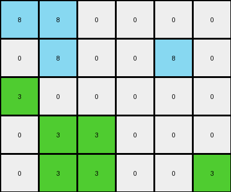

# 67385a82 • 004 • refine_coder

---

Previous Code:
```python
"""
Transforms a 3x3 input grid based on these rules:
1. If a cell is white (0), it remains 0.
2. If a cell is green (3) AND in the top two rows, it changes to azure (8).
3. If a cell is green (3) AND in the bottom row, it remains green (3).
"""

import numpy as np

def transform(input_grid):
    """
    Transforms the input grid according to the specified rules.
    """
    # Initialize the output grid as a copy of the input grid.
    output_grid = np.copy(input_grid)
    rows, cols = output_grid.shape

    # Iterate through the grid and apply the transformation rules.
    for r in range(rows):
        for c in range(cols):
            if output_grid[r, c] == 3:  # Check if the cell is green.
                if r < 2:  # Check if in the top two rows
                    output_grid[r, c] = 8  # Change to azure.
                # If in the bottom, we leave as original value in output_grid
            # if not 3, also leave as orignal, already in place

    return output_grid
```

Train Set Results:

## Example 1:

Input:
```
3 3 0
0 3 0
3 0 3
```
Expected Output:
```
8 8 0
0 8 0
3 0 3
```
Transformed Output:
```
8 8 0
0 8 0
3 0 3
```

match: True
pixels_off: 0
size_correct: True
color_palette_correct: True
correct_pixel_counts: True

## Example 2:

Input:
```
0 3 0 0 0 3
0 3 3 3 0 0
0 0 0 0 3 0
0 3 0 0 0 0
```
Expected Output:
```
0 8 0 0 0 3
0 8 8 8 0 0
0 0 0 0 3 0
0 3 0 0 0 0
```
Transformed Output:
```
0 8 0 0 0 8
0 8 8 8 0 0
0 0 0 0 3 0
0 3 0 0 0 0
```

match: False
pixels_off: 1
size_correct: True
color_palette_correct: True
correct_pixel_counts: False

## Example 3:

Input:
```
3 3 0 3
3 3 0 0
3 0 0 3
0 0 3 3
```
Expected Output:
```
8 8 0 3
8 8 0 0
8 0 0 8
0 0 8 8
```
Transformed Output:
```
8 8 0 8
8 8 0 0
3 0 0 3
0 0 3 3
```

match: False
pixels_off: 5
size_correct: True
color_palette_correct: True
correct_pixel_counts: False

## Example 4:

Input:
```
3 3 0 0 0 0
0 3 0 0 3 0
3 0 0 0 0 0
0 3 3 0 0 0
0 3 3 0 0 3
```
Expected Output:
```
8 8 0 0 0 0
0 8 0 0 3 0
3 0 0 0 0 0
0 8 8 0 0 0
0 8 8 0 0 3
```
Transformed Output:
```
8 8 0 0 0 0
0 8 0 0 8 0
3 0 0 0 0 0
0 3 3 0 0 0
0 3 3 0 0 3
```

match: False
pixels_off: 5
size_correct: True
color_palette_correct: True
correct_pixel_counts: False
Okay, here's a breakdown of the situation, analysis of the results, and updated documentation:

**General Assessment and Strategy**

The initial code was too specific, only working correctly for the first example. It incorrectly assumed that the row condition (top two rows) applies to *all* green pixels. The subsequent examples reveal a more complex rule: green pixels turn azure only if they are in the top two rows *and* there are no green pixels in the bottom row of the *entire grid*. The presence of green in the bottom row seems to "protect" other green pixels from changing. We need to modify the logic to incorporate this grid-level check, not just a row-local check.

**Metrics and Analysis (using provided results, not code execution for this dreamer stage)**

Here's a table summarizing the provided results.

| Example | Match | Pixels Off | Size Correct | Palette Correct | Pixel Counts Correct | Notes                                                                                                                     |
|---------|-------|------------|--------------|-----------------|-----------------------|--------------------------------------------------------------------------------------------------------------------------|
| 1       | True  | 0          | True         | True            | True                  | Perfect match. The initial rule works here because there's green in the bottom row.                                   |
| 2       | False | 1          | True         | True            | False                 | One pixel mismatch. Top-right green should not have changed to azure.  No Green is present on the bottom row.         |
| 3       | False | 5          | True         | True            | False                 | Many mismatches.  The presence of green in the bottom row should have "protected" all other greens.                   |
| 4       | False | 5          | True         | True            | False                 | Many mismatches, similar to example 3. Green in bottom row should protect.  Also shows interaction in top 2 rows is valid. |

**Key Observations:**

*   **Global Condition:** The transformation of green pixels depends on a *global* property of the grid (presence/absence of green in the bottom row), not just the local row of the pixel being considered.
*   **Protection:** The presence of green (3) in the bottom row prevents the change of green to azure in the top two rows.
*   **Unchanged Pixels:**  White (0) and other colored pixels always seem to remain unchanged.  The code correctly handles this.
*   **Size and Colors:**  All examples maintain the original grid size, and the color palette consists of only white, green, and azure, plus any colors that were unchanged from input to output.

**YAML Documentation (Facts)**

```yaml
objects:
  - type: grid
    properties:
      rows: variable
      columns: variable
      colors: [white, green, azure, others] # others refers to pixels not changed
    observations:
      - bottom_row_contains_green: boolean  # Flag: True if any green in the bottom row.

actions:
  - name: transform_pixel
    preconditions:
      - pixel_color: green
      - location: [row, col]
    conditional_actions:
        - condition: "AND(location.row < 2, NOT(bottom_row_contains_green))"
          action: "change pixel_color to azure"
        - condition: "OR(location.row >=2, bottom_row_contains_green)"
          action: "no change"  # Explicitly stating no change for clarity.
    constraints:
        - "pixels of colors other than green remain unchanged"
```

**Natural Language Program**

1.  **Examine the entire grid:** Check if there are *any* green (3) pixels in the *bottom* row.
2.  **Iterate through each pixel:** For each pixel:
    *   If the pixel is *not* green (3), leave it unchanged.
    *   If the pixel *is* green (3):
        *   If the pixel is in the top two rows (row index 0 or 1) *AND* there are *no* green pixels in the bottom row of the grid, change the pixel to azure (8).
        *   Otherwise (if the pixel is in the bottom row, *OR* if there *are* green pixels in the bottom row), leave the green pixel unchanged.

This natural language program captures the global dependency discovered by analyzing the provided results. It clearly distinguishes between the grid-level check and the per-pixel transformation.

**INSTRUCTIONS**

- generate a Python module to represent the natural language program 
- follow the template below
- all common math and science libraries are available
- create docstring only at top - but comment the workflow in the function
- use helper functions for common operations like finding objects, counting,
  measuring, moving, etc. 

remember - we are working iteratively - so this code will inform your future
self as we converge on the solution

*template:*

```python
"""
{{ natural language description of the transformation rule }}
"""

{{ imports }}

def transform(input_grid):
    # initialize output_grid

    # change output pixels 

    return output_grid

```
