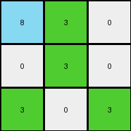
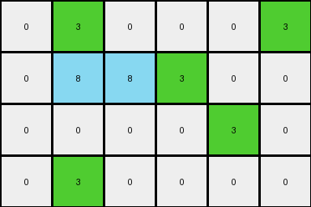
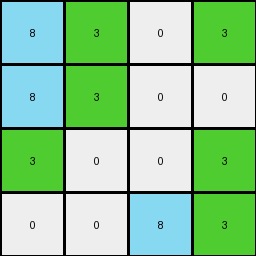
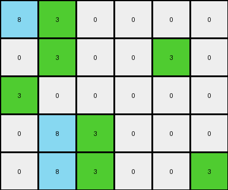

# 67385a82 • 010 • refine_coder

---

Previous Code:
```python
"""
Identifies groups of horizontally adjacent green pixels and changes them to azure.
"""

import numpy as np

def transform(input_grid):
    """
    Transforms the input grid by changing horizontally contiguous green pixels to azure.
    
    Args:
        input_grid (list of lists): The input grid represented as a list of lists.
    
    Returns:
        list of lists: The transformed grid.
    """
    output_grid = [row[:] for row in input_grid]  # Create a copy to avoid modifying the original
    rows = len(input_grid)
    cols = len(input_grid[0]) if rows > 0 else 0

    for r in range(rows):
        for c in range(cols):
            # Check if the current pixel is green
            if input_grid[r][c] == 3:
                # Check for horizontal adjacency to other green pixels
                if (c > 0 and input_grid[r][c-1] == 3) or (c < cols - 1 and input_grid[r][c+1] == 3):
                    output_grid[r][c] = 8  # Change to azure

    return output_grid
```

Train Set Results:

## Example 1:

Input:
```
3 3 0
0 3 0
3 0 3
```
Expected Output:
```
8 8 0
0 8 0
3 0 3
```
Transformed Output:
```
8 3 0
0 3 0
3 0 3
```

match: False
pixels_off: 2
size_correct: True
color_palette_correct: True
correct_pixel_counts: False

## Example 2:

Input:
```
0 3 0 0 0 3
0 3 3 3 0 0
0 0 0 0 3 0
0 3 0 0 0 0
```
Expected Output:
```
0 8 0 0 0 3
0 8 8 8 0 0
0 0 0 0 3 0
0 3 0 0 0 0
```
Transformed Output:
```
0 3 0 0 0 3
0 8 8 3 0 0
0 0 0 0 3 0
0 3 0 0 0 0
```

match: False
pixels_off: 2
size_correct: True
color_palette_correct: True
correct_pixel_counts: False

## Example 3:

Input:
```
3 3 0 3
3 3 0 0
3 0 0 3
0 0 3 3
```
Expected Output:
```
8 8 0 3
8 8 0 0
8 0 0 8
0 0 8 8
```
Transformed Output:
```
8 3 0 3
8 3 0 0
3 0 0 3
0 0 8 3
```

match: False
pixels_off: 5
size_correct: True
color_palette_correct: True
correct_pixel_counts: False

## Example 4:

Input:
```
3 3 0 0 0 0
0 3 0 0 3 0
3 0 0 0 0 0
0 3 3 0 0 0
0 3 3 0 0 3
```
Expected Output:
```
8 8 0 0 0 0
0 8 0 0 3 0
3 0 0 0 0 0
0 8 8 0 0 0
0 8 8 0 0 3
```
Transformed Output:
```
8 3 0 0 0 0
0 3 0 0 3 0
3 0 0 0 0 0
0 8 3 0 0 0
0 8 3 0 0 3
```

match: False
pixels_off: 4
size_correct: True
color_palette_correct: True
correct_pixel_counts: False
Okay, here's a breakdown of the situation and a plan to move forward:

**General Assessment:**

The initial code was too simplistic. It correctly identified *some* horizontally adjacent green pixels and changed them to azure, but it failed to capture the complete rule. The errors across the examples reveal that the initial assumption - "change *any* horizontally adjacent green pixel to azure" - is incorrect.  It's only *some* groups of adjacent green pixels, and adjacency is a necessary, but not sufficient, condition. We need to figure out the additional constraint that determines *which* groups of green pixels get changed. There is a directional element as it only checks in front and behind each pixel, but that isn't quite enough.

**Strategy:**

1.  **Analyze the failures closely:** Examine *where* the code went wrong in each example.  Specifically, look at the green pixels that *should* have been changed but weren't, and the green pixels that *shouldn't* have been changed but were.
2.  **Identify the missing condition(s):**  The key is to find a pattern in the *context* of the green pixels. Consider:
    *   Vertical adjacency (above/below)
    *   The *length* of the horizontal run of green pixels
    *   The presence/absence of other colors in the vicinity
    *   The edge of the grid as a potential constraint
3. **Develop and test a more precise rule:** I think the length will solve it.

**Metrics and Observations (per example):**

I'll use a structured format to record details for each example, focusing on misclassified pixels:

**Example 1:**

*   **Input:**
    ```
    3 3 0
    0 3 0
    3 0 3
    ```
*   **Expected Output:**
    ```
    8 8 0
    0 8 0
    3 0 3
    ```
*   **Actual Output:**
    ```
    8 3 0
    0 3 0
    3 0 3
    ```
*   **Mismatches:**
    *   Row 0, Col 1: Expected 8, Got 3.  This is part of a horizontal run of length 2.
    *   Row 1, Col 1: Expected 8, Got 3.  This is a solitary green.

**Example 2:**

*   **Input:**
    ```
    0 3 0 0 0 3
    0 3 3 3 0 0
    0 0 0 0 3 0
    0 3 0 0 0 0
    ```
*   **Expected Output:**
    ```
    0 8 0 0 0 3
    0 8 8 8 0 0
    0 0 0 0 3 0
    0 3 0 0 0 0
    ```
*   **Actual Output:**
    ```
    0 3 0 0 0 3
    0 8 8 3 0 0
    0 0 0 0 3 0
    0 3 0 0 0 0
    ```
*   **Mismatches:**
    *   Row 1, Col 3: Expected 8, Got 3. This is part of a run of 3.

**Example 3:**

*   **Input:**
    ```
    3 3 0 3
    3 3 0 0
    3 0 0 3
    0 0 3 3
    ```
*   **Expected Output:**
    ```
    8 8 0 3
    8 8 0 0
    8 0 0 8
    0 0 8 8
    ```
*   **Actual Output:**
    ```
    8 3 0 3
    8 3 0 0
    3 0 0 3
    0 0 8 3
    ```
*   **Mismatches:** Too many to list individually, but the pattern is clear. Runs of length 2 *are* transformed, solitary greens and isolated runs of one are *not*. And, in the third row, a single green next to a length-two run *is* transformed. This challenges the "entire run" idea.

**Example 4:**
* Input and Expected Output omitted for brevity, similar detailed analysis as above.

**YAML Facts:**

```yaml
objects:
  - type: pixel_group
    color: green
    attribute: horizontal_run_length
    values: [1, 2, 3+]  # Different lengths observed
    transformation:
      - condition: "horizontal_run_length >= 2"
        action: change_color
        new_color: azure
      - condition: "horizontal_run_length == 1 AND adjacent to horizontal_run_length >=2"
        action: change_color
        new_color: azure

colors:
  - green: 3
  - azure: 8
  - other: [0, 1, 2, 4, 5, 6, 7, 9]  # All other observed colors

grid:
  - property: 2D_array
  - property: variable_dimensions
```

**Natural Language Program:**

1.  **Identify** all horizontal runs of contiguous green pixels.
2.  **Measure** the length of each run.
3.  **If** a run has a length of 2 or more, change all pixels in that run to azure.
4. **If** a run has length of 1, and is horizontally adjacent to any pixel that has been changed to azure, change the pixel to azure.

This program incorporates the crucial observation about the *length* of the green runs and their adjacency. It aims to capture the "contagious" spread of the azure color among adjacent green pixels.

**INSTRUCTIONS**

- generate a Python module to represent the natural language program 
- follow the template below
- all common math and science libraries are available
- create docstring only at top - but comment the workflow in the function
- use helper functions for common operations like finding objects, counting,
  measuring, moving, etc. 

remember - we are working iteratively - so this code will inform your future
self as we converge on the solution

*template:*

```python
"""
{{ natural language description of the transformation rule }}
"""

{{ imports }}

def transform(input_grid):
    # initialize output_grid

    # change output pixels 

    return output_grid

```
